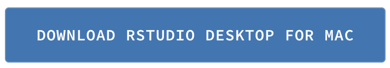

```{r setup, include=FALSE}
knitr::opts_chunk$set(echo = TRUE)
```


# Option 1: Use Rstudio cloud, no installations on computer required

- Sign up for an Rstudio (free) account here: https://rstudio.cloud/plans/free
- Read the [Rstudio cloud guide](https://rstudio.cloud/learn/guide), especially the [navigation](https://rstudio.cloud/learn/guide#navigation) section.
- Before class we will send a link to the project that you will clone into your account. All work will be done on this website.

# Option 2: Install R and Rstudio and relevant packages on your own computer

## Pre-course installation

- R and Rstudio are two separate programs. You must install R first. Then install Rstudio desktop. 
- For help, try [watching this video](https://www.youtube.com/watch?v=kOQDdJZ7Hl4&feature=youtu.be)
- Even if you have R installed already, we highly recommend installing the latest version if it has been a while since you installed it. Just follow the instructions as below to update everything.
- **TRY TO DO THIS YOURSELF BEFORE THE WORKSHOP** If you have tried it at home and still have questions, come to the workshop 30 minutes early and the instructors will try to help.

### Install R and Rstudio on your computer

#### Install **R** (first)

- Windows: Download from https://cran.rstudio.com/bin/windows/base/ from the link "Download R 4.2.1 for Windows"
- Mac OS X: Download the latest .pkg file (top link, currently R-4.2.1.pkg) from https://cran.rstudio.com/bin/macosx/
    * For some packages and uses, [Xcools](https://apps.apple.com/us/app/xcode/id497799835?mt=12) and [XQuartz](https://www.xquartz.org/) may be required, but no need to install these until you find you need them (Xcode takes a long time to install)
    
#### Install **RStudio Desktop** Open Source License (second)

- Go to https://www.rstudio.com/products/rstudio/download/#download
- Click the blue box which contains the download file corresponding to your operating system, i.e.

<a href="https://www.rstudio.com/products/rstudio/download/#download"></a>

### Open Rstudio

After installation, open Rstudio by clicking on the Rstudio icon, a round blue ball with R in it, that should look something like this:


Do not open the regular R software, it is just working in the background when you use Rstudio.

### Install useful packages

Download [this file](https://drive.google.com/file/d/13GdHlXEvvI3wyXKsYIv4EXh0XCadiaxx/view?usp=sharing) to your computer, open in Rstudio, and click "source" to run the entire document, or run each line of code. See instructions in top comments.


# Prepare for the course

## *Highly recommended*

- Get acquainted with Rstudio Cloud or Rstudio Desktop (and R) prior to the workshop. You will get much more out of the workshop if you have opened the software and explored the interface first.

## *Recommended*

- Try out the [Programming basics](https://rstudio.cloud/learn/primers/1.2) interactive lesson from Rstudio.
- Look over [slides from a previous version of this workshop](https://jminnier-berd-r-courses.netlify.app/01-getting-started-v2/01_getting_started_slides.html)

## Still want more preparation?

- **Very Useful**: [Rstudio interactive lessons](https://rstudio.cloud/learn/primers)
- View previous OHSU OCTRI BERD workshops that have been recorded, including an earlier version of "Getting Started with R and Rstudio"
    + Slides at [github.com/jminnier/berd_r_courses](https://github.com/jminnier/berd_r_courses)
    + [Recordings are on echo](https://echo360.org/section/ffe141ee-01ee-4895-bdfc-ed179b922d17/public) Search for BERD.
- [R Programming for OHSU-PSU School of Public Health](https://sph-r-programming-2022.netlify.app/) 11 week course, all videos and materials are available
- Long list of other resources [here](https://github.com/jminnier/awesome-rstats/blob/master/learn-r.md)
- [Rstudio IDE cheatsheet](https://resources.rstudio.com/rstudio-cheatsheets/rstudio-ide-cheat-sheet)
- [Modern Dive textbook chapter getting started](https://moderndive.com/1-getting-started.html)
- [R bootcamp - interactive tutorial](https://r-bootcamp.netlify.com/) Ted Laderas & Jessica Minnier
- [Introduction to module and RStudio by Emma Rand](http://www-users.york.ac.uk/~er13/17C%20-%202018/pracs/01IntroductionToModuleAndRStudio.html)
- [Basic Basics opinionated tour of Rstudio](http://rladiessydney.org/post/2018/11/05/basicbasics-1/)

# Instructor Info

[Jessica Minnier, PhD](http://jessicaminnier.com/) & [Meike Niederhausen, PhD](https://ohsu-psu-sph.org/faculty-2/faculty-directory/?cn-s=niederhausen&cn-cat=), 
Oregon Health & Science University

Slides and code for BERD workshop materials: [jminnier/berd_r_courses](https://github.com/jminnier/berd_r_courses)
