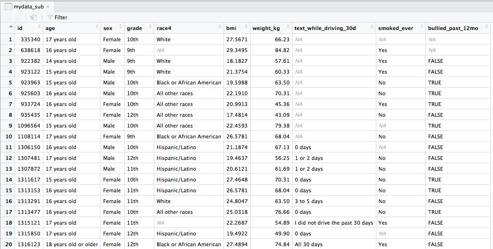
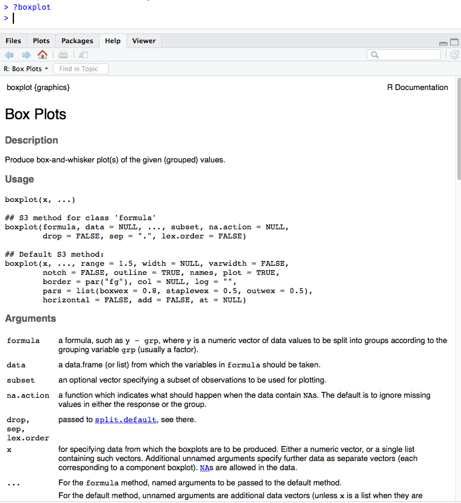

```{r setup, include=FALSE}
options(htmltools.dir.version = FALSE)

library(tidyverse)

knitr::opts_chunk$set(
  warning=FALSE, 
  message=FALSE, 
  fig.width=10.5, 
  fig.height=4,
  fig.align = "center",
  rows.print=16,
  echo=TRUE,
  highlight = TRUE,
  prompt = TRUE, # IF TRUE adds a > before each code input
  comment=NA # PRINTS IN FRONT OF OUTPUT, default is '##' which comments out output
  #comment=NA
  )

theme_set(theme_bw(base_size = 24))
```


# Pre-course installation

## Install R

- Windows : Download from https://cran.rstudio.com/bin/windows/base/
- Mac OS X: Download the latest .pkg file (currently R-3.5.2.pkg) from https://cran.rstudio.com/bin/macosx/

## Install RStudio Desktop Open Source License

- Select download file corresponding to your operating system  from https://www.rstudio.com/products/rstudio/download/#download

---

# Questions

- Who has used R?
- What other statistical software have you used?
- Has anyone used other programming languages (C, java, python, etc)?
- Why do you want to learn R?

---

# Learning Objectives

- Basic operations in R/RStudio
- Understand data structures
- Be able to load in data
- Basic operations on data
- Be able to make a plot
- Know how to get help

---
class: center, inverse, middle

# Introduction

Rrrrrr?

---

# What is R? 

.pull-left[
- A programming language
- Focus on statistical modeling and data analysis
    + import data, manipulate data, run statistics, make plots
- Useful for "Data Science"
- Great visualizations
- Also useful for most anything else you'd want to tell a computer to do
- Interfaces with other languages i.e. python, C++, bash

]


.pull-right[

]


For the history and details: [Wikipedia](https://bit.ly/1efFmaY)

- an interpreted language (run it through a command line)
- procedural programming with functions
- Why "R"?? Scheme (?) inspired S (invented at Bell Labs in 1976) which inspired R (**free and open source!** in 1993)


---

# What is RStudio?


- R is a programming language
- RStudio is an integrated development environment (IDE) = an interface to use R (with perks!)

from [Modern Dive](https://moderndive.com/2-getting-started.html); see also [DataCamp's video discussion on the difference](https://campus.datacamp.com/courses/working-with-the-rstudio-ide-part-1/orientation?ex=1)
---

# Start RStudio


from [Modern Dive](https://moderndive.com/2-getting-started.html)

---

# RStudio anatomy


from [Emma Rand](http://www-users.york.ac.uk/~er13/17C%20-%202018/pracs/01IntroductionToModuleAndRStudio.html#what_are_r_and_rstudio)

---

# Rstudio demo


---

class: inverse, middle, center

# Let's code!

---

# Coding in the console 
 
.pull-left[
__Typing and execting code in the console __
* Type code in the console
* Press __return__ to execute the code

<br>

_Coding in the console is not advisable for most situations!_
* We only recommend this for short pieces of code that you don't need to save
]


.pull-right[
```{r}
7
3 + 5
"hello"

# this is a comment, nothing happens
# 5 - 8
```
]


---

# We can do math


.pull-left[
```{r}
10^2
3 ^ 7
6/9
9-43
```
]

--

.pull-right[
R follows the rules for order of operations and ignores spaces between numbers (or objects)

```{r}
4^3-2* 7+9 /2
```


The equation above is computed as $$4^3 − (2 \cdot 7) + \frac{9}{2}$$ 
]


---

# Logarithms and exponentials

.pull-left[

Logarithms: `log()` is base $e$
```{r}
log(10)
log10(10)
```

]

--

.pull-right[
Exponentials
```{r}
exp(1)
exp(0)
```
]

<br>

--

Check that `log()` is base $e$

```{r}
log(exp(1))
```

---

# Variables

Data, information, everything is stored as a variable

* Can assign a variable using either `=` or `<-`
    - Using `<-` is preferable

.pull-left[
Assigning just one value:
```{r}
x = 5
x
x <- 5
x
```
]

--

.pull-right[
Assigning a __vector__ of values
* Consecutive integers

```{r}
a <- 3:10
a
```

* __Concatenate__ a string of numbers

```{r}
b <- c(5, 12, 2, 100, 8)
b
```
]


---

# We can do math with variables

.pull-left[
Math using variables with just one value
```{r}
x <- 5
x

x + 3

y <- x^2
y
```
]

--

.pull-right[
Math on vectors of values: element-wise computation
```{r}
a <- 3:6
a

a+2

a*3

a*a
```
]


---

# Variable can include text (characters)

```{r}
hi <- "hello"
hi

greetings <- c("Guten Tag", "Hola", hi)
greetings
```


---

# Common console errors 
 
__Incomplete commands__ 

.pull-left[
* When the console is waiting for a new command, the prompt line begins with `>`
  + If the console prompt is `+`, then a previous command is incomplete
  + You can finish typing the command in the console window
]
   
.pull-right[
Example:

```{r}
3 + (2*6
)
```
]

```{r error=TRUE, echo=FALSE}
# this is not a console example, since the console will prompt for more code with +
# 3 + (2*6
```

--

__Object is not found__

* This happens when text is entered for a non-existent variable (object)

Example:

```{r error=TRUE}
hello
```

---

class: inverse, center, middle

# R scripts (save your work!)

---

# Coding in a script (1/3)

<!-- * Note that both of these options show the keyboard shortcut for your operating system   -->

* __Create a new script__ by 
    + selecting `File -> New File -> R Script`, 
    + or clicking on  (the left most button at the top of the scripting window), and then selecting the first option `R Script` 

  
* __Type code__ in the script
    - Type each R command on its own line
    - Use `#` to convert text to comments so that text doesn't accidentally get executed as an R command


---

# Coding in a script (2/3)


* __Select code__ you want to execute, by 
    - placing the cursor in the line of code you want to execute, 
    - or highlighting the code you want to execute


* __Execute code__ in the script, by
    - clicking on the  button in the top right corner of the scripting window, 
    - or typing one of the following key combinations to execute the code
          + __Windows__:  __ctrl + return__
          + __Mac__:  __command + return__


---

# Coding in a script (3/3)

* The screenshot below shows code in the scripting window (top left window)
* The executed highlighted code and its output appear in the console window (bottom left window)


---

# Saving a script

* __Save a script__ by 
    + selecting `File -> Save`, 
    + or clicking on  (towards the left above the scripting window)

* You will need to specify
    + a __filename__ to save the script as
        - ALWAYS use __.R__ as the filename extension for R scripts
    + the __folder__ to save the script in

---

class: center, inverse, middle

# Practice time!

---

# Practice questions

1. Create a vector of all integers from 4 to 10, and save it as `a1`. 

2. Create a vector of _even_ integers from 4 to 10, and save it as `a2`. 

3. What is the sum of `a1` and `a2`? 

4. What does the command `sum(a1)` do?

5. What does the command `length(a1)` do?

6. Use the commands to calculate the average of the values in `a1`.

7. The formula for the first $n$ integers is $n(n+1)/2$. Compute the sum of all integers from 1 to 100 to verify that this formula holds for $n=100$. 

8. Compute the sum of the squares of all integers from 1 to 100.

9. Take a break!


---

class: inverse, middle, center

# Object types

---

# Data frames

__Vectors__ vs. __data frames__: a data frame is a collection (or array or table) of vectors

```{r}
df <- data.frame(IDs=1:3, 
                 gender=c("male", "female", "Male"), 
                 age=c(28, 35.5, 31),
                 trt = c("control", "1", "1"),
                 Veteran = c(FALSE, TRUE, TRUE))
df
```


* A data frame allows different columns to be of different data types (i.e. numeric vs. text), and even allows both numeric and text within a column (stored together as text).

* Vectors and data frames are examples of _objects_ in R. 
  + There are other types of R objects to store data, such as matrices, lists, and tibbles.
  + These will be discussed in future R workshops.


---

# Variable types

* integer: integer-valued numbers
* numeric: numbers that are decimals
* factor: how categorical variables are stored
* character: text 
* logical (TRUE, FALSE)

Each variable (column) in a data frame can be of a different type.

* View the __structure__ of our data frame to see what the variable types are:

```{r}
str(df)
```

<!-- * Note that the ID column is _integer_ type since the values are all whole numbers, although we likely would think of it as being a categorical variable and thus prefer it to be a factor. -->

---

# Data frame cells, rows, or columns


<!-- * Our data frame `df` -->
.pull-left[
Show whole data frame
```{r}
df
```

Specific cell value: 

`DatSetName[row#, column#]`

```{r}
# Fourth row, Third column
df[2, 3]
```
]

.pull-right[
Entire column
```{r}
# Third column
df[, 3]
```

Entire row
```{r}
# Second row
df[2,]
```
]


---

class: inverse, center, middle

# Getting the data into Rstudio

---

# Load a data set

* Open csv file directly from the internet:

```{r}
mydata <- read.csv(url("http://bit.ly/berd_data_csv"))
```

* Or, download file and open saved file using Import Dataset button in Environment window:  . 
  + If you use this option, then copy and paste the code from the console importing the data to your script so that you have a record of from where and how you loaded the data set.


```{r, eval=FALSE}
View(mydata) 
# Can also view the data by clicking on its name in the Environment tab
```


<!--  -->




---

# About the data

Data from the CDC's [Youth Risk Behavior Surveillance System (YRBSS) ](https://www.cdc.gov/healthyyouth/data/yrbs/index.htm)

- complex survey data
- national school-based survey conducted by CDC and state, territorial, tribal, and local surveys conducted by state, territorial, and local education and health agencies and tribal governments
- monitors six categories of health-related behaviors that contribute to the leading causes of death and disability among youth and adults (including alcohol & drug use, unhealthy & dangerous behaviors, sexuality, physical activity); see [Questionnaires](https://www.cdc.gov/healthyyouth/data/yrbs/questionnaires.htm)
- this data is a small subset (20 rows) of data in the R package [`yrbss`](https://github.com/hadley/yrbss) which includes YRBSS from 1991-2013
- we will use the full R data set in a future workshop teaching data cleaning


---

# Data set summary

```{r}
summary(mydata)
```

---

# Data set info

```{r}
dim(mydata)
nrow(mydata)
ncol(mydata)

names(mydata)
```


---

# Data structure

* What are the different __variable types__ in this data set?


```{r}
str(mydata)   # structure of data
```


---

# View the beginning of a data set

```{r}
head(mydata)
head(mydata, 2)
```

---

# View the end of a data set

```{r}
tail(mydata)
```

---

class: inverse, center, middle

# Working with the data

---

# The $

Suppose we want to single out the column of BMI values.
* How did we previously learn to do this?

--

```{r}
mydata[, 6]
```

The problem with this method, is that we need to know the column number which can change as we make changes to the data set. 

--

* Use the `$` instead: `DatSetName$VariableName`

```{r}
mydata$bmi
```

---

# Basic plots of numeric data (1/3)


## Histogram

```{r fig.height=2.5, fig.width=7}
hist(mydata$bmi)
```

With extra features: 

```{r fig.height=2.5, fig.width=7}
hist(mydata$bmi, xlab = "BMI", main="BMI's of students")
```

---

# Basic plots of numeric data (2/3)

## Boxplot

.pull-left[
```{r fig.height=5, fig.width=5}
boxplot(mydata$bmi)
```

]

--

.pull-right[
```{r fig.height=5, fig.width=5}
boxplot(mydata$bmi ~ mydata$sex, 
  horizontal = TRUE, 
  xlab = "BMI", ylab = "sex",
  main = "BMI's of students by sex")
```
]

---

# Basic plots of numeric data (3/3)

## Scatterplot

.pull-left[
```{r fig.height=5, fig.width=5}
plot(mydata$weight_kg, mydata$bmi)
```
]

.pull-right[
```{r fig.height=5, fig.width=5}
plot(mydata$weight_kg, mydata$bmi, 
   xlab = "weight (kg)", ylab = "BMI", 
   main = "BMI vs. Weight")
```
]

---

# Summary stats of numeric data (1/2)

## Standard R `summary` command

```{r}
summary(mydata$bmi)
```

## Mean and standard deviation

```{r}
mean(mydata$bmi)
sd(mydata$bmi)
```

---

# Summary stats of numeric data (2/2)
<!-- QQ: Why is (2/2) being cut off? It's not cut off for (1/2).-->
## Min, max, & median

.pull-left[
```{r}
min(mydata$bmi)
max(mydata$bmi)

```
]

.pull-right[
```{r}
median(mydata$bmi)
```
]

## Quantiles

```{r}
quantile(mydata$bmi, prob=c(0, .25, .5, .75, 1))  
```

---

# Add height column to data frame

Since $\textrm{BMI} = \frac{kg}{m^2}$, we have
$\textrm{height}(m) = \sqrt{\frac{\textrm{weight}(kg)}{\textrm{BMI}}}$

<!-- * UPDATE: need correct units! -->
```{r}
mydata$height_m <- sqrt( mydata$weight_kg / mydata$bmi)
mydata$height_m
dim(mydata); names(mydata)
```


---

# Access specific columns in data set

.pull-left[
Previously we used `DatSetName[, column#]`

```{r}
mydata[, c(2, 6)]   # sixth column
```
]


.pull-right[
The code below uses _column names_ instead of numbers.

```{r}
mydata[, c("age", "bmi")]
```
]


<!-- This is the same as `mydata$bmi`. -->

---

# Access specific rows in data set


<!-- Below is code that uses the column names instead of row and column numbers. -->

* Rows for 14 year olds only
```{r}
mydata[mydata$age == "14 years old",]
```

In this case the output is only one row since there is only one 14 year old.

* Rows for teens with BMI less than 19
```{r}
mydata[mydata$bmi < 19,]
```

---

# Access specific values in data set 

* Grade and race for 15 year olds only

```{r}
mydata[mydata$age == "15 years old", c("age", "grade", "race4")]
```

* Age, sex, and BMI for students with BMI less than 19

```{r}
mydata[mydata$bmi < 19, c("age", "sex", "bmi")]
```


---

# Practice

1. Create data frames for males and females separately.

2. Do males and females have similar BMI's? Weights? Compares means, standard deviations, range, and boxplots.

3. Plot BMI vs. weight for each gender separately. Do they have similar relationships?

4. Are males or females more likely to be bullied in the past 12 months? Calculate the percentage bullied for each gender.

5. Are students that were bullied in the past year more likely to have smoked in the past? Does this vary by gender?


---

# Save data frame

* Save __.RData__ file: the standard R format, which is recommended if saving data for future use in R
```{r}
save(mydata, file = "mydata.RData")
```

You can load .RData files using the load() command:

```{r}
load("mydata.RData")
```
  

<br>

* Save __csv__ file: comma-separated values

```{r}
write.csv(mydata, file = "mydata.csv", col.names = TRUE, row.names = FALSE)
```


---

class: inverse, center, middle

# The more you know

---

# Installing and using packages

(Packages are to R/Rstudio like apps are to your phone/OS)

## CRAN = package mothership

[Comprehensive R Archive Network](https://cran.r-project.org/)

Also can use the "Packages" tab in the Files/Plots/Packages/Help/Viewer window


```{r, eval = FALSE}
# Install a package from CRAN (main package repository)
install.packages("tidyverse") # only do this ONCE
# Load the package
library(tidyverse)
```

## Other places (i.e. github) = wild west

```{r, eval=FALSE}
install.packages("devtools") # only do this ONCE
library(devtools)
# Install a package from github (often in development, no testing)
# https://github.com/hadley/yrbss
install_github("hadley/yrbss")
library(yrbss)
```


---

# How to get help (1/2)

Use `?` in front of function name in console. Try this:


---

# How to get help (2/2)

- Use `??` (i.e `??dplyr` or `??read_csv`) for searching all documentation in installed packages (including unloaded packages)
- search [Stack Overflow #r tag](https://stackoverflow.com/questions/tagged/r)
- google your question + rcran or + r (i.e. "make a boxplot rcran" "make a boxplot r")
- google the error in quotes (i.e. "Evaluation error: invalid type (closure) for variable '***'")
- search [github](https://github.com/search/advanced?q=language:R) for your function name (to see examples) or error
- [Rstudio community](https://community.rstudio.com/)
- [twitter #rstats](https://twitter.com/search?q=%23rstats&src=typd)

---

# Resources

- [RStudio IDE Cheatsheet](https://resources.rstudio.com/rstudio-cheatsheets/rstudio-ide-cheat-sheet)
- Install R/RStudio [help video](https://www.youtube.com/watch?v=kOQDdJZ7Hl4&feature=youtu.be)
- [Basic Basics](http://rladiessydney.org/post/2018/11/05/basicbasics/)

Interactive lessons

- [DataCamp](www.datacamp.com)
    + [Introduction to R (free course)](https://www.datacamp.com/courses/free-introduction-to-r)
    + [Introduction to the Tidyverse](https://www.datacamp.com/courses/introduction-to-the-tidyverse)
    + [Intermediate R](https://www.datacamp.com/courses/intermediate-r)

Some of this is drawn from materials in online books/lessons:

- [Intro to R/RStudio](http://www-users.york.ac.uk/~er13/17C%20-%202018/pracs/01IntroductionToModuleAndRStudio.html) by Emma Rand
- [Modern Dive](https://moderndive.com/) - An Introduction to Statistical and Data Sciences via R by Chester Ismay & Albert Kim
- [Cookbook for R](http://www.cookbook-r.com/) by Winston Chang

---

# Local resources

- OHSU's [BioData club](https://biodata-club.github.io/) + active slack channel
- Portland's [R user meetup group](https://www.meetup.com/portland-r-user-group/) + active slack channel
- [R-ladies PDX](https://www.meetup.com/R-Ladies-PDX/) meetup group
- in June in Portland, the [WNAR Annual meeting](http://www.wnar.org/event-3013994) (biostats conference) will have R related workshops
- in June in Redmond, the [Cascadia R conference](https://www.eventbank.com/event/cascadia-r-conference-2019-11944/) will have presentations

---

# Possible Future Workshop Topics?

- data wrangling with the tidyverse
- reproducible reports in R
- tables
- ggplot2 visualization
- advanced tidyverse: functions, purrr
- statistical modeling in R

## Contact info:

Jessica Minnier: _minnier@ohsu.edu_

Meike Niederhausen: _niederha@ohsu.edu_


## This workshop info:

- Code for these slides on github: [jminnier/berd_r_courses](https://github.com/jminnier/berd_r_courses)
- all the [R code in an R script](https://jminnier-berd-r-courses.netlify.com/01-getting-started/01_getting_started_slides.R)
- answers to practice problems can be found here: [html](https://jminnier-berd-r-courses.netlify.com/01-getting-started/01_getting_started_Practice_Answers.html), [pdf](https://jminnier-berd-r-courses.netlify.com/01-getting-started/01_getting_started_Practice_Answers.pdf)

```{r, include=FALSE}
#knitr::purl("01-getting-started/01_getting_started_slides.Rmd", out = "01-getting-started/01_getting_started_slides.R")
#knitr::purl("01_getting_started_slides.Rmd")
```

