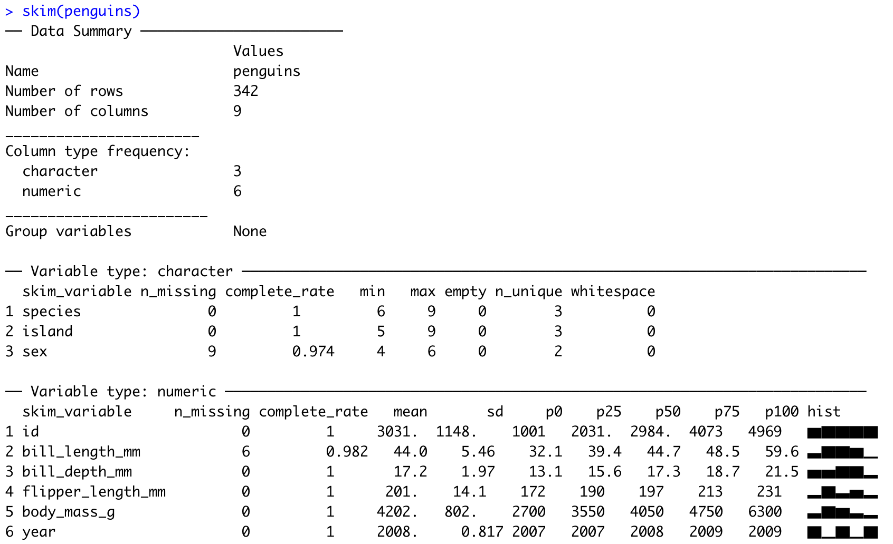

layout: true
  
<!-- <div class="my-footer"><span>bit.ly/berd_tidy</span></div>  -->

---

```{r setup, include=FALSE}
options(htmltools.dir.version = FALSE)

library(tidyverse)
library(lubridate)
library(janitor)

knitr::opts_chunk$set(
  warning=FALSE, 
  message=FALSE, 
  #fig.width=10.5, 
  #fig.height=4,
  fig.align = "center",
  rows.print=7,
  echo=TRUE,
  highlight = TRUE,
  prompt = FALSE, # IF TRUE adds a > before each code input
  comment = NA # PRINTS IN FRONT OF OUTPUT, default is '##' which comments out output
  #comment=NA
  )

# set ggplot theme
theme_set(theme_bw(base_size = 24))
```


```{r xaringan-themer, include = FALSE}
# creates xaringan theme
# devtools::install_github("gadenbuie/xaringanthemer")
library(xaringanthemer)
mono_light(
  base_color =  "#518c66", ## OHSU Marquam
  code_highlight_color = "#c0e8f5",
  link_color = "#38BDDE",
  header_font_google = google_font("Josefin Sans"),
  text_font_google   = google_font("Montserrat", "300", "300i","400i","700"),
  code_font_google   = NULL,
  text_font_size = "24px",
  code_font_size = "20px",
  header_h1_font_size = "45px",
  header_h2_font_size = "40px",
  header_h3_font_size = "35px",
  padding = "0em 2em 1em 2em",
  outfile = "css/xaringan-themer-solns.css"
)
```

```{r, echo = FALSE}
penguins <- read_csv(here::here("01-intro-r-eda","data","penguins.csv"))
```


# Practice 1 (pg. 1)

1. Create a new Rmd file to type the code and answers for the tasks below in it. 

1. Remove the template text starting with line 12 (keep the YAML header and setup code chunk), and save the file as `Practice1.Rmd`

1. Create a new code chunk. 

1. Create a vector of all integers from 4 to 10, and save it as `a1`. 

1. What does the command `sum(a1)` do? 

1. What does the command `length(a1)` do? 

1. Use the `sum` and `length` commands to calculate the average of the values in `a1`.

1. Knit the Rmd file.


---

# Answers to Practice 1 questions

__#4__ Create a vector of all integers from 4 to 10, and save it as `a1`. 

```{r}
a1 <- 4:10
```

__#5__ What does the command `sum(a1)` do?

```{r}
sum(a1)
```

`sum` adds up the values in the vector

---

__#6__ What does the command `length(a1)` do?

```{r}
length(a1)
```

`length` is the number of values in the vector

__#7__ Use the commands to calculate the average of the values in `a1`.

```{r}
sum(a1) / length(a1)

# this is equivalent
mean(a1)
```

---

# Practice 1 (pg. 2)

* Run the code below to install the `tidyverse` and `janitor` packages in R, which we will be using in upcoming slides.
  + If you get a message about restarting R, click Yes.
  + If you get an error message (warnings are ok), ask a helper.

```{r eval=FALSE}
# install.packages("tidyverse")
# install.packages("janitor")
```

* After running the code, comment out the code with `#` in front of the commands so that they do not run when knitting the file. 
    + *We only need to install packages once* and thus do not need to run this code again.


* __Take a break!__

---

```{r echo=FALSE}
penguins <- read_csv(here::here("01-intro-r-eda","data","penguins.csv"))
mydata <- read_csv(here::here("01-intro-r-eda","data","yrbss.csv"))
```

# Practice 2

Create a new Rmd for Practice 2 or continue in your current Rmd.

1. Find the median bill length. Is the median bill length similar to the mean?

1. What is the distance between the smallest and largest bill *depths*?

1. What does the `range()` command do? Try it out on the bill depths.

1. Make a scatterplot with bill length on the x-axis and bill depth on the y-axis. What is the relationship between bill length and depth?

1. Knit your Rmd file. 

1. If you have time, 
    * install the package `skimr`
    * load the package
    * run the command `skim(penguins)`
    * what does the `skim` command do?

---


# Practice 2 Answers

__#1__ Find the median bill length. Is the median bill length similar to the mean?

```{r}
median(penguins$bill_length_mm, na.rm = TRUE)
mean(penguins$bill_length_mm, na.rm = TRUE)
```

The mean and median bill lengths are similar to each other. 

---

__#2__ What is the distance between the smallest and largest bill *depths*?

```{r}
max(penguins$bill_depth_mm) - min(penguins$bill_depth_mm)
```

The distance between the smallest and largest bill depths is 8.4 mm.  

*Note that we do not need to use `na.rm = TRUE` for bill depths since there are no missing values.

__#3__ What does the `range()` command do? Try it out on the bill depths.

```{r}
range(penguins$bill_depth_mm)
```

The `range()` command gives the minimum and maximum values.

---

__#4__ Make a scatterplot with bill length on the x-axis and bill depth on the y-axis. What is the relationship between bill length and depth?

```{r fig.height=5, fig.width=5}
plot(penguins$bill_length_mm, 
     penguins$bill_depth_mm, 
   xlab = "Length", ylab = "Depth", 
   main = "Bill depth vs. length")
```

---

__#6__ If you have time, 

* install the package `skimr`
* load the package
* run the command `skim(penguins)`
* what does the `skim` command do?


.pull-left-40[
```{r eval=FALSE}
# install.packages("skimr")
library(skimr)
skim(penguins)
```

The `skim()` command gives summaries of each of the variables in the dataset.
]

.pull-right-60[
<center>

</center>

]


```{r, include=FALSE}
#knitr::purl("01-getting-started-v2/01_getting_started_Practice_Answers.Rmd")
pagedown::chrome_print(here::here("01-intro-r-eda","01_intro_r_eda_Practice_Answers_part1.html"))

```


