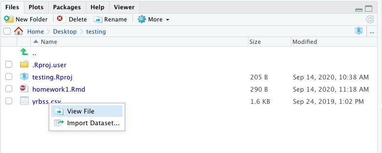

layout: true
  
<!-- <div class="my-footer"><span>bit.ly/berd_tidy</span></div>  -->

---

```{r setup, include=FALSE}
options(htmltools.dir.version = FALSE)

library(tidyverse)
library(lubridate)
library(janitor)
library(emo)
library(here)

knitr::opts_chunk$set(
  warning=FALSE, 
  message=FALSE, 
  #fig.width=10.5, 
  #fig.height=4,
  fig.align = "center",
  rows.print=7,
  echo=TRUE,
  highlight = TRUE,
  # prompt = TRUE, # IF TRUE adds a > before each code input
  # comment = NA # PRINTS IN FRONT OF OUTPUT, default is '##' which comments out output
  comment = '##'
  )

# set ggplot theme
# theme_set(theme_bw(base_size = 24))
```

```{r xaringan-themer, include = FALSE}
# creates xaringan theme
# devtools::install_github("gadenbuie/xaringanthemer")
library(xaringanthemer)
mono_light(
  base_color =  "#3A6185", ## OHSU Marquam
  code_highlight_color = "#cbdded",
  link_color = "#38BDDE",
  header_font_google = google_font("Josefin Sans"),
  text_font_google   = google_font("Montserrat", "300", "300i","400i","700"),
  code_font_google   = NULL,
  text_font_size = "24px",
  code_font_size = "20px",
  header_h1_font_size = "45px",
  header_h2_font_size = "40px",
  header_h3_font_size = "35px",
  padding = "0em 2em 1em 2em",
  outfile = "css/xaringan-themer.css"
)
```


# 1. Open slides: [bit.ly/berd_eda](http://bit.ly/berd_eda)

## 2. Install R & Rstudio: instructions [bit.ly/berd_install](http://bit.ly/berd_install)

## 4. Download folder of data (unzip completely)

CHANGE TO DOWNLOAD CSV OF DATA?

- Go to [bit.ly/intro_rproj](http://bit.ly/intro_rproj) and **unzip** folder
- Open (double click on) `berd_intro_project.Rproj` file.

---

# Learning Objectives

.pull-left[
- Basic operations in R/RStudio
- Understand data structures
- Be able to load in data
- Basic operations on data
]
.pull-right[
- Some data wrangling
- Use Rstudio projects
- Be able to make a plot
- Basics of tidyverse and ggplot
- Know how to get help
]

<center><a href="https://github.com/allisonhorst/stats-illustrations"><br>Allison Horst</a></center>
---
class: center, inverse, middle

# Introduction

Rrrrrr?

---

# What is R? 

.pull-left-60[
- A programming language
- Focus on statistical modeling and data analysis
    + import data, manipulate data, run statistics, make plots
- Useful for "Data Science"
- Great visualizations
- Also useful for most anything else you'd want to tell a computer to do
- Interfaces with other languages i.e. python, C++, bash

]


.pull-right-40[

]


For the history and details: [Wikipedia](https://bit.ly/1efFmaY)

- an interpreted language (run it through a command line)
- procedural programming with functions
- Why "R"?? Scheme (?) inspired S (invented at Bell Labs in 1976) which inspired R (**free and open source!** in 1992)

---

# Why R?
.pull-left[
- Free + Cross-platform (Mac/Windows)
- Flexible, fun, many more modern statistics methods, large community for learning and help
- One of the most popular data science tools for statistics in academia and industry
- SAS and STATA (and SPSS) are still used but becoming less popular (expensive, not as versatile/comprehensive)
- Constantly evolving and improving
- If you want a job doing stats and not be limited to specific research groups or some pharma companies, you absolutely *need to know R*
]

.pull-right[

<center><a href="http://r4stats.com/articles/popularity/"><br>r4stats Robert A. Muenchen</a></center>
]

---

# What is RStudio?

.pull-left[
R is a programming language]
.pull-right[
RStudio is an integrated development environment (IDE) = an interface to use R (with perks!)
]

<center><a href="https://moderndive.com/1-getting-started.html#r-rstudio"><br>Modern Dive</a></center>

---

# Start RStudio


<center><a href="https://moderndive.com/1-getting-started.html#using-r-via-rstudio"><br>Modern Dive</a></center>
---

<center><a href="http://www-users.york.ac.uk/~er13/17C%20-%202018/pracs/01IntroductionToModuleAndRStudio.html#what_are_r_and_rstudio"><br>Emma Rand</a></center>

---

# RStudio demo

- Start RStudio and explore


**Bonus lessons**

- [gifs showing how to adjust panels, personalize how Rstudio looks, etc](https://www.pipinghotdata.com/posts/2020-09-07-introducing-the-rstudio-ide-and-r-markdown/#background)

---

class: inverse, middle, center

# Let's code!

## R Basics

---

# Coding in the console 
 
.pull-left[
When you first open R, the console should be empty.


]


.pull-right[
__Typing and executing code in the console __
* Type code in the console (blue text)
* Press __return__ to execute the code
* Output shown below in black


]

---

# We can do math


.pull-left[
```{r prompt = TRUE, comment = NA}
10^2
3 ^ 7
6/9
9-43
```
]

--

.pull-right[
* Rules for order of operations are followed
* Spaces between numbers and characters are ignored

```{r prompt = TRUE, comment = NA}
4^3-2* 7+9 /2
```


The equation above is computed as $$4^3 − (2 \cdot 7) + \frac{9}{2}$$ 
]


---

# Variables

Variables are used to store data, figures, model output, etc.
.pull-left[
* Can assign a variable using either `=` or `<-`
    - Using `<-` is preferable
    - type name of variable to print
    

Assign just one value:
```{r prompt = TRUE, comment = NA}
x = 5
x
x <- 5
x
```
]

--

.pull-right[
Assign a __vector__ of values:
* Consecutive integers using `:`

```{r prompt = TRUE, comment = NA}
a <- 3:10
a
```

* __Concatenate__ a string of numbers

```{r prompt = TRUE, comment = NA}
b <- c(5, 12, 2, 100, 8)
b
```
]


---

# We can do math with variables

.pull-left[
Math using variables with just one value
```{r prompt = TRUE, comment = NA}
x <- 5
x

x + 3

y <- x^2
y
```
]

--

.pull-right[
Math on vectors of values: __element-wise__ computation
```{r prompt = TRUE, comment = NA}
a <- 3:6
a

a+2; a*3

a*a
```
]


---

# Variables can include text (characters)

```{r prompt = TRUE, comment = NA}
hi <- "hello"
hi

greetings <- c("Guten Tag", "Hola", hi)
greetings
```


---

# Using functions

* `mean()` is an example of a function
* functions have "arguments" that are specified within the `()`
* `?mean` in console will show help for `mean()`

.pull-left[
Arguments specified by name:
```{r prompt = TRUE, comment = NA}
mean(x = 1:4)
```

```{r prompt = TRUE, comment = NA}
seq(from = 1, to = 12, by = 3)
seq(by = 3, to = 12, from = 1)
```
]
.pull-right[
Arguments not specified, but listed in order:
```{r prompt = TRUE, comment = NA}
mean(1:4)
```

```{r prompt = TRUE, comment = NA}
seq(1,12,3)
```

]


---

# Missing values

Missing values are denoted as `NA` and are handled differently depending on the operation. There are special functions for `NA` (i.e. `is.na()`, `na.omit()`).
.pull-left[
```{r prompt = TRUE, comment = NA}
x <- c(1, 2, NA, 5)
is.na(x)
mean(x)
mean(x, na.rm=TRUE)
```
]
.pull-right[
```{r prompt = TRUE, comment = NA}
x <- c("a", "a", NA, "b")
table(x)
table(x, useNA = "always")
```

]

---

# Viewing list of defined variables

 
<!-- __List of defined variables (and other objects)__ -->

* `ls()` is the R command to see what objects have been defined. 
* This list includes all defined objects (including dataframes, functions, etc.)
```{r prompt = TRUE, comment = NA}
ls()
```

* You can also look at the list in the Environment window:


---

# Removing defined variables


* The R command to delete an object is `rm()`. 

```{r prompt = TRUE, comment = NA}
ls()
rm("greetings", hi)  # Can run with or without quotes
ls()
```

* Remove EVERYTHING - _Be careful!!_
```{r prompt = TRUE, comment = NA}
rm(list=ls())
ls()
```
 
 * Can also remove everything using the _Clear Workspace_ option in the _Session_ menu.

---

# Common console errors (1/2)
 
__Incomplete commands__ 

.pull-left[
* When the console is waiting for a new command, the prompt line begins with `>`
  + If the console prompt is `+`, then a previous command is incomplete
  + You can finish typing the command in the console window
]
   
.pull-right[
Example:

```{r prompt = TRUE, comment = NA}
3 + (2*6
)
```
]

```{r error=TRUE, echo=FALSE}
# this is not a console example, since the console will prompt for more code with +
# 3 + (2*6
```

---

# Common console errors (2/2)


__Object is not found__

* This happens when text is entered for a non-existent variable (object)

Example:

```{r error=TRUE, prompt = TRUE, comment = NA}
hello
```

* Can be due to missing quotes

```{r error=TRUE, prompt = TRUE, comment = NA}
install.packages(dplyr) # need install.packages("dplyr")
```


---

# R Projects (.Rproj file) & Good Practices

__Use projects to keep everything together__ ([read this](https://r4ds.had.co.nz/workflow-projects.html))
- A project keeps track of your coding environment and file structure.
- Create an RStudio project for each data analysis project, for each homework assignment, etc.
- A project is associated with a directory folder
    + Keep data files there
    + Keep code scripts there; edit them, run them in bits or as a whole
    + Save your outputs (plots and cleaned data) there
- Only use relative paths, never absolute paths
    + relative (good): `read.csv("data/mydata.csv")`
    + absolute (bad): `read.csv("/home/yourname/Documents/stuff/mydata.csv")`
    
__Advantages of using projects__
- standardizes file paths
- keep everything together
- a whole folder can be easily shared and run on another computer
- when you open the project everything is as you left it


---

# Create a new R project

Let's go through it together. ([Read this for more](https://support.rstudio.com/hc/en-us/articles/200526207-Using-Projects))

File -> New Project -> New Directory

**Bonus lessons**

- [Video on projects in R, most useful info in minutes 2:00-13:00](https://rstudio.com/resources/webinars/managing-part-1-projects-in-rstudio/)


---

class: inverse, center, middle

# Coding with R Markdown (Rmd)

## or, creating reproducible reports

<center><a href="https://github.com/allisonhorst/stats-illustrations"><br>Allison Horst</a></center>

---

#  Create an R Markdown file (`.Rmd`) 

<!-- * Note that both of these options show the keyboard shortcut for your operating system   -->
    
Two options:
1. click on File $\rightarrow$ New File $\rightarrow$ R Markdown $\rightarrow$ OK , or
1. in upper left corner of RStudio click on   $\rightarrow$ 

.pull-left[
Pop-up window:
* Enter a title and your name
* Keep default HTML output format
* Then click OK.

<!--    -->
<center></center>

]
   
.pull-right[
* You should then see the following text in your editor window:


<!-- img src="img/01_rmd_screenshot.png" width="60%" height="100%"> -->
]


---

# Save the Markdown file (`.Rmd`)

* __Save the file__ by 
    + selecting `File -> Save`, 
    + or clicking on  (towards the left above the scripting window),
    + or keyboard shortcut
        * PC:   _Ctrl + s_
        * Mac:   _Command + s_
        

* You will need to specify
    + a __filename__ to save the file as
        - ALWAYS use __.Rmd__ as the filename extension for R markdown files
    + the __folder__ to save the file in


---

# Compare the .Rmd file with its html output 

.pull-left[
.Rmd file

]

.pull-right[
html output  

]

---

# Compare the .Rmd file with its html output 

<center></center>


---

# How to create the html file? _Knit_ the .Rmd file! 

<!-- *Before knitting the .Rmd file, you must first **save it**. * -->

To **knit** the .Rmd file, either
1. click on the knit icon  at the top of the editor window 
1. or use keyboard shortcuts
    * Mac: *Command+Shift+K* 
    * PC:  *Ctrl+Shift+K*

* A new window will open with the html output.
* You will now see both .Rmd and .html files in the folder where you saved the .Rmd file.

__Remarks:__
* The template .Rmd file that RStudio creates will knit to an html file by default
* Watch the [Reproducible Reports with R Markdown](https://github.com/jminnier/berd_r_courses) workshop for more customization and output formats (Word, pdf, slides).
    + Slides at https://jminnier-berd-r-courses.netlify.com/03-rmarkdown/03_rmarkdown_slides.html.


---

class: middle, inverse

# 3 types of R Markdown content

1. <span style="color:darkorange"> *Code chunks*</span>: type R code and execute it to see code output
2. Text: write about your analyses
3. YAML metadata: customize the report

We will first focus on using code chunks.

---

# Create a code chunk

Code chunks can be created by either

1. Clicking on  $\rightarrow$  at top right of the editor window, or

1. __Keyboard shortcut__
  * Mac:   _Command + Option + I_
  * PC:   _Ctrl + Alt + I_

* An empty code chunk looks like this:

<center></center>  

<!--  -->

* Note that a code chunks start with ` ```{r} ` and ends with ` ``` `.  


---

# Enter and run code (1/n)


.pull-left[
* __Type R code__ inside code chunks 
* __Select code__ you want to run, by 
    - placing the cursor in the line of code you want to run, 
    - __*or*__ highlighting the code you want to run
* __Run selected code__ by
    - clicking on the  button in the top right corner of the scripting window and choosing "Run Selected Line(s)", 
    - or typing one of the following key combinations:
          + __Windows__:  __ctrl + return__
          + __Mac__:  __command + return__
]

.pull-right[
<center></center>  
<center></center>  
]


---

# Enter and run code (2/n)

.pull-left-40[
* __Run all code__ in a chunk by
    - by clicking the play button in the top right corner of the chunk

* The code output appears below the code chunk

]

.pull-right-60[
<center></center>
]


---

# Useful keyboard shortcuts

.pull-left-60[

action | mac | windows/linux
---| ---| ---
Run code in Rmd or script | cmd + enter | ctrl + enter 
`<-`| option + - | alt + -
]
.pull-right-40[
Try typing in Rmd (with shortcut) and running
```{r, eval=FALSE}
y <- 5
y
```
]

## Others: ([see full list](https://support.rstudio.com/hc/en-us/articles/200711853-Keyboard-Shortcuts))

action | mac | windows/linux
---| ---| ---
interrupt currently executing command | esc | esc
in console, go to previously run code | up/down | up/down
keyboard shortcut help | option + shift + k | alt + shift + k

---

class: center, inverse, middle

# Practice time!

---

# Practice 1

1. Create a new Rmd file and type the code and answers for tasks below in it. Save as `Practice1.Rmd`

1. Remove any template text you don't need (starting with line 12), and create a new code chunk.

1. Create a vector of all integers from 4 to 10, and save it as `a1`. 

1. Create a vector of _even_ integers from 4 to 10, and save it as `a2`. 

1. What do you get when you add `a1` to `a2`? 

1. What does the command `sum(a1)` do?

1. What does the command `length(a1)` do?

1. Use the `sum` and `length` commands to calculate the average of the values in `a1`.

1. Knit the Rmd file.

1. Take a break!


---

class: inverse, middle, center

# Intro to Data

---

# How is data stored, how do we use it?

- Often, data is in an excel sheet, or a plain text file (.csv, .txt)
- .csv files open in Excel automatically, but actually are plain text
- Usually, columns are variables/measures and rows are observations (i.e. a person's measurements)

**Open the data file `yrbss.csv` and look at it**

**Move the data file `yrbss.csv` into the Rstudio project folder** 
<center></center>

---

# Data in R/Rstudio

**Open `yrbss.csv` in Rstudio and look at it**

- Click on `yrbss.csv` in the Files pane, click *View File*
<center></center>

**We will show you how to store and use this data in R as a data frame**
 
---

# First, load the packages we need

We will be using functions within the `tidyverse` package in R.

- In the console, run the installation code
  + if you get a message about restarting R, click Yes
  + if you get an error message IN RED (warnings in orange or black text are ok), ask a TA

```{r eval=FALSE}
install.packages("tidyverse")
install.packages("janitor")
```

- Then add this code to the setup chunk in the Rmd and run that chunk:

.pull-left[
```{r}
library(tidyverse)
library(janitor)
```
]
.pull-right[
<center></center>
]

- Now we can use functions in these packages, such as `read_csv()` and `%>%` and `mutate()` and `tabyl()`

---

class: inverse, middle, center

# Object types

---

# Data frames (aka "tibbles" in tidyverse)

.pull-left-60[
__Vectors__ vs. __data frames__: a data frame is a collection (or array or table) of vectors

```{r}
df <- tibble(
  IDs=1:3, 
  gender=c("male", "female", "Male"), 
  age=c(28, 35.5, 31),
  trt = c("control", "1", "1"),
  Veteran = c(FALSE, TRUE, TRUE)
  )
df
```

]
.pull-right-40[

* Allows different columns to be of different data types (i.e. numeric vs. text)
* Both numeric and text can be stored within a column (stored together as *text*).

* Vectors and data frames are examples of _**objects**_ in R. 
  + There are other types of R objects to store data, such as matrices, lists.
  + These will be discussed in future R workshops.
]


---

# Variable (column) types

type | description
---|---
integer | integer-valued numbers
numeric | numbers that are decimals
factor | categorical variables stored with levels (groups)
character | text, "strings"
logical | boolean (TRUE, FALSE)

<!-- Each variable (column) in a data frame can be of a different type. -->

* View the __structure__ of our data frame to see what the variable types are:

```{r}
str(df)
```

<!-- * Note that the ID column is _integer_ type since the values are all whole numbers, although we likely would think of it as being a categorical variable and thus prefer it to be a factor. -->

---

# Data frame cells, rows, or columns


<!-- * Our data frame `df` -->
.pull-left[
Show whole data frame
```{r}
df
```

Specific cell: `DatSetName[row#, column#]`

```{r}
# Second row, Third column
df[2, 3]
```
]

.pull-right[
Entire col: `DatSetName[, column#]`
```{r}
# Third column
df[, 3]
```

Entire row: `DatSetName[row#, ]`
```{r}
# Second row
df[2,]
```
]


---

class: inverse, center, middle

# Getting the data into Rstudio

---

# Load a data set

* Read in csv file from file path with code (filepath relative to Rproj directory)

```{r, eval=FALSE}
mydata <- read_csv("yrbss.csv")
```

```{r, echo=FALSE}
mydata <- read_csv(here::here("01-intro-r-eda","data","yrbss.csv"))
```

* Or, open saved file using Import Dataset button in Environment window:   + From Text(readr). 
  + If you use this option, **then copy and paste the importing code to your Rmd** so you have a record of from where and how you loaded the data set.


```{r, eval=FALSE}
# Run in console:
View(mydata) 
# Can also view the data by clicking on its name in the Environment tab
```


<!--  -->


---

# Load a data set: bonus lessons

- [Importing Data, Rstudio support topic](https://support.rstudio.com/hc/en-us/articles/218611977-Importing-Data-with-RStudio)


---

# About the data

Data from the CDC's [Youth Risk Behavior Surveillance System (YRBSS) ](https://www.cdc.gov/healthyyouth/data/yrbs/index.htm)

- small subset (20 rows) of the full complex survey data
- national school-based survey conducted by CDC and state, territorial, tribal, and local surveys conducted by state, territorial, and local education and health agencies and tribal governments
- monitors health-related behaviors (including alcohol & drug use, unhealthy & dangerous behaviors, sexuality, physical activity); see [Questionnaires](https://www.cdc.gov/healthyyouth/data/yrbs/questionnaires.htm)
- original data in the R package [`yrbss`](https://github.com/hadley/yrbss) which includes YRBSS from 1991-2013


---

# Data set summary

```{r}
summary(mydata)
```

---

# Data set info

.pull-left-40[
```{r}
dim(mydata)
nrow(mydata)
ncol(mydata)
```
]

.pull-right-60[
```{r}
names(mydata)
```
]


---

# Data structure

* What are the different __variable types__ in this data set?


```{r}
str(mydata)   # structure of data
```


---

# View the beginning of a data set

```{r}
head(mydata)
```

---

# View the end of a data set

```{r}
tail(mydata)
```

---

# Specify how many rows to view at beginning or end of a data set

```{r}
head(mydata, 3)
tail(mydata, 1)
```

---

class: inverse, center, middle

# Working with the data

---

# The $

Suppose we want to single out the column of BMI values.

.pull-left[
* How did we previously learn to do this?
```{r}
mydata[, 6]
```
]
.pull-right[
The problem with this method, is that we need to know the column number which can change as we make changes to the data set. 

* Use the `$` instead: `DatSetName$VariableName`

```{r}
mydata$bmi
```
]
---

# Basic plots of numeric data: Histogram

```{r fig.height=2.5, fig.width=7}
hist(mydata$bmi)
```

With extra features: 

```{r fig.height=2.5, fig.width=7}
hist(mydata$bmi, xlab = "BMI", main="BMIs of students")
```

---

# Basic plots of numeric data: Boxplot

.pull-left[
```{r fig.height=5, fig.width=5}
boxplot(mydata$bmi)
```

]

--

.pull-right[
```{r fig.height=5, fig.width=5}
boxplot(mydata$bmi ~ mydata$sex, 
  horizontal = TRUE, 
  xlab = "BMI", ylab = "sex",
  main = "BMIs of students by sex")
```
]

---

# Basic plots of numeric data: Scatterplot

.pull-left[
```{r fig.height=5, fig.width=5}
plot(mydata$weight_kg, mydata$bmi)
```
]

.pull-right[
```{r fig.height=5, fig.width=5}
plot(mydata$weight_kg, mydata$bmi, 
   xlab = "weight (kg)", ylab = "BMI", 
   main = "BMI vs. Weight")
```
]

---

# Summary stats of numeric data (1/2)

* Standard R `summary` command

```{r}
summary(mydata$bmi)
```

* Mean and standard deviation

```{r}
mean(mydata$bmi)
sd(mydata$bmi)
```

---

# Summary stats of numeric data (2/2)
<!-- QQ: Why is (2/2) being cut off? It's not cut off for (1/2).-->
* Min, max, & median

.pull-left[
```{r}
min(mydata$bmi)
max(mydata$bmi)

```
]

.pull-right[
```{r}
median(mydata$bmi)
```
]

* Quantiles

```{r}
quantile(mydata$bmi, prob=c(0, .25, .5, .75, 1))  
```


<!-- # Add height column to data frame -->

<!-- Since $\textrm{BMI} = \frac{kg}{m^2}$, we have -->
<!-- $\textrm{height}(m) = \sqrt{\frac{\textrm{weight}(kg)}{\textrm{BMI}}}$ -->


<!-- mydata$height_m <- sqrt( mydata$weight_kg / mydata$bmi ) -->
<!-- mydata$height_m -->


---

# Working with data, we will use the pipe `%>%`

The pipe operator `%>%` is part of the tidyverse, and strings together commands to be performed sequentially

```{r}
mydata %>% head(n=3)      # prounounce %>% as "then"
```

- Always _first list the tibble_ that the commands are being applied to
- Can use __multiple pipes__ to run multiple commands in sequence
    + What does the following code do?

```{r, eval=FALSE}
mydata %>% head(n=2) %>% summary()
```

---

class: center, middle, inverse

# Subsetting data


[tidyverse data wrangling cheatsheet](https://www.rstudio.com/wp-content/uploads/2015/02/data-wrangling-cheatsheet.pdf)


---

# `filter()` $\sim$ rows

filter data based on rows
.pull-left-40[
- math: `>`,  `<`,  `>=`,  `<=`
-  double = for "is equal to":  `==`
-  `&` (and) 
-  `|` (or)
- != (not equal)
]
.pull-right-60[
- `is.na()` to filter based on missing values
- `%in%` to filter based on group membership
- `!` in front negates the statement, as in 
    + `!is.na(age)` 
    + `!(grade %in% c("9th","10th"))`
]


```{r}
mydata %>% filter(bmi > 20)
```


---

# `filter()` practice

What do these commands do? Try them out:

```{r, eval=FALSE}
mydata %>% filter(age == "14 years old")
mydata %>% filter(bmi/weight_kg < 0.5)    # can do math
mydata %>% filter((bmi < 15) | (bmi > 25))
mydata %>% filter(bmi < 20, weight_kg < 60, sex == "Female") # filter on multiple variables

mydata %>% filter(id == 923122)      # note the use of == instead of just =
mydata %>% filter(sex == "Female")
mydata %>% filter(!(grade == "9th"))
mydata %>% filter(grade %in% c("10th", "11th"))

mydata %>% filter(is.na(bmi))
mydata %>% filter(!is.na(bmi))
```

---

# `select()` $\sim$ columns

- select columns (variables)
- no quotes needed around variable names
- can be used to rearrange columns
- uses special syntax that is flexible and has many options

```{r}
mydata %>% select(id, grade)
```

---

# Column selection syntax options

There are many ways to select a set of variable names (columns):

- `var1:var20`: all columns from `var1` to `var20`
- `one_of(c("a", "b", "c"))`: all columns with names in the specified character vector of names
- __Removing columns__
    + `-var1`: remove the column`var1`
    + `-(var1:var20)`: remove all columns from `var1` to `var20`
- __Select using text within column names__
    + `contains("date")`, `contains("_")`: all variable names that contain the specified string
    + `starts_with("a")` or `ends_with("last")`: all variable names that start or end with the specificed string
- __Rearranging columns__
    + use `everything()` to select all columns not already named
    + example: `select(var1, var20, everything())` moves the column `var20` to the second position

See other examples in the [data wrangling cheatsheet](https://www.rstudio.com/wp-content/uploads/2015/02/data-wrangling-cheatsheet.pdf).


---

# `select()` practice

Which columns are selected & in what order using these commands?  
First guess and then try them out.

```{r, eval=FALSE}
mydata %>% select(id:sex)
mydata %>% select(one_of(c("age","weight_kg")))

mydata %>% select(-grade,-sex)
mydata %>% select(-(id:sex))

mydata %>% select(contains("race"))
mydata %>% select(starts_with("r"))
mydata %>% select(-contains("r"))

mydata %>% select(id, race4, everything())
```

---

class: center, middle, inverse

# Changing the data

<center></center>

[Alison Horst](https://github.com/allisonhorst/stats-illustrations)

---

# Save a new data frame, or overwrite existing one

Use a new variable name on left side of `<-` assignment to save updated data frames:

```{r}
mydata_new <- mydata %>% select(id:sex)
mydata_new
```

---

# `rename()` $\sim$ columns

- renames column variables
- `%>% rename(new_name = old_name)`

.pull-left[
Renames the column, just prints the output
```{r}
# This does not save the new name
mydata %>% rename(record = id)
```
]
.pull-right[

Renames the column *and* overwrites `mydata` with renamed column:

```{r}
mydata <- mydata %>% rename(record = id)
mydata
```
]

---

# Make new variables


[tidyverse data wrangling cheatsheet](https://www.rstudio.com/wp-content/uploads/2015/02/data-wrangling-cheatsheet.pdf)


---

# `mutate()`

Use `mutate()` to add new columns to a tibble
* many options in how to define new column of data


```{r}
newdata <- mydata %>% 
   mutate(height_m = sqrt(weight_kg / bmi))   # use = (not <- or ==) to define new variable

newdata %>% select(bmi, weight_kg, height_m)
```


---

# `mutate()` practice

What do the following commands do?  
First guess and then try them out.

```{r, eval=FALSE}
mydata %>% mutate(bmi_high = (bmi > 30))

mydata %>% mutate(male = (sex == "Male"))
mydata %>% mutate(male = 1 * (sex == "Male"))

mydata %>% mutate(grade_num = as.numeric(str_remove(grade, "th")))
```


---

# Practice 2

1. Create a new Rmd or continue in your current Rmd.

1. Create data frames for males and females separately.

1. Do males and females have similar BMIs? Weights? Compares means, standard deviations, range, and boxplots.

1. Plot BMI vs. weight for each gender separately. Do they have similar relationships?

1. Are males or females more likely to be bullied in the past 12 months? Calculate the percentage bullied for each gender.


---

# Save data frame

* Save __.RData__ file: the standard R format, which is recommended if saving data for future use in R
```{r, eval=FALSE}
save(mydata, file = "data/mydata.RData")  # saving mydata within the data folder
```

You can load .RData files using the load() command:

```{r, eval=FALSE}
load("data/mydata.RData")
```
  

<br>

* Save __csv__ file: comma-separated values

```{r, eval=FALSE}
write.csv(mydata, file = "data/mydata.csv", col.names = TRUE, row.names = FALSE)
```

---

class: center, middle, inverse

# More commands to filter rows

<!-- TO-DO: rename? -->

---

# Remove rows with missing data

`drop_na()` (or `na.omit()`) removes *all* rows with *any* missing (`NA`) values in *any* column

```{r}
mydata %>% drop_na()
```

For more on dealing with missing data, see [Tidyverse part 2 workshop](https://jminnier-berd-r-courses.netlify.app/02-data-wrangling-tidyverse/02_data_wrangling_slides_part2.html#35)

---

# Remove rows with duplicated data

`distinct()` removes rows that are duplicates of other rows

```{r}
data_dups <- tibble(
  name = c("Ana","Bob","Cara", "Ana"),
  race = c("Hispanic","Other", "White", "Hispanic")
)
```

.pull-left[
```{r}
data_dups
```
]
.pull-right[
```{r}
data_dups %>% distinct()
```
]

---

# Order rows: `arrange()`

Use `arrange()` to order the rows by the values in specified columns

```{r}
mydata %>% arrange(bmi, weight_kg) %>% head(n=3)

mydata %>% arrange(desc(bmi), weight_kg) %>% head(n=3)
```


---
class: center, inverse, middle

# Quick tips on summarizing data

## categorical data
## numerical data

<center>

  
</center>

[janitor](https://cran.r-project.org/web/packages/janitor/readme/README.html),   [dplyr](https://dplyr.tidyverse.org/)


---

# Numerical data summaries: Using `$` vs `summarize()`

We saw how to summarize a vector pulled with `$`, but there are easier ways to summarize multiple columns at once.

.pull-left-40[
```{r}
mean(mydata$bmi)
mean(mydata$weight_kg)
```
]
.pull-right-60[
```{r}
mydata %>%
  summarize(mean(bmi), mean(weight_kg)) #<<
```
]
---

# Numerical data summaries: `summarize()`

- We can summarize data as a whole, or in groups with `group_by()`
- `group_by()` is very powerful, see [data wrangling cheatsheet](https://www.rstudio.com/wp-content/uploads/2015/02/data-wrangling-cheatsheet.pdf)


.pull-left[
```{r}
# summary of all data as a whole
mydata %>% 
  summarize(bmi_mean =mean(bmi), #<<
            bmi_sd = sd(bmi),  #<<
            bmi_cv = sd(bmi)/mean(bmi)) #<<
```
]

.pull-right[
```{r}
# summary by group variable
mydata %>% 
  group_by(grade) %>% #<<
  summarize(n_per_group = n(), 
            bmi_mean =mean(bmi),
            bmi_sd = sd(bmi),
            bmi_cv = sd(bmi)/mean(bmi))
```
]
---

# Combine `summarize()` with other tidy functions

```{r}
mydata %>% 
  group_by(grade) %>% 
  summarize(n_per_group = n(), 
            bmi_mean =mean(bmi),
            bmi_sd = sd(bmi)) %>%
  mutate(bmi_cv = bmi_sd/bmi_mean) %>% #<<
  filter(bmi_cv > .2)  #<<
```

---
# Advanced `summarize(across())`

- Can also use `across()` to summarize multiple variables ([more examples](https://www.tidyverse.org/blog/2020/04/dplyr-1-0-0-colwise/))

.pull-left[
```{r}
mydata %>% 
  summarize(across(c(bmi, weight_kg), mean))
```
]   
.pull-right[
```{r}
mydata %>%
  summarize(across(where(is.numeric), mean))
```
]
```{r}
mydata %>%
  summarize(across(where(is.character), n_distinct))
```


---

# Frequency tables: simple `count()`

.pull-left[
```{r}
mydata %>% count(grade)
```
]
.pull-right[
```{r}
mydata %>% count(grade, sex)
```
]

---

# Fancier frequency tables: `janitor` package's `tabyl` function 

.pull-left[

```{r}
# default table
mydata %>% tabyl(grade)
```

```{r}
# output can be treated as tibble
mydata %>% tabyl(grade) %>% select(-n)
```
]
.pull-right[

`adorn_` your table!
```{r}
mydata %>%
  tabyl(grade) %>%
  adorn_totals("row") %>% #<<
  adorn_pct_formatting(digits=2)  #<<
```

]


---

# 2x2 `tabyl`s

.pull-left-40[
```{r}
# default 2x2 table
mydata %>% tabyl(grade, sex)
```

What adornments does the tabyl to right have?
]
.pull-right-60[
```{r}
mydata %>% tabyl(grade, sex) %>%
  adorn_percentages(denominator = "col") %>% #<<
  adorn_totals("row") %>% #<<
  adorn_pct_formatting(digits = 1) %>% #<<
  adorn_ns() #<<
```
]

- Notice `grade` is not sorted in a pleasing way. We will learn how to deal with this when we discuss `factors` as a data type in R.
- Base R has a `table` function, but it is clunkier and the output is not a data frame. 
- See the [tabyl vignette](https://cran.r-project.org/web/packages/janitor/vignettes/tabyls.html) for more information, adorn options, & 3-way `tabyl`s


---
# 3 way tabyls are possible

```{r}
mydata %>% tabyl(grade, race4, sex)
```

---
class: center, middle, inverse

# Making prettier plots

<center><a href="https://ggplot2.tidyverse.org/index.html"></a></center>

---

# Basics of ggplot

- For a full treatment, watch our [BERD workshop "Data Visualization with R and ggplot2"](https://github.com/jminnier/berd_r_courses)

<center></center>

---

# Simple

.pull-left[
```{r}
ggplot(data = mydata, 
       aes(x = weight_kg, y = bmi)) +
  geom_point()
```
]
.pull-right[
```{r}
ggplot(data = mydata, 
       aes(x = weight_kg)) +
  geom_histogram()
```
]

---

# Improved scatterplot (watch [BERD ggplot video](https://github.com/jminnier/berd_r_courses) for many customizations)

.pull-left[
```{r scatter_nice, eval=FALSE}
ggplot(data = mydata, 
       aes(x = weight_kg, 
           y = bmi, 
           color = sex)) +
  geom_point()+
  ggtitle("Weight vs BMI by Sex") +
  xlab("Weight (kg)") +
  ylab("BMI (kg/m^2)") +
  theme_bw()
```
]
.pull-right[
```{r scatter_nice_out, ref.label="scatter_nice", echo=FALSE, fig.keep = "first"}
```
]

---

# Bar plots - counts

.pull-left[
```{r}
ggplot(data = mydata,
       aes(x = grade, 
           fill = sex)) +
  geom_bar()
```
]
.pull-right[

```{r}
ggplot(data = mydata,
       aes(x = grade, 
           fill = sex)) +
  geom_bar(position = "dodge")
```
]

---

# Bar plots - percentages

.pull-left[
```{r bar_pct}
pct_data <- mydata %>% 
  count(grade, sex) %>% 
  group_by(grade) %>% 
  mutate(pct = 100*n/sum(n))
pct_data
```
]
.pull-right[
```{r}
ggplot(data = pct_data, 
       aes(x = grade, y = pct, 
           fill = sex)) +
  geom_col(position = "dodge")+
  ylab("Percent")
```
]
---

# Factor data types

---

class: inverse, center, middle

# The more you know

---

# Installing and using packages

- Packages are to R like apps are to your phone/OS
- Packages contain additional functions and data
- Install packages with `install.packages()`
  + Also can use the "Packages" tab in Files/Plots/Packages/Help/Viewer window
  + *Only install once (unless you want to update)*
  + Installs from [Comprehensive R Archive Network (CRAN)](https://cran.r-project.org/) = package mothership

```{r, eval = FALSE}
install.packages("dplyr")   # only do this ONCE, use quotes
```

- Load packages: At the top of your script include `library()` commands to load each required package *every* time you open Rstudio.
```{r}
library(dplyr)    # run this every time you open Rstudio
```

- Use a function without loading the package with `::`
```{r}
dplyr::arrange(mydata, bmi)
```

---

# Installing packages from other places (i.e. github, URLs)

- Need to have [remotes](https://github.com/r-lib/remotes#readme) package installed first:
```{r, eval=FALSE}
install.packages("remotes") 
```

- To install a package from github (often in development) use `install_github()` from the remotes package

```{r, eval=FALSE}
# https://github.com/hadley/yrbss
remotes::install_github("hadley/yrbss")

# Load it the same way
library(yrbss)
```


---

# How to get help (1/2)

Use `?` in front of function name in console. Try this:


---

# How to get help (2/2)

- Use `??` (i.e `??dplyr` or `??read_csv`) for searching all documentation in installed packages (including unloaded packages)
- search [Stack Overflow #r tag](https://stackoverflow.com/questions/tagged/r)
- googlequestion + rcran or + r (i.e. "make a boxplot rcran" "make a boxplot r")
- google error in quotes (i.e. `"Evaluation error: invalid type (closure) for variable '***'"`)
- search [github](https://github.com/search/advanced?q=language:R) for your function name (to see examples) or error
- [Rstudio community](https://community.rstudio.com/)
- [twitter #rstats](https://twitter.com/search?q=%23rstats&src=typd)

---

# Resources

- Click on this [List of resources for learning R](https://github.com/jminnier/awesome-rstats/blob/master/learn-r.md)
- Watch [recordings of our other workshops](https://github.com/jminnier/berd_r_courses)
- __Highly recommend *Data Wrangling in R with Tidyverse*__

Getting started:

- [RStudio IDE Cheatsheet](https://resources.rstudio.com/rstudio-cheatsheets/rstudio-ide-cheat-sheet)
- Install R/RStudio [help video](https://www.youtube.com/watch?v=kOQDdJZ7Hl4&feature=youtu.be)
- [Basic Basics](http://rladiessydney.org/post/2018/11/05/basicbasics/)

Some of this is drawn from materials in online books/lessons:

- [Intro to R/RStudio](http://www-users.york.ac.uk/~er13/17C%20-%202018/pracs/01IntroductionToModuleAndRStudio.html) by Emma Rand
- [Modern Dive](https://moderndive.com/) - An Introduction to Statistical and Data Sciences via R by Chester Ismay & Albert Kim
- [Cookbook for R](http://www.cookbook-r.com/) by Winston Chang

---

# Local resources

.pull-left[
- OHSU's [BioData club](https://biodata-club.github.io/) + active slack channel
- Portland's [R user meetup group](https://www.meetup.com/portland-r-user-group/) + active slack channel
- [R-ladies PDX](https://www.meetup.com/R-Ladies-PDX/) meetup group
- [Cascadia R Conf - May 31, 2020 in Eugene with workshops](https://cascadiarconf.org/)
]
.pull-right[
<center><a href="https://github.com/allisonhorst/stats-illustrations"><br>Allison Horst</a></center>
]

---

## Contact info:

Jessica Minnier: _minnier@ohsu.edu_

Meike Niederhausen: _niederha@ohsu.edu_


## This workshop info:

- Code for these slides on github: [jminnier/berd_r_courses](https://github.com/jminnier/berd_r_courses)
- all the [R code in an R script](https://jminnier-berd-r-courses.netlify.com/01-getting-started-v2/01_getting_started_slides.R)
- answers to practice problems can be found here: [html](https://jminnier-berd-r-courses.netlify.com/01-getting-started-v2/01_getting_started_Practice_Answers.html), [pdf](https://jminnier-berd-r-courses.netlify.com/01-getting-started-v2/01_getting_started_Practice_Answers.pdf)
- The project folder of examples can be downloaded at [github.com/jminnier/berd_intro_project](https://github.com/jminnier/berd_intro_project) & the solutions are in the `solns/` folder.


```{r, eval=FALSE, echo=FALSE}
# RUN THESE AFTER KNITTING
knitr::purl(here::here("01-getting-started-v2","01_getting_started_slides.Rmd"), 
            out = here::here("01-getting-started-v2","01_getting_started_slides.R"))
# remotes::install_github('rstudio/pagedown')
pagedown::chrome_print(here::here("01-getting-started-v2","01_getting_started_slides.html"))
```

