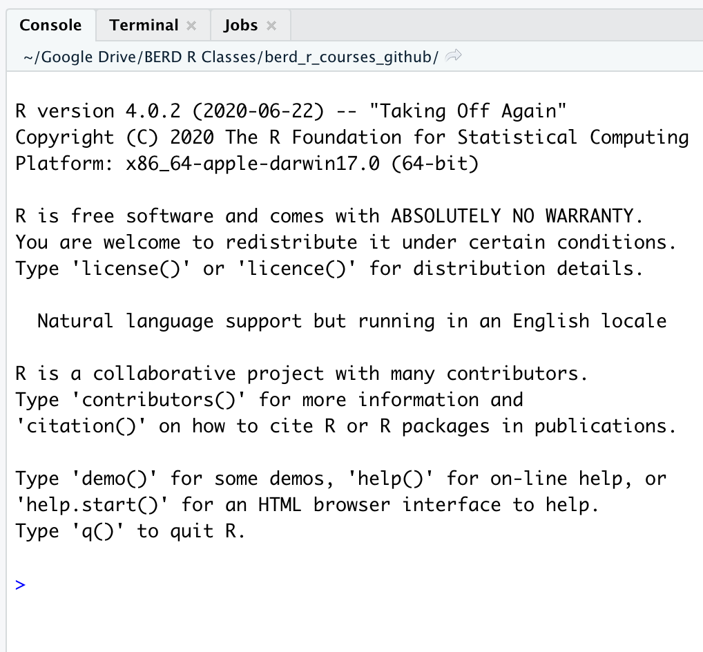
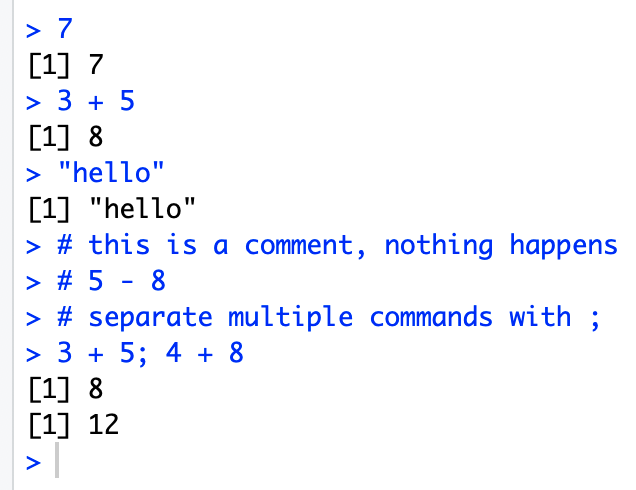

---

class: inverse, middle, center

# Let's code! R Basics


<center><a href="https://github.com/allisonhorst/stats-illustrations"><br>Allison Horst</a></center>

---

# Coding in the console 
 
.pull-left[
When you first open R, the console should be empty.



]


.pull-right[
__Typing and executing code in the console __
* Type code in the console (blue text)
* Press __return__ to execute the code
* Output shown below in black



]

---

# Math calculations using R


.pull-left[
```{r prompt = TRUE, comment = NA}
10^2
3 ^ 7
6/9
9-43
```
]

--

.pull-right[
* Rules for order of operations are followed
* Spaces between numbers and characters are ignored

```{r prompt = TRUE, comment = NA}
4^3-2* 7+9 /2
```


The equation above is computed as $$4^3 − (2 \cdot 7) + \frac{9}{2}$$ 
]


---

# Variables

Variables are used to store data, figures, model output, etc.
.pull-left[
* Can assign a variable using either `=` or `<-`
    - Using `<-` is preferable
    - type name of variable to print
    

Assign just one value:
```{r prompt = TRUE, comment = NA}
x = 5
x
x <- 5
x
```
]

--

.pull-right[
Assign a __vector__ of values:
* Consecutive integers using `:`

```{r prompt = TRUE, comment = NA}
a <- 3:10
a
```

* __Concatenate__ a string of numbers

```{r prompt = TRUE, comment = NA}
b <- c(5, 12, 2, 100, 8)
b
```
]


---

# We can do math with variables

.pull-left[
Math using variables with just one value
```{r prompt = TRUE, comment = NA}
x <- 5
x

x + 3

y <- x^2
y
```
]

--

.pull-right[
Math on vectors of values:  
__element-wise__ computation
```{r prompt = TRUE, comment = NA}
a <- 3:6
a

a+2; a*3

a*a
```
]


---

# Variables can include text (characters)

```{r prompt = TRUE, comment = NA}
hi <- "hello"
hi

greetings <- c("Guten Tag", "Hola", hi)
greetings
```


---

# Using functions

* `mean()` is an example of a function
* functions have "arguments" that are specified within the `()`
* `?mean` in console will show help for `mean()`

.pull-left[
Arguments specified by name:
```{r prompt = TRUE, comment = NA}
mean(x = 1:4)
```

```{r prompt = TRUE, comment = NA}
seq(from = 1, to = 12, by = 3)
seq(by = 3, to = 12, from = 1)
```
]
.pull-right[
Arguments not specified, but listed in order:
```{r prompt = TRUE, comment = NA}
mean(1:4)
```

```{r prompt = TRUE, comment = NA}
seq(1,12,3)
```

]


---


# Common console errors (1/2)
 
__Incomplete commands__ 

.pull-left[
* When the console is waiting for a new command, the prompt line begins with `>`
  + If the console prompt is `+`, then a previous command is incomplete
  + You can finish typing the command in the console window
]
   
.pull-right[
Example:

```{r prompt = TRUE, comment = NA}
3 + (2*6
)
```
]

```{r error=TRUE, echo=FALSE}
# this is not a console example, since the console will prompt for more code with +
# 3 + (2*6
```

---

# Common console errors (2/2)


__Object is not found__

* This happens when text is entered for a non-existent variable (object)

Example:

```{r error=TRUE, prompt = TRUE, comment = NA}
hello
```

* Can be due to missing quotes

```{r error=TRUE, prompt = TRUE, comment = NA}
install.packages(dplyr) # need install.packages("dplyr")
```


