---

class: inverse, middle, center

# Intro to Data

---

# How is data stored, how do we use it?

- Often, data is in an excel sheet, or a plain text file (.csv, .txt)
- .csv files open in Excel automatically, but actually are plain text
- Usually, columns are variables/measures and rows are observations (i.e. a person's measurements)

## Our example data: 

[**Download data csv file** link](http://bit.ly/penguin_data) and pay attention to *where* it downloads on your computer

- Make sure it is a .csv file and not a "web archive" or something else.

**Open the data file `penguins.csv` and look at it**

- What are the columns? What are the rows?


---

# About the penguins data

- A data set about penguins at Palmer Station, Antarctica! More info at [github.com/allisonhorst/palmerpenguins](https://github.com/allisonhorst/palmerpenguins)
- Data were collected and made available by Dr. Kristen Gorman and the Palmer Station, Antarctica LTER, a member of the Long Term Ecological Research Network.
- Each row is a penguin measurement
- Some false missingness was induced for practice in this workshop.

<center></center>


---

# Workflow - Keep it together!

**Steps for a new data analysis project or homework:**

1. Create a folder to contain all your files.
2. Move data file (`penguins.csv`) into this folder.
3. Create an RStudio project inside this folder. (next slides)
4. Create a new Rmd for your analyses/homework.

## Do steps 1 & 2 now!

<center>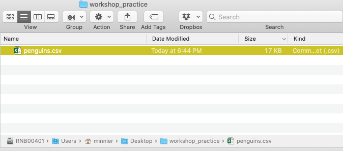</center>


---


# R Projects (.Rproj file) & Good Practices

__Use projects to keep everything together__ ([read this](https://r4ds.had.co.nz/workflow-projects.html))
- A project keeps track of your coding environment and file structure.
- Create an RStudio project for each data analysis project, for each homework assignment, etc.
- A project is associated with a directory folder
    + Keep data files there
    + Keep code scripts there; edit them, run them in bits or as a whole
    + Save your outputs (plots and cleaned data) there
- Only use relative paths, never absolute paths
    + relative (good): `read.csv("data/mydata.csv")`
    + absolute (bad): `read.csv("/home/yourname/Documents/stuff/mydata.csv")`
    
__Advantages of using projects__
- standardizes file paths
- keep everything together
- a whole folder can be easily shared and run on another computer
- when you open the project everything is as you left it


---

# Create a new R project

Let's go through it together. ([Read this for more](https://support.rstudio.com/hc/en-us/articles/200526207-Using-Projects))

.pull-left-60[
- Click 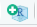 in top left *or* File -> New Project 
- Click *Existing Directory*
- Browse to your folder with the data
- *Optional* Click "Open in new session checkbox"
- Click "Create project"
]
.pull-right-40[
<center>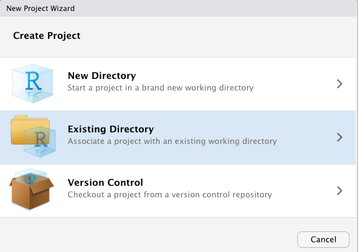</center>

<center>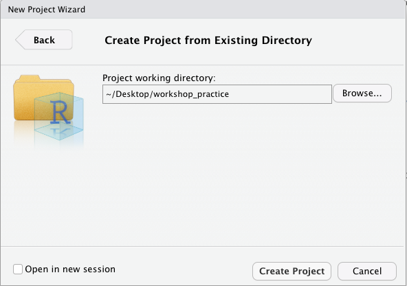</center>
]


**Bonus lessons**

- [Video on projects in R, most useful info in minutes 2:00-13:00](https://rstudio.com/resources/webinars/managing-part-1-projects-in-rstudio/)


---

# The data file will be in your Files pane:

and your workspace folder location will be showing at the top (i.e. `Home/Desktop/workshop_practice`)

<center>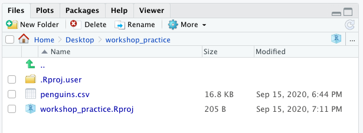</center>

---

# Data in R/Rstudio

**Open `penguins.csv` in Rstudio and look at it**

- Click on `penguins.csv` in the Files pane, click *View File*
<center>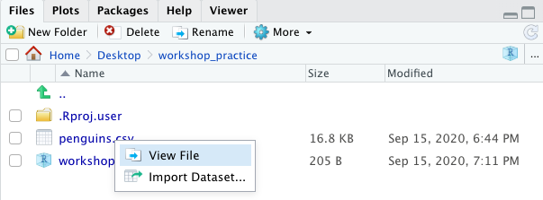</center>

**We will show you how to store and use this data in R as a data frame**

Currently it is still just a file in your folder.
 
---

# To run and save your code: Create a new Rmd!

- Then save it with a meaningful filename.
- You will be prompted to save it in your current working folder.

<center>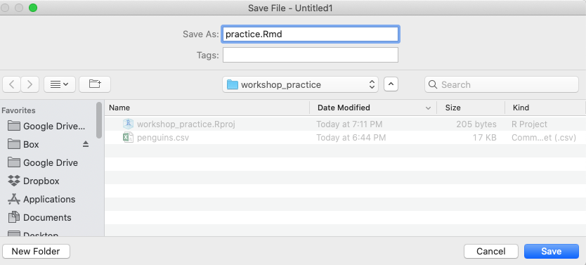</center>

---

# Load the packages we need in the Rmd

Add this code to the setup chunk in the Rmd and run that chunk:

.pull-left[
```{r}
library(tidyverse)
library(janitor)
```
]
.pull-right[
<center>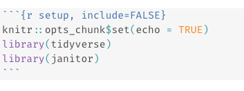</center>
]

Now we can use functions in these packages, such as `read_csv()` and `%>%` and `mutate()` and `tabyl()`


## Remove everything in the Rmd below this code

- Loading library code should always be at the top of your Rmd so you can use these packages in code "lower down"

---

# Load the data set into R

* Create a new code chunk (Code -> insert chunk)
* Read in csv file from file path with code (filepath relative to Rproj directory)
* Copy this code to that code chunk and run it.

```{r, eval=FALSE}
penguins <- read_csv("penguins.csv")
```

```{r, echo=FALSE}
penguins <- read_csv(here::here("01-intro-r-eda","data","penguins.csv"))
mydata <- read_csv(here::here("01-intro-r-eda","data","yrbss.csv"))
```

* Or, open saved file using Import Dataset button in Environment window:   + From Text(readr). 
  + If you use this option, **then copy and paste the importing code to your Rmd** so you have a record of from where and how you loaded the data set.


```{r, eval=FALSE}
# Run in console:
View(penguins) 
# Can also view the data by clicking on its name in the Environment tab
```


<!-- 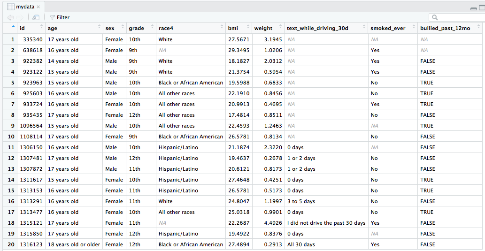 -->

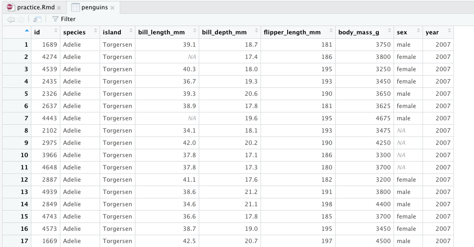

---

# Your Rmd should look something like this:

Try knitting it!

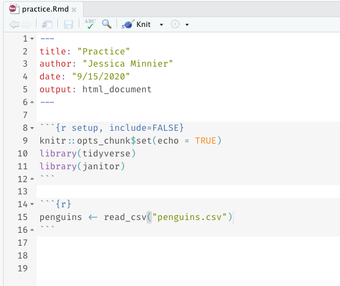


---

# Load a data set: bonus lessons

- [Importing Data, Rstudio support topic](https://support.rstudio.com/hc/en-us/articles/218611977-Importing-Data-with-RStudio)


---

class: inverse, middle, center

# Object types

---

# Data frames (aka "tibbles" in tidyverse)

.pull-left-60[
__Vectors__ vs. __data frames__: a data frame is a collection (or array or table) of vectors

```{r}
penguins
```

]
.pull-right-40[

* Different columns can be of different data types (i.e. numeric vs. text)
* Both numeric and text can be stored within a column (stored together as *text*).

* Vectors and data frames are examples of _**objects**_ in R. 
  + There are other types of R objects to store data, such as matrices, lists.
]


---

# Variable (column) types

type | description
---|---
**double/numeric** | **numbers that are decimals**
**character** | **text, "strings"**
integer | integer-valued numbers
factor | categorical variables stored with levels (groups)
logical | boolean (TRUE, FALSE)

- We will focus on double & character, as most data will be of this type when using `read_csv()` to read in your data sets
- If you see `int` = integer as a column type, you can treat it as a double for most intents and purposes.

<!-- Each variable (column) in a data frame can be of a different type. -->

<!-- * Note that the ID column is _integer_ type since the values are all whole numbers, although we likely would think of it as being a categorical variable and thus prefer it to be a factor. -->

---

# Data structure

* What are the different __variable types__ in this data set?
* What is `NA`?

```{r}
glimpse(penguins)   # structure of data
```

---

# Data set summary

```{r}
summary(penguins)
```

---

# Show (print) whole data frame

Tibble truncates the output to ten rows, so you can't actually see it all.

```{r}
penguins
```

---

# View whole data frame

We showed this already, very handy to see *all* data. Run in console since it's more interactive.

```{r, eval = FALSE}
View(penguins)
```

---

# Data set info

.pull-left-40[
```{r}
dim(penguins)
nrow(penguins)
ncol(penguins)
```
]

.pull-right-60[
```{r}
names(penguins)
```
]


---

# View the beginning of a data set

```{r}
head(penguins)
```

---

# View the end of a data set

```{r}
tail(penguins)
```

---

# Specify how many rows to view at beginning or end of a data set

```{r}
head(penguins, 3)
tail(penguins, 1)
```

---

## Data frame cells, rows, or columns (rarely used)

.pull-left-60[

Specific cell: `DatSetName[row#, column#]`

```{r}
# Second row, Third column
penguins[2, 3]
```

Entire row: `DatSetName[row#, ]`
```{r}
# Second row
penguins[2,]
```
]

.pull-right-40[
Entire col: `DatSetName[, column#]`
```{r}
# Third column
penguins[, 3]
```

]

