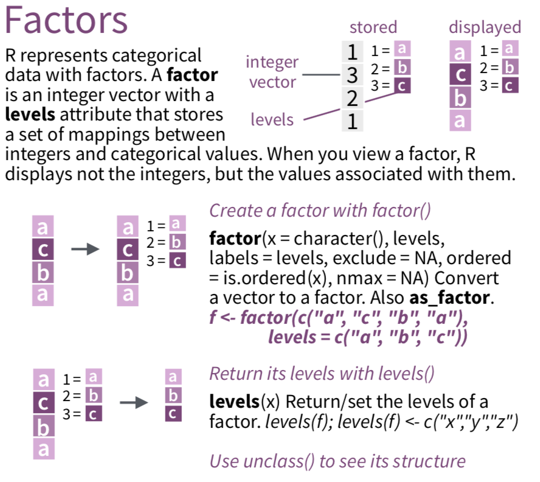

---

# Factors for categorical data

.pull-left-40[
- `factor` is a data type that saves character variables as categories (factor levels)

- Using factor data types are useful for making plots and necessary for some statistical modeling functions

- We recommend using commands from the `forcats` package to work with factor data

- See [`forcats` cheatsheet](https://github.com/rstudio/cheatsheets/raw/master/factors.pdf)
and [`forcats` vignette](https://cran.r-project.org/web/packages/forcats/vignettes/forcats.html)
]
.pull-right-60[
<center></center>
]

---

# Create a factor variable using `factor()`


```{r}
penguins <- penguins %>%
  mutate(sex_fac = factor(sex)) #<<
levels(penguins$sex_fac)  # factor levels are in alphanumeric order by default
penguins %>% select(sex, sex_fac) %>% summary()  # character vs. factor types
penguins %>% select(sex, sex_fac) %>% str()  # str for structure
```


---

# Specify order of factor levels: `fct_relevel()`


```{r}
penguins <- penguins %>%
  mutate(species_fac = factor(species)) #<<

summary(penguins$species_fac)  # levels are in alphanumeric order by default

penguins <- penguins %>%
  mutate(species_fac = fct_relevel(species_fac,   #<<
                                   c("Adelie", "Gentoo", "Chinstrap"))) #<<

summary(penguins$species_fac)  # levels are specified order
```


---

# Collapse factor levels

```{r}
penguins <- penguins %>%
  mutate(species_fac2 = fct_collapse(species_fac, # collapse levels #<<
                                    Adelie = c("Adelie"), #<<
                                    Other = c("Gentoo", "Chinstrap")) #<<
         )

penguins %>% select(species_fac, species_fac2) %>% summary()
penguins %>% tabyl(species_fac, species_fac2) 
```
