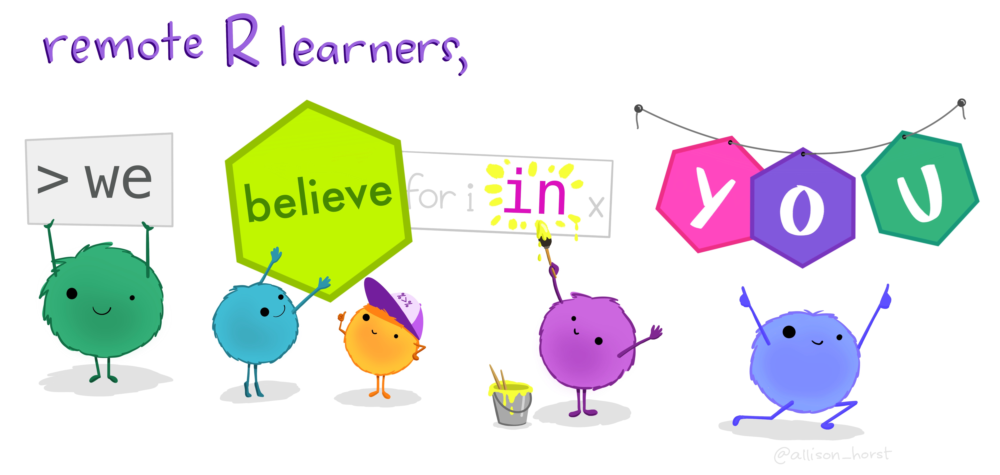
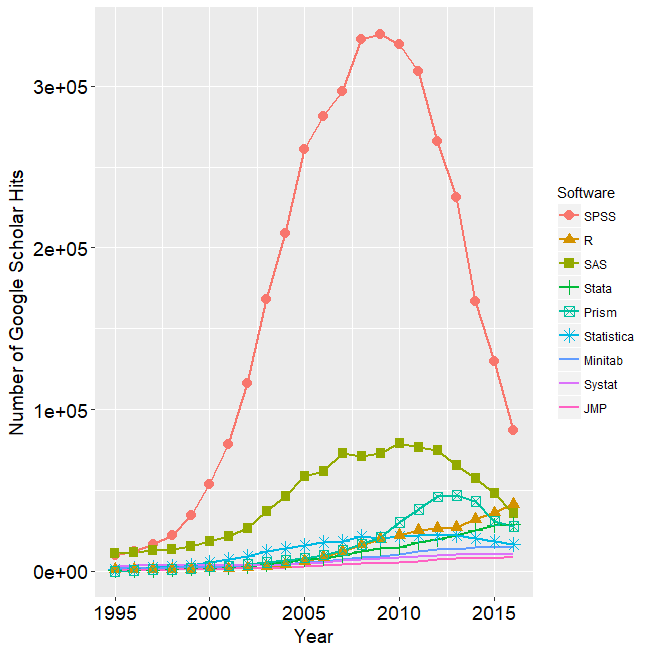
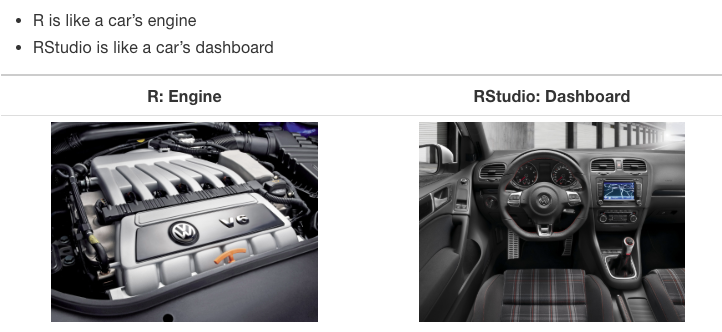
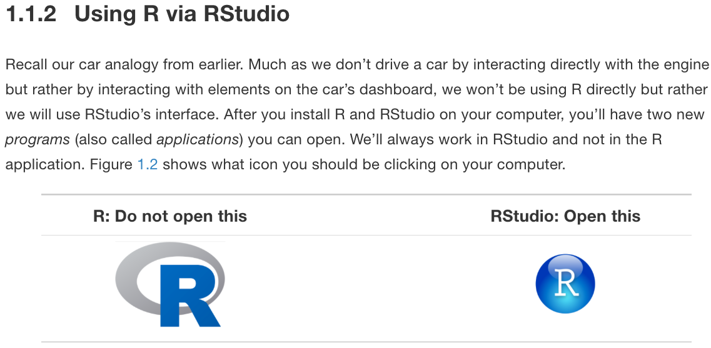

### Do this now:

1. **Open html slides**: [bit.ly/berd_intro_part1](http://bit.ly/berd_intro_part1)
  + You will be able to copy and paste code/links from here

1. Make sure you have already **installed R & Rstudio**
  + instructions here [bit.ly/berd_install](http://bit.ly/berd_install)
  + If you need help, let us or a helper know

1. **Open google doc** for asking questions: [bit.ly/berd_doc](https://bit.ly/berd_doc)
  + Helpers will be monitoring this, you can ask questions, copy code or screenshots.

---

### Zoom rules (note: we are recording):

1. **[Change your name in Zoom](https://teaching.nmc.edu/knowledgebase/changing-your-name-in-a-zoom-meeting/)** to a made up name/animal/word if you *do not want your name in recording* 
  + Show participants list, next to your name click Rename

1. **Turn off your video** to save bandwidth, and for recording privacy. If you prefer to have video on during breakout rooms, go ahead!

1. Asking questions: **No private messages to instructors**, we won’t see them. **Chat message everyone or “Helpers” for help or to go to a breakout room**. You may also unmute yourself during lecture. 

1. **Breakout rooms** are for getting help with R or with exercises in smaller groups.
    + The # of your breakout room corresponds to “your” helper. During breaks and exercises, helpers will be in breakout rooms.
    + You won’t be able to see what is going on in the main room while you are in your breakout room.
    + You can stay in main room during exercises if you prefer, and can ask questions to the presenters in the main room during that time.

---

# Learning Objectives

.pull-left[
- Basic operations in R/RStudio
- Understand data structures
- Be able to load in data
- Basic operations on data
]
.pull-right[
- Some data wrangling
- Use Rstudio projects
- Be able to make a plot
- Basics of tidyverse and ggplot
- Know how to get help
]

<center><a href="https://github.com/allisonhorst/stats-illustrations"><br>Allison Horst</a></center>
---
class: center, inverse, middle

# Introduction

Rrrrrr?

---

# What is R? 

.pull-left-60[
- A programming language
- Focus on statistical modeling and data analysis
    + import data, manipulate data, run statistics, make plots
- Useful for "Data Science"
- Great visualizations
- Also useful for most anything else you'd want to tell a computer to do
- Interfaces with other languages i.e. python, C++, bash

]


.pull-right-40[

]


For the history and details: [Wikipedia](https://bit.ly/1efFmaY)

- an interpreted language (run it through a command line)
- procedural programming with functions
- Why "R"?? Scheme (?) inspired S (invented at Bell Labs in 1976) which inspired R (**free and open source!** in 1992)

---

# Why R?
.pull-left[
- Free + Cross-platform (Mac/Windows)
- Flexible, fun, many more modern statistics methods, large community for learning and help
- One of the most popular data science tools for statistics in academia and industry
- SAS and STATA (and SPSS) are still used but becoming less popular (expensive, not as versatile/comprehensive)
- Constantly evolving and improving
- If you want a job doing stats and not be limited to specific research groups or some pharma companies, you absolutely *need to know R*
]

.pull-right[

<center><a href="http://r4stats.com/articles/popularity/"><br>r4stats Robert A. Muenchen</a></center>
]

---

# What is RStudio?

.pull-left[
R is a programming language]
.pull-right[
RStudio is an integrated development environment (IDE) = an interface to use R (with perks!)
]

<center><a href="https://moderndive.com/1-getting-started.html#r-rstudio"><br>Modern Dive</a></center>

---

# Start RStudio


<center><a href="https://moderndive.com/1-getting-started.html#using-r-via-rstudio"><br>Modern Dive</a></center>
---

<center><a href="http://www-users.york.ac.uk/~er13/17C%20-%202018/pracs/01IntroductionToModuleAndRStudio.html#what_are_r_and_rstudio"><br>Emma Rand</a></center>

---

# RStudio demo

- Start RStudio and explore


**Bonus lessons**

- [gifs showing how to adjust panels, personalize how Rstudio looks, etc](https://www.pipinghotdata.com/posts/2020-09-07-introducing-the-rstudio-ide-and-r-markdown/#background)

---

# Installing and using packages

- Packages are to R like apps are to your phone/OS
- Packages contain additional functions and data
- Install packages with `install.packages()`
  + Also can use the "Packages" tab in Files/Plots/Packages/Help/Viewer window
  + *Only install once (unless you want to update)*
  + Installs from [Comprehensive R Archive Network (CRAN)](https://cran.r-project.org/) = package mothership

```{r, eval = FALSE}
install.packages("dplyr")   # only do this ONCE, use quotes
```

- Load packages: At the top of your script include `library()` commands to load each required package *every* time you open Rstudio.

```{r}
library(dplyr)    # run this every time you open Rstudio
```
