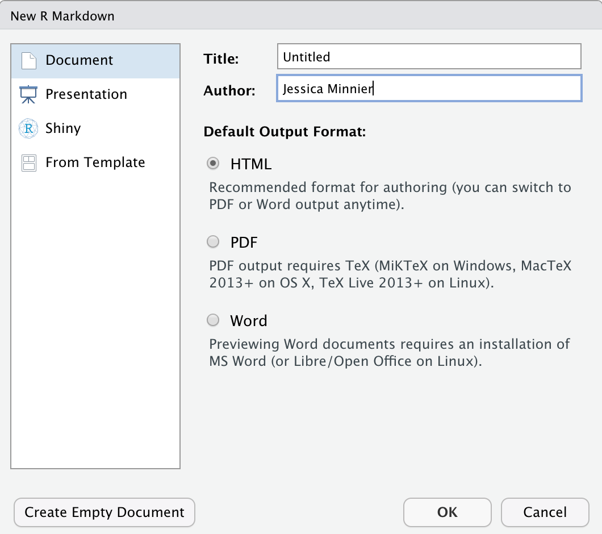
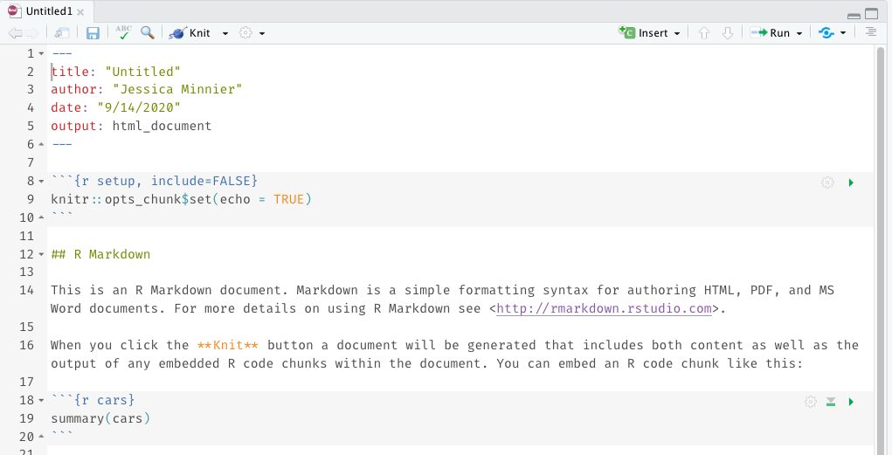
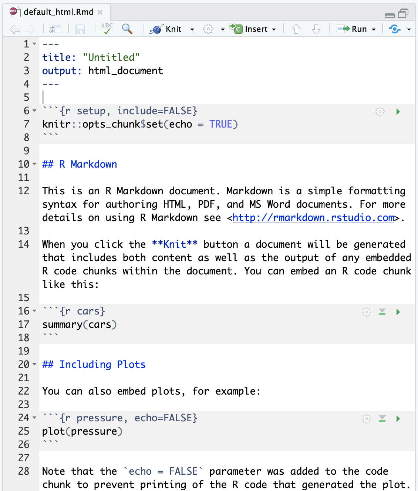
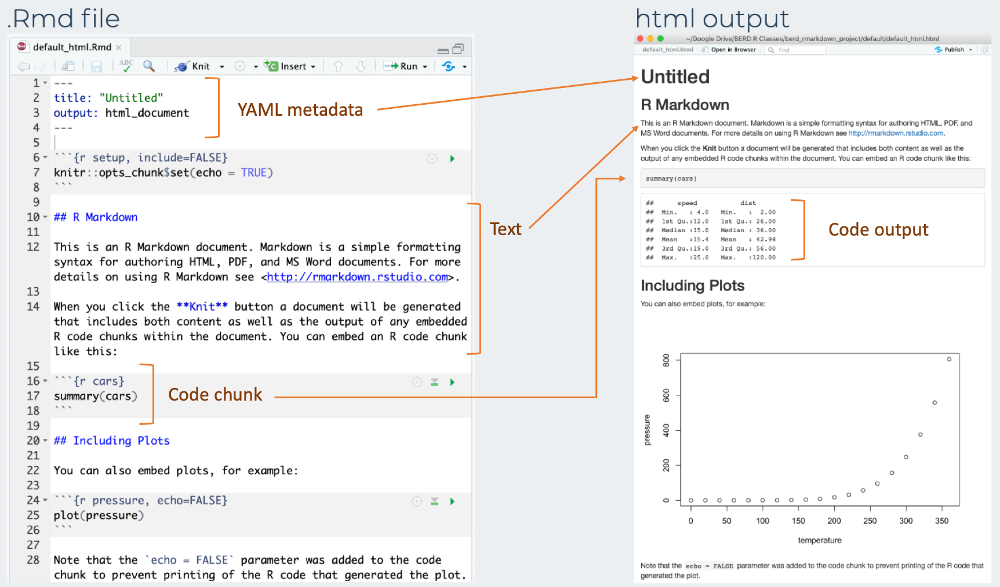
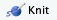
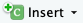
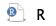
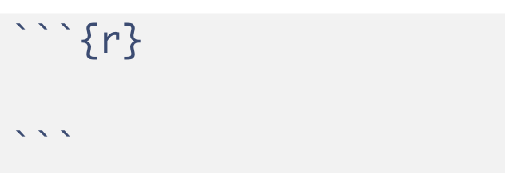
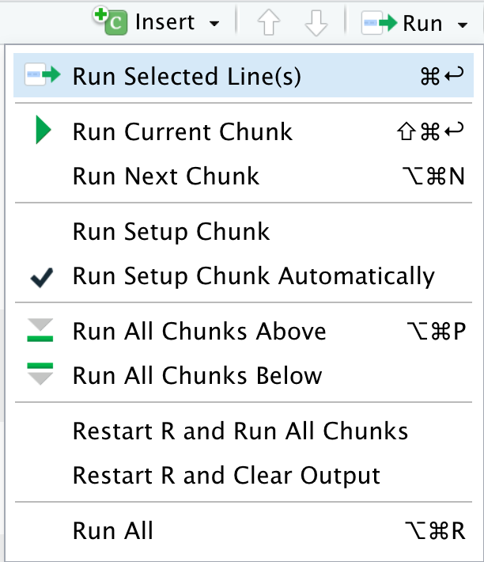
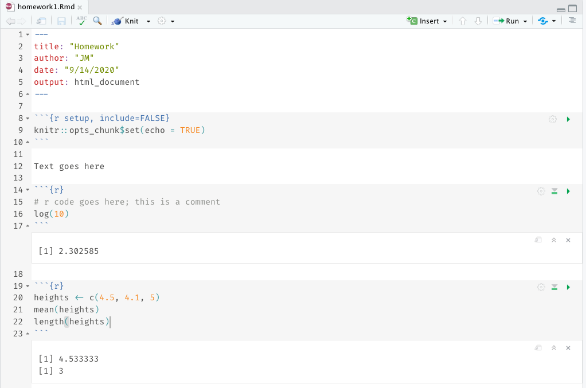

---

class: inverse, center, middle

# Coding with R Markdown (Rmd)

## or, creating reproducible reports

<center><a href="https://github.com/allisonhorst/stats-illustrations"><br>Allison Horst</a></center>

---

#  Create an R Markdown file (`.Rmd`) 

<!-- * Note that both of these options show the keyboard shortcut for your operating system   -->
    
Two options:
1. click on File $\rightarrow$ New File $\rightarrow$ R Markdown $\rightarrow$ OK , or
1. in upper left corner of RStudio click on   $\rightarrow$ 

.pull-left[
Pop-up window:
* Enter a title and your name
* Keep default HTML output format
* Then click OK

<!--    -->
<center></center>

]
   
.pull-right[
* You should then see the following text in your editor window:


<!-- img src="img/01_rmd_screenshot.png" width="60%" height="100%"> -->
]


---

# Save the Markdown file (`.Rmd`)

* __Save the file__ by 
    + selecting `File -> Save`, 
    + or clicking on  (towards the left above the scripting window),
    + or keyboard shortcut
        * PC:   _Ctrl + s_
        * Mac:   _Command + s_
        

* You will need to specify
    + a __filename__ to save the file as
        - ALWAYS use __.Rmd__ as the filename extension for R markdown files
    + the __folder__ to save the file in


---

# Compare the .Rmd file with its html output 

.pull-left[
.Rmd file

]

.pull-right[
html output  

]

---

# Compare the .Rmd file with its html output 

<center></center>


---

# How to create the html file? _Knit_ the .Rmd file! 

<!-- *Before knitting the .Rmd file, you must first **save it**. * -->

To **knit** the .Rmd file, either
1. click on the knit icon  at the top of the editor window 
1. or use keyboard shortcuts
    * Mac: *Command+Shift+K* 
    * PC:  *Ctrl+Shift+K*

* A new window will open with the html output.
* You will now see both .Rmd and .html files in the folder where you saved the .Rmd file.

__Note:__
* The template .Rmd file that RStudio creates will knit to an html file by default


---


# 3 types of R Markdown content

1. <span style="color:darkorange">__Code chunks__</span>: type R code and execute it to see code output
2. __Text__: write about your analyses
3. __YAML metadata__: customize the report

* This workshop will focus on using <span style="color:darkorange">code chunks</span>. 
* Watch the [Reproducible Reports with R Markdown](https://github.com/jminnier/berd_r_courses) workshop for  customization options and different output formats (Word, pdf, slides).
    + Slides at https://jminnier-berd-r-courses.netlify.com/03-rmarkdown/03_rmarkdown_slides.html.


---

# Create a code chunk

Code chunks can be created by either

1. Clicking on  $\rightarrow$  at top right of the editor window, or

1. __Keyboard shortcut__
  * Mac:   _Command + Option + I_
  * PC:   _Ctrl + Alt + I_

* An empty code chunk looks like this:

<center></center>  

<!--  -->

* Note that a code chunks start with ` ```{r} ` and ends with ` ``` `.  


---

# Enter and run code (1/n)


.pull-left[
* __Type R code__ inside code chunks 
* __Select code__ you want to run, by 
    - placing the cursor in the line of code you want to run, 
    - __*or*__ highlighting the code you want to run
* __Run selected code__ by
    - clicking on the  button in the top right corner of the scripting window and choosing "Run Selected Line(s)", 
    - or typing one of the following key combinations:
          + __Windows__:  __ctrl + return__
          + __Mac__:  __command + return__
]

.pull-right[
<center></center>  
<center></center>  
]


---

# Enter and run code (2/n)

.pull-left-40[
* __Run all code__ in a chunk by
    - by clicking the play button in the top right corner of the chunk

* The code output appears below the code chunk

]

.pull-right-60[
<center></center>
]


---

# Useful keyboard shortcuts

.pull-left-60[

action | mac | windows/linux
---| ---| ---
Run code in Rmd or script | cmd + enter | ctrl + enter 
`<-`| option + - | alt + -
]
.pull-right-40[
Try typing in Rmd (with shortcut) and running
```{r, eval=FALSE}
y <- 5
y
```
]

## Others: ([see full list](https://support.rstudio.com/hc/en-us/articles/200711853-Keyboard-Shortcuts))

action | mac | windows/linux
---| ---| ---
interrupt currently executing command | esc | esc
in console, go to previously run code | up/down | up/down
keyboard shortcut help | option + shift + k | alt + shift + k
