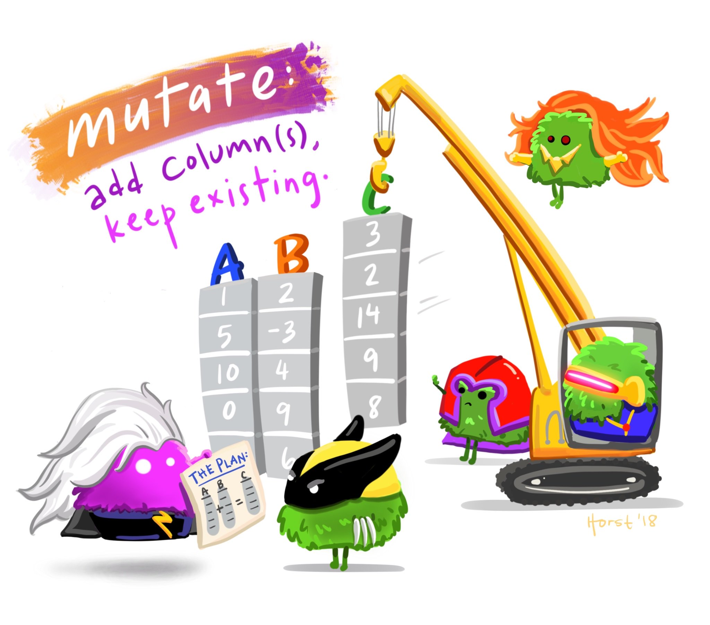

---

class: center, middle, inverse

# Data Wrangling

<center><a href="https://github.com/allisonhorst/stats-illustrations"><br>Allison Horst</a></center>


---

class: center, middle, inverse

# Subsetting data


[tidyverse data wrangling cheatsheet](https://www.rstudio.com/wp-content/uploads/2015/02/data-wrangling-cheatsheet.pdf)


---

# `filter()` rows that satisfy specified conditions

<center><a href="https://github.com/allisonhorst/stats-illustrations"><br>Allison Horst</a></center>


---

# `filter()` options

Subset rows of data by specifying conditions within `filter()`
.pull-left-40[
- math: `>`,  `<`,  `>=`,  `<=`
-  double = for "is equal to":  `==`
-  `&` (and) 
-  `|` (or)
- != (not equal)
]
.pull-right-60[
- `is.na()` to filter based on missing values
- `%in%` to filter based on group membership
- `!` in front negates the statement, as in 
    + `!is.na(sex)` 
    + `!(species %in% c("Adelie", "Gentoo"))`
]


```{r}
penguins %>% filter(bill_length_mm > 55)
```


---

# `filter()` practice

What do these commands do? Try them out:

```{r, eval=FALSE}
penguins %>% filter(island == "Torgersen")
penguins %>% filter(bill_length_mm/bill_depth_mm > 3)    # can do math
penguins %>% filter((body_mass_g < 3000) | (body_mass_g > 6000))

# filter on multiple variables:
penguins %>% filter(body_mass_g < 3000, bill_depth_mm < 20, sex == "female") 
penguins %>% filter(body_mass_g < 3000 & bill_depth_mm < 20 & sex == "female") 
penguins %>% filter(body_mass_g < 3000 | bill_depth_mm < 20 | sex == "female") 

penguins %>% filter(year == 2008)      # note the use of == instead of just =
penguins %>% filter(sex == "female")

penguins %>% filter(!(species == "Adelie"))
penguins %>% filter(species %in% c("Chinstrap", "Gentoo"))

penguins %>% filter(is.na(sex))
penguins %>% filter(!is.na(sex))
```

---

# `select()` columns

- select columns (variables)
- no quotes needed around variable names
- can be used to rearrange columns
- syntax is flexible and has many options

```{r}
penguins %>% select(id, island, species, body_mass_g)
```

---

# Column selection syntax options

There are many ways to select a set of variable names (columns):

- `var1:var20`: all columns from `var1` to `var20`
- __Removing columns__
    + `-var1`: remove the column`var1`
    + `-(var1:var20)`: remove all columns from `var1` to `var20`
- __Select by specifying text within column names__
    + `contains("mm")`, `contains("_")`: all variable names that contain the specified string
    + `starts_with("a")` or `ends_with("last")`: all variable names that start or end with the specified string

See other examples in the [data wrangling cheatsheet](https://www.rstudio.com/wp-content/uploads/2015/02/data-wrangling-cheatsheet.pdf).


---

# `select()` practice

Which columns are selected & in what order using these commands?  
First guess and then try them out.

```{r, eval=FALSE}
penguins %>% select(id:bill_length_mm)

penguins %>% select(where(is.character))
penguins %>% select(where(is.numeric))

penguins %>% select(-id,-species)
penguins %>% select(-(id:island))

penguins %>% select(contains("bill"))
penguins %>% select(starts_with("s"))
penguins %>% select(-contains("mm"))

```


---

# `relocate()` columns to move them around

<center><a href="https://github.com/allisonhorst/stats-illustrations"><br>Allison Horst</a></center>


---

# `relocate()` columns

- change the order of columns in dataset
- default action is to list specified column names first
- no quotes needed around variable names
- similar options as with `select()`, plus special ones such as `.before` and `.after`

```{r}
penguins %>% relocate(year, body_mass_g)
```

---

# `relocate()` practice

What order are the columns in using these commands?  
First guess and then try them out.

```{r, eval=FALSE}
penguins %>% relocate(species:bill_length_mm)

penguins %>% relocate(where(is.character))
penguins %>% relocate(where(is.numeric))

penguins %>% relocate(flipper_length_mm,.before = bill_length_mm)
penguins %>% relocate(species, .after = island)
penguins %>% relocate(species, .after = last_col())
```


---

# Save your modified data

* Use a new variable name and the `<-` assignment operator to save a modified data frame
* You can save the modified data using the same name, but it will replace the previous dataset

```{r}
penguins_sub <- penguins %>% select(id:island, sex)
penguins_sub
```

---

class: center, middle, inverse

# Make new variables

<center></center>

[Alison Horst](https://github.com/allisonhorst/stats-illustrations)

---

# `mutate()` the data

Use `mutate()` to add new columns to a tibble
* Many options for how to define new column of data

```{r}
penguins <- penguins %>% 
   mutate(bill_ratio = bill_length_mm / bill_depth_mm)   #<<
# use = (not <- or ==) to define new variable

penguins %>% select(bill_ratio, bill_length_mm, bill_depth_mm)
```


---

# `mutate()` practice

What do the following commands do?  
First guess and then try them out.

```{r, eval=FALSE}
penguins <- penguins %>% mutate(bill_long = (bill_length_mm > 45))

penguins <- penguins %>% mutate(male = (sex == "male"))
penguins <- penguins %>% mutate(male2 = 1 * (sex == "male"))
```


---

# `rename()` columns

* `rename(new_name = old_name)`

.pull-left[
Code renames the column, but just prints output without saving the rename:
```{r}
# This does not save the new name
penguins %>% rename(record = id)
```
]
.pull-right[

Code renames the column *and* overwrites `penguins` with renamed column:

```{r}
penguins2 <- penguins %>% #<<
    rename(record = id)
penguins2
```
]