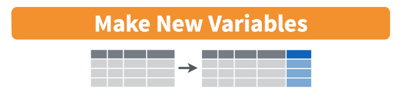

---

class: center, middle, inverse

# Subsetting data


[tidyverse data wrangling cheatsheet](https://www.rstudio.com/wp-content/uploads/2015/02/data-wrangling-cheatsheet.pdf)


---

# `filter()` $\sim$ rows

filter data based on rows
.pull-left-40[
- math: `>`,  `<`,  `>=`,  `<=`
-  double = for "is equal to":  `==`
-  `&` (and) 
-  `|` (or)
- != (not equal)
]
.pull-right-60[
- `is.na()` to filter based on missing values
- `%in%` to filter based on group membership
- `!` in front negates the statement, as in 
    + `!is.na(age)` 
    + `!(grade %in% c("9th","10th"))`
]


```{r}
mydata %>% filter(bmi > 20)
```


---

# `filter()` practice

What do these commands do? Try them out:

```{r, eval=FALSE}
mydata %>% filter(age == "14 years old")
mydata %>% filter(bmi/weight_kg < 0.5)    # can do math
mydata %>% filter((bmi < 15) | (bmi > 25))
mydata %>% filter(bmi < 20, weight_kg < 60, sex == "Female") # filter on multiple variables

mydata %>% filter(id == 923122)      # note the use of == instead of just =
mydata %>% filter(sex == "Female")
mydata %>% filter(!(grade == "9th"))
mydata %>% filter(grade %in% c("10th", "11th"))

mydata %>% filter(is.na(bmi))
mydata %>% filter(!is.na(bmi))
```

---

# `select()` $\sim$ columns

- select columns (variables)
- no quotes needed around variable names
- can be used to rearrange columns
- uses special syntax that is flexible and has many options

```{r}
mydata %>% select(id, grade)
```

---

# Column selection syntax options

There are many ways to select a set of variable names (columns):

- `var1:var20`: all columns from `var1` to `var20`
- `one_of(c("a", "b", "c"))`: all columns with names in the specified character vector of names
- __Removing columns__
    + `-var1`: remove the column`var1`
    + `-(var1:var20)`: remove all columns from `var1` to `var20`
- __Select using text within column names__
    + `contains("date")`, `contains("_")`: all variable names that contain the specified string
    + `starts_with("a")` or `ends_with("last")`: all variable names that start or end with the specificed string
- __Rearranging columns__
    + use `everything()` to select all columns not already named
    + example: `select(var1, var20, everything())` moves the column `var20` to the second position

See other examples in the [data wrangling cheatsheet](https://www.rstudio.com/wp-content/uploads/2015/02/data-wrangling-cheatsheet.pdf).


---

# `select()` practice

Which columns are selected & in what order using these commands?  
First guess and then try them out.

```{r, eval=FALSE}
mydata %>% select(id:sex)
mydata %>% select(one_of(c("age","weight_kg")))

mydata %>% select(-grade,-sex)
mydata %>% select(-(id:sex))

mydata %>% select(contains("race"))
mydata %>% select(starts_with("r"))
mydata %>% select(-contains("r"))

mydata %>% select(id, race4, everything())
```

---

class: center, middle, inverse

# Changing the data

<center></center>

[Alison Horst](https://github.com/allisonhorst/stats-illustrations)

---

# Save a new data frame, or overwrite existing one

Use a new variable name on left side of `<-` assignment to save updated data frames:

```{r}
mydata_new <- mydata %>% select(id:sex)
mydata_new
```

---

# `rename()` $\sim$ columns

- renames column variables
- `%>% rename(new_name = old_name)`

.pull-left[
Renames the column, just prints the output
```{r}
# This does not save the new name
mydata %>% rename(record = id)
```
]
.pull-right[

Renames the column *and* overwrites `mydata` with renamed column:

```{r}
mydata <- mydata %>% rename(record = id)
mydata
```
]

---

# Make new variables


[tidyverse data wrangling cheatsheet](https://www.rstudio.com/wp-content/uploads/2015/02/data-wrangling-cheatsheet.pdf)


---

# `mutate()`

Use `mutate()` to add new columns to a tibble
* many options in how to define new column of data


```{r}
newdata <- mydata %>% 
   mutate(height_m = sqrt(weight_kg / bmi))   # use = (not <- or ==) to define new variable

newdata %>% select(bmi, weight_kg, height_m)
```


---

# `mutate()` practice

What do the following commands do?  
First guess and then try them out.

```{r, eval=FALSE}
mydata %>% mutate(bmi_high = (bmi > 30))

mydata %>% mutate(male = (sex == "Male"))
mydata %>% mutate(male = 1 * (sex == "Male"))

mydata %>% mutate(grade_num = as.numeric(str_remove(grade, "th")))
```

