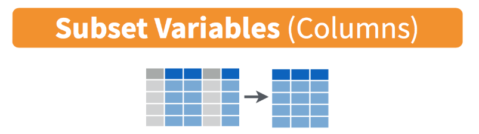

layout: true
  
<!-- <div class="my-footer"><span>bit.ly/berd_tidy</span></div>  -->

---

```{r setup, include=FALSE}
options(htmltools.dir.version = FALSE)

library(tidyverse)
library(lubridate)
library(janitor)

knitr::opts_chunk$set(
  warning=FALSE, 
  message=FALSE, 
  #fig.width=10.5, 
  #fig.height=4,
  fig.align = "center",
  rows.print=7,
  echo=TRUE,
  highlight = TRUE,
  prompt = FALSE, # IF TRUE adds a > before each code input
  comment = NA # PRINTS IN FRONT OF OUTPUT, default is '##' which comments out output
  #comment=NA
  )

# set ggplot theme
theme_set(theme_bw(base_size = 24))
```


```{r xaringan-themer, include = FALSE}
# creates xaringan theme
# devtools::install_github("gadenbuie/xaringanthemer")
library(xaringanthemer)
mono_light(
  base_color =  "#3A6185", ## OHSU Marquam
  code_highlight_color = "#c0e8f5",
  link_color = "#38BDDE",
  header_font_google = google_font("Josefin Sans"),
  text_font_google   = google_font("Montserrat", "300", "300i","400i","700"),
  code_font_google   = NULL,
  text_font_size = "24px",
  code_font_size = "20px",
  header_h1_font_size = "45px",
  header_h2_font_size = "40px",
  header_h3_font_size = "35px",
  padding = "0em 2em 1em 2em",
  outfile = "css/xaringan-themer.css"
)
```


# Load files for today's workshop

.pull-left[
- Open the slides of this workshop: [bit.ly/berd_tidy]()
- Open the pre-workshop homework: [find it here](https://jminnier-berd-r-courses.netlify.com/02-data-wrangling-tidyverse/02_pre_course_homework.html)
- Dowlonad & open the HW project file `berd_tidyverse_project.Rproj`
- Open a new script and run the commands to the right
]

.pull-right[
`# install.packages("tidyverse")`  
`library(tidyverse)`  
`library(lubridate)`  
`demo_data <- read_csv("data/yrbss_demo.csv")`
]

<center></center>[Allison Horst](https://github.com/allisonhorst/stats-illustrations)

---

# Learning objectives

<!-- TO-DO: update after finishing rest of slides -->

Part 1:
- What is data wrangling?
- A few good practices in R/RStudio
- What is tidy data?
- What is tidyverse?
- Reshape and manipulate data frames

Part 2:
- Some data cleaning


---

class: center, middle, inverse

# Getting started

<center></center>

[Alison Horst](https://github.com/allisonhorst/stats-illustrations)


---

# What is data wrangling?

.pull-left[
- "data janitor work"
- importing data
- cleaning data
- changing shape of data
]
.pull-right[
- fixing errors and poorly formatted data elements
- transforming columns and rows
- filtering, subsetting
]


<center></center>

[G. Grolemond & H. Wickham's R for Data Science](https://r4ds.had.co.nz/introduction.html)

---

# Good practices in RStudio

__Use projects__ ([read this](https://r4ds.had.co.nz/workflow-projects.html))
- Create an RStudio project for each data analysis project
- A project is associated with a directory folder
    + Keep data files there
    + Keep scripts there; edit them, run them in bits or as a whole
    + Save your outputs (plots and cleaned data) there

- Only use relative paths, never absolute paths
    + relative (good): `read_csv("data/mydata.csv")`
    + absolute (bad): `read_csv("/home/yourname/Documents/stuff/mydata.csv")`
    
__Advantages of using projects__
- standardize file paths
- keep everything together
- a whole folder can be shared and run on another computer


---

# Useful keyboard shortcuts

.pull-left[
action | mac | windows/linux
---| ---| ---
run code in script | cmd + enter | ctrl + enter 
`<-`| option + - | alt + -
`%>%` | cmd+shift+m | ctrl + shift + m
]
.pull-right[
Try typing and running
```{r, eval=FALSE}
y <- 5
y
```

Now, in the console, press the up arrow.

<!-- TO-DO: can we add a comment that %>% will be covered later in slides? -->
<!-- TO-DO: can we make pull left wider so that cmd+shift+m can include spaces? -->


]
## Others: ([see list](https://support.rstudio.com/hc/en-us/articles/200711853-Keyboard-Shortcuts))

action | mac | windows/linux
---| ---| ---
interrupt currently executing command | esc | esc
in console, go to previously run code | up/down | up/down
keyboard shortcut help | option+shift+k | alt+shift+k

---

class: center, middle, inverse

# Tibbles

<center></center>

[hexbin](https://pkg.earo.me/hexbin/)

---

# Data frames vs. tibbles

.pull-left[
Previously we learned about *data frames*
```{r}
data.frame(name = c("Sarah","Ana","Jose"), 
           rank = 1:3,
           age = c(35.5, 25, 58),
           city = c(NA,"New York","LA"))
```
]
.pull-right[
A *tibble* is a data frame but with perks
```{r}
tibble(name = c("Sarah","Ana","Jose"), 
       rank = 1:3,
       age = c(35.5, 25, 58),
       city = c(NA,"New York","LA"))
```
]

How are these two datasets different?


---

# Import data as a data frame (try this)


Base R functions import data as data frames (`read.csv`, `read.table`, etc)

```{r}
mydata_df <- read.csv("data/small_data.csv")
mydata_df
```

---

# Import data as a tibble (try this)

`tidyverse` functions import data as tibbles (`read_csv`, `read_excel()`, etc)

```{r}
mydata_tib <- read_csv("data/small_data.csv")
mydata_tib
```

---

# Compare & contrast data frame and tibble

__Run the code below__

data frame

```{r, results=FALSE}
glimpse(mydata_df)
str(mydata_df)       # How are glimpse() and str() different?
head(mydata_df)
summary(mydata_df)
class(mydata_df)     # What information does class() give?
```


tibble 

```{r, results=FALSE}
glimpse(mydata_tib)
str(mydata_tib)       
head(mydata_tib)
summary(mydata_tib)
class(mydata_tib)     
```


---

# Tibble perks


Viewing tibbles:
- variable types are given (character, factor, double, integer, boolean, date)
- number of rows & columns shown are limited for easier viewing


Other perks:
- tibbles can typically be used anywhere a `data.frame` is needed
- `read_*()` functions don't read character columns as factors (no surprises)


---

class: center, middle, inverse

# Tidy Data


[Allison Horst](https://github.com/allisonhorst/stats-illustrations)

---

# What are tidy data?

1. Each variable forms a column
2. Each observation forms a row 
3. Each value has its own cell


[G. Grolemond & H. Wickham's R for Data Science](https://r4ds.had.co.nz/tidy-data.html)

---

# Untidy data: example 1

```{r}
untidy_data <- tibble(
  name = c("Ana","Bob","Cara"),
  meds = c("advil 500mg 2xday","tylenol 1000mg 1xday", "advil 200mg 3xday")
)
untidy_data
```

---

# Tidy data: example 1

You will learn how to do this!
```{r}
untidy_data %>% 
  separate(col = meds, into = c("med_name","dose_mg","times_per_day"), sep=" ") %>%
  mutate(times_per_day = as.numeric(str_remove(times_per_day, "xday")),
         dose_mg = as.numeric(str_remove(dose_mg, "mg")))
```


---

# Untidy data: example 2

```{r}
untidy_data2 <- tibble(
  name = c("Ana","Bob","Cara"),
  wt_07_01_2018 = c(100, 150, 140),
  wt_08_01_2018 = c(104, 155, 138),
  wt_09_01_2018 = c(NA, 160, 142)
)
untidy_data2
```


---

# Tidy data: example 2

You will learn how to do this!
```{r}
untidy_data2 %>% 
  gather(key = "date", value = "weight", -name) %>%
  mutate(date = str_remove(date,"wt_"),
         date = dmy(date))     # dmy() is a function in the lubridate package
```


---

class: center, middle, inverse

# How to tidy?


[Allison Horst](https://github.com/allisonhorst/stats-illustrations)

---

# Tools for tidying data

- `tidyverse` functions
    + `tidyverse` is a suite of packages that implement `tidy` methods for data importing, cleaning, and wrangling  
    + load the `tidyverse` packages by running the code `library(tidyverse)` 
        * see pre-workshop homework for code to install `tidyverse`

- Functions to easily work with rows and columns, such as
    + subset rows/columns
    + add new rows/columns
    + split apart or unite columns
    + join together different data sets (part 2)
    + make data _long_ or _wide_ (part 2)

- Often many steps to tidy data
    + string together commands to be performed sequentially 
    + do this using pipes `%>%`


<!-- TO-DO: are we adding new rows in this talk?-->

---

# How to use the pipe `%>%`

The pipe operator `%>%` strings together commands to be performed sequentially

```{r}
mydata_tib %>% head(n=3)      # prounounce %>% as "then"
```

- Always _first list the tibble_ that the commands are being applied to
- Can use __multiple pipes__ to run multiple commands in sequence
    + What does the following code do?

```{r, eval=FALSE}
mydata_tib %>% head(n=3) %>% summary()
```


---

# About the data

Data from the CDC's [Youth Risk Behavior Surveillance System (YRBSS) ](https://www.cdc.gov/healthyyouth/data/yrbs/index.htm)

- complex survey data
- national school-based survey 
    + conducted by CDC and state, territorial, and local education and health agencies and tribal governments
- monitors six categories of health-related behaviors 
    + that contribute to the leading causes of death and disability among youth and adults 
    + including alcohol & drug use, unhealthy & dangerous behaviors, sexuality, and physical activity
    + see [Questionnaires](https://www.cdc.gov/healthyyouth/data/yrbs/questionnaires.htm)
- the data in `yrbss_demo.csv` are a subset of data in the R package [`yrbss`](https://github.com/hadley/yrbss), which includes YRBSS from 1991-2013

- Look at your _Environment_ tab to make sure `demo_data` is already loaded

```{r, results=FALSE}
demo_data <- read_csv("data/yrbss_demo.csv")
```


---

class: center, middle, inverse

# Subsetting data




[tidyverse data wrangling cheatsheet](https://www.rstudio.com/wp-content/uploads/2015/02/data-wrangling-cheatsheet.pdf)


---

# `filter()` $\sim$ rows

filter data based on rows

.pull-left[
- math: `>`,  `<`,  `>=`,  `<=`
-  double = for "is equal to":  `==`
-  `&` (and) 
-  `|` (or)
]
.pull-right[
- `!` in front negates the statement, as in `!=` or `!(grade=="9th")`
- `is.na()` function to filter based on missing values
- `%in%` to filter based on group membership
]


```{r}
demo_data %>% filter(bmi > 20)
```


---

# Compare to base R

.pull-left[

- __Bracket method__: need to repeat tibble name
- Need to use `$` 
- Very nested and confusing to read

```{r}
demo_data[demo_data$grade=="9th",]
```

]
.pull-right[
- __Pipe method__: list tibble name once
- No `$` needed since uses "non-standard evaluation": `filter()` knows `grade` is a column in `demo_data`
```{r}
demo_data %>% filter(grade=="9th")
```

]


---

# `filter()` practice

What do these commands do? Try them out:

```{r, eval=FALSE}
demo_data %>% filter(bmi < 5)
demo_data %>% filter(bmi/stweight < 0.5)    # can do math
demo_data %>% filter((bmi < 15) | (bmi > 50))
demo_data %>% filter(bmi < 20, stweight < 50, sex == "Female") # filter on multiple variables

demo_data %>% filter(record == 506901)      # note the use of == instead of just =
demo_data %>% filter(sex == "Male")
demo_data %>% filter(!(grade == "9th"))
demo_data %>% filter(grade %in% c("10th", "11th"))

demo_data %>% filter(is.na(bmi))
demo_data %>% filter(!is.na(bmi))
```


---

# Subset by columns


[tidyverse data wrangling cheatsheet](https://www.rstudio.com/wp-content/uploads/2015/02/data-wrangling-cheatsheet.pdf)

---

# `select()` $\sim$ columns

- select columns (variables)
- no quotes needed around variable names
- can be used to rearrange columns
- uses special syntax that is flexible and has many options

```{r}
demo_data %>% select(record, grade)
```

---

# Compare to base R

.pull-left[
- Need brackets 
- Need quotes around column names
```{r}
demo_data[, c("record","age","sex")]
```
]
.pull-right[
- No quotes needed and easier to read. 
- More flexible, either of following work:
```{r, results="hold"}
demo_data %>% select(record, age, sex)
demo_data %>% select(record:sex)
```
]


---

# Column selection syntax options

There are many ways to select a set of variable names (columns):

- `var1:var20`: all columns from `var1` to `var20`
- `one_of(c("a", "b", "c"))`: all columns with names in the specified character vector of names
- __Removing columns__
    + `-var1`: remove the column`var1`
    + `-(var1:var20)`: remove all columns from `var1` to `var20`
- __Select using text within column names__
    + `contains("date")`, `contains("_")`: all variable names that contain the specified string
    + `starts_with("a")` or `ends_with("last")`: all variable names that start or end with the specificed string
- __Rearranging columns__
    + use `everything()` to select all columns not already named
    + example: `select(var1, var20, everything())` moves the column `var20` to the second position

See other examples in the [data wrangling cheatsheet](https://www.rstudio.com/wp-content/uploads/2015/02/data-wrangling-cheatsheet.pdf).


---

# `select()` practice

Which columns are selected & in what order using these commands?  
First guess and then try them out.

```{r, eval=FALSE}
demo_data %>% select(record:sex)
demo_data %>% select(one_of(c("age","stweight")))

demo_data %>% select(-grade,-sex)
demo_data %>% select(-(record:sex))

demo_data %>% select(contains("race"))
demo_data %>% select(starts_with("r"))
demo_data %>% select(-contains("r"))

demo_data %>% select(record, race4, race7, everything())
```


---

# `rename()` $\sim$ columns

- renames column variables

```{r}
demo_data %>% rename(id = record)   # order: new_name = old_name
```

---

# Practice

Do the following data wrangling steps in order so that the output from the previous step is the input for the next step.
Save the results in each step as `newdata`.

<!-- removed following since uses `rename_all(toupper)` that we moved to end -->
<!-- 1. Convert all column names to upper case, save the result as `newdata`. -->
<!-- I updated the instructions so not using all caps, as well as the solution in the code chunk below -->

1. Import `demo_data.csv` in the `data` folder if you haven't already done so.

1. Subset the data so that only character variables are included and save the result as `newdata`.

1. Filter `newdata` to only keep Asian or Native Hawaiian/other PI subjects that are in the 9th grade, and save again as `newdata`.

1. Filter `newdata` to remove subjects younger than 13, and save as `newdata`.

1. Remove the column `race4`, and save as `newdata`.

1. How many rows does the resulting `newdata` have? How many columns?

```{r, include=FALSE}
newdata <- demo_data %>%
  # rename_all(toupper) %>%
  select_if(is.character) %>%
  filter(race7 %in% c("Asian","Native Hawaiian/other PI"), grade == "9th") %>%
  filter(age != "12 years old or younger") %>%
  select(-race4)
dim(newdata)
```


---

class: center, middle, inverse

# Changing the data

<center></center>

[Alison Horst](https://github.com/allisonhorst/stats-illustrations)


---

# Make new variables


[tidyverse data wrangling cheatsheet](https://www.rstudio.com/wp-content/uploads/2015/02/data-wrangling-cheatsheet.pdf)


---

# `mutate()`

Use `mutate()` to add new columns to a tibble
* many options in how to define new column of data


```{r}
newdata <- demo_data %>% 
  mutate(height_m = sqrt(stweight / bmi))   # use = (not <- or ==) to define new variable

newdata %>% select(record, bmi, stweight)
```


---

# `mutate()` practice

What do the following commands do?  
First guess and then try them out.

```{r, eval=FALSE}
demo_data %>% mutate(bmi_high = (bmi > 30))

demo_data %>% mutate(male = (sex == "Male"))
demo_data %>% mutate(male = 1 * (sex == "Male"))

demo_data %>% mutate(grade_num = as.numeric(str_remove(grade, "th")))
```


---

# `case_when()` with `mutate()`

Use `case_when()` to create multi-valued variables that depend on an existing column 
- Example: create BMI groups based off of the `bmi` variable
```{r}
demo_data2 <- demo_data %>%
  mutate(
    bmi_group = case_when(
      bmi < 18.5 ~ "underweight",               # condition ~ new_value
      bmi >= 18.5 & bmi <= 24.9 ~ "normal",
      bmi > 24.9 & bmi <= 29.9 ~ "overweight",
      bmi > 29.9 ~ "obese")
    )
demo_data2 %>% select(bmi, bmi_group) %>% head()
```


---

# `separate()` and `unite()`


---

class: center, middle, inverse

# More commands to filter rows

<!-- TO-DO: rename? -->

---

# Remove rows with missing data

`na.omit` removes *all* rows with *any* missing (`NA`) values in *any* column

```{r}
demo_data %>% na.omit()
```

We will discuss dealing with missing data more in part 2

---

# Remove rows with duplicated data

`distinct()` removes rows that are duplicates of other rows

```{r}
data_dups <- tibble(
  name = c("Ana","Bob","Cara", "Ana"),
  race = c("Hispanic","Other", "White", "Hispanic")
)
```

.pull-left[
```{r}
data_dups
```
]
.pull-right[
```{r}
data_dups %>% distinct()
```
]

---

# Order rows: `arrange()`

Use `arrange()` to order the rows by the values in specified columns

```{r}
demo_data %>% arrange(bmi, stweight) %>% head(n=3)

demo_data %>% arrange(desc(bmi), stweight) %>% head(n=3)
```


---

# practice slide

<!-- TO-DO: Add practice problems -->


---

class: center, middle, inverse

# more column commands

<!-- TO-DO: rename -->

---

# `mutate_`

<!-- TO-DO: Add mutate_ -->


---

# `select_*()` and `rename_*()` practice

- variants of `select()` and `rename()` that operate on a selection of columns
- which columns depends on a predicate, can be:
    + a function that returns TRUE/FALSE like `is.numeric()`, or
    + variable names through `vars()`


What do these commands do? Try them out:

```{r,eval=FALSE}
demo_data %>% select_if(is.numeric)

demo_data %>% rename_all(toupper) # toupper() is a function
demo_data %>% rename_if(is.character, toupper)

demo_data %>% rename_at(vars(contains("race")), toupper)
```


---


# The pipe operator `%>%` revisited

- a function performed on (usually) a data frame or tibble
- the result is a transformed data set as a `tibble`
- Suppose you want to perform a series of operations on a data.frame or tibble `mydata` using hypothetical functions `f()`, `g()`, `h()`:
    + Perform `f(mydata)`
    + use the output as an argument to `g()`
    + use the output as an argument to `h()`

.pull-left[
One option:

```{r, eval=FALSE}
h(g(f(mydata)))
```
]
.pull-right[

A long tedious option:

```{r, eval=FALSE}
fout <- f(mydata)
gout <- g(fout)
h(gout)
```
]

<!-- ??? Include function composition image, such as https://www.google.com/imgres?imgurl=http%3A%2F%2F3.bp.blogspot.com%2F-VoYjsWxjZC4%2FVjjGdkmVLPI%2FAAAAAAAACGA%2FZP7vnSa8x4s%2Fs640%2Fcomp%252Bfunction%252Bbox.JPG&imgrefurl=http%3A%2F%2Fbeautifulhighschoolmath.blogspot.com%2F2015%2F11%2Fprecalculus-composition-of-functions.html&docid=NvxyNrA8MhPH5M&tbnid=Ip8VFKhlDweR6M%3A&vet=10ahUKEwiXnb_e2dfhAhUTFnwKHRvIAn4QMwiWASgtMC0..i&w=615&h=396&bih=1088&biw=1203&q=function%20composition&ved=0ahUKEwiXnb_e2dfhAhUTFnwKHRvIAn4QMwiWASgtMC0&iact=mrc&uact=8 -->

<!-- ??? Concerned that we'll lose non-mathy people with the function composition -->
<!-- Also, function composition is different than adding functions -->


<!-- ??? Sequential operations? -->
---

# Use the pipe `%>%`

Instead, we can use the pipe operator (pronounced "then")

- Take `mydata` then
- perform `f()` then
- perform `g()` then
- perform `h()`

```{r, eval=FALSE}
mydata %>% 
  f() %>% 
  g() %>% 
  h()
```

---

# Why use the pipe?

<!-- TO-DO: create more complicated example and compare w/ and w/o pipe -->

- makes code more readable
- `h(f(g(mydata)))` can get complicated with multiple arguments
    + i.e. `h(f(g(mydata, na.rm=T), print=FALSE), type = "mean")`

A real example:
```{r}
mydata_new <- mydata_tib %>% select(id, weight_kg, bmi) %>%
  mutate(height_m = sqrt(weight_kg /bmi))
mydata_new %>% head(n=3)
```

---

# Resources - Tidyverse & Data Wrangling

Links

- [Learn the tidyverse](https://www.tidyverse.org/learn/)
- [Data wrangling cheatsheet](https://www.rstudio.com/wp-content/uploads/2015/02/data-wrangling-cheatsheet.pdf)

Some of this is drawn from materials in online books/lessons:

- [R for Data Science](https://r4ds.had.co.nz/index.html) - by Garrett Grolemund & Hadley Wickham
- [Modern Dive](https://moderndive.com/) - An Introduction to Statistical and Data Sciences via R by Chester Ismay & Albert Kim
- [A gRadual intRoduction to the tidyverse](https://github.com/Cascadia-R/gRadual-intRoduction-tidyverse) - Workshop for Cascadia R 2017 by Chester Ismay and Ted Laderas
- [Cookbook for R](http://www.cookbook-r.com/) by Winston Chang
- ["Tidy Data" by Hadley Wickham](https://vita.had.co.nz/papers/tidy-data.pdf)
---

# Possible Future Workshop Topics?

- reproducible reports in R
- tables
- ggplot2 visualization
- advanced tidyverse: functions, purrr
- statistical modeling in R

---

## Contact info:

Jessica Minnier: _minnier@ohsu.edu_

Meike Niederhausen: _niederha@ohsu.edu_


## This workshop info:

<!-- TO-DO: Update??? Create file with jsut the R code-->

- Code for these slides on github: [jminnier/berd_r_courses](https://github.com/jminnier/berd_r_courses)
- all the [R code in an R script](https://jminnier-berd-r-courses.netlify.com/02-data-wrangling-tidyverse/02_data_wrangling_slides.R)
- answers to practice problems can be found here: [html](https://jminnier-berd-r-courses.netlify.com/02-data-wrangling-tidyverse/02_data_wrangling_slides_practice_answers.html), [pdf](https://jminnier-berd-r-courses.netlify.com/02-data-wrangling-tidyverse/02_data_wrangling_slides_practice_answers.pdf)

```{r, eval=FALSE, echo=FALSE}
# RUN THESE AFTER KNITTING
knitr::purl(here::here("02-data-wrangling-tidyverse/02_data_wrangling_slides_part1.Rmd"), out = here::here("02-data-wrangling-tidyverse/02_data_wrangling_slides_part1.R"))
# remotes::install_github('rstudio/pagedown')
pagedown::chrome_print(here::here("02-data-wrangling-tidyverse/02_data_wrangling_slides_part1.html"))
```
