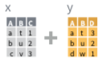
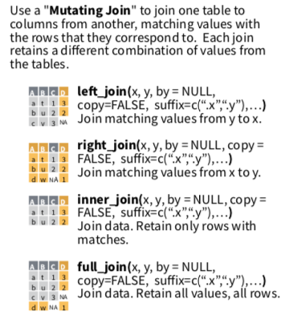
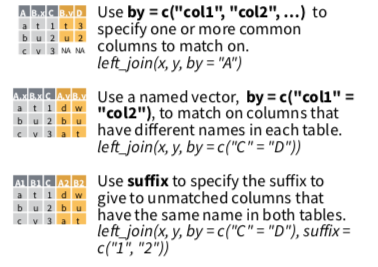
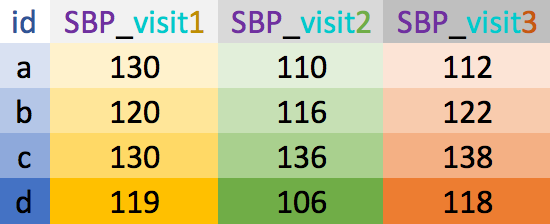
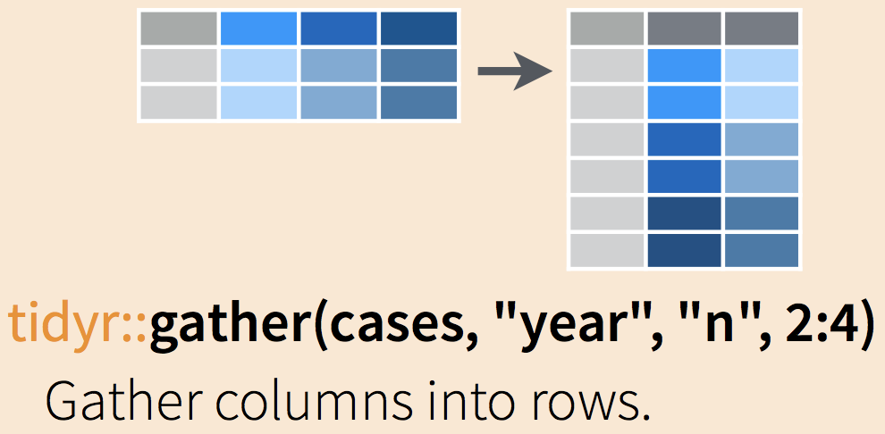
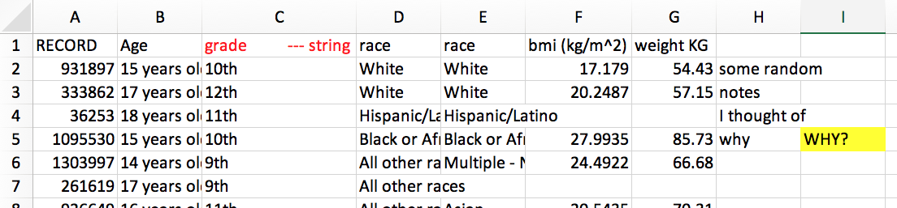

layout: true
  
<!-- <div class="my-footer"><span>bit.ly/berd_tidy</span></div>  -->

---

```{r setup, include=FALSE}
options(htmltools.dir.version = FALSE)

library(tidyverse)
library(lubridate)
library(janitor)

knitr::opts_chunk$set(
  warning=FALSE, 
  message=FALSE, 
  #fig.width=10.5, 
  #fig.height=4,
  fig.align = "center",
  rows.print=7,
  echo=TRUE,
  highlight = TRUE,
  prompt = FALSE, # IF TRUE adds a > before each code input
  comment = NA # PRINTS IN FRONT OF OUTPUT, default is '##' which comments out output
  )

# set ggplot theme
theme_set(theme_bw(base_size = 24))
```


```{r xaringan-themer, include = FALSE}
# Use xaringan theme from first set
```


# Load files for today's workshop

.pull-left-40[
- Open the slides of this workshop: [bit.ly/berd_tidy2](https://bit.ly/berd_tidy2)
- If you haven't already,
  + Open the [pre-workshop homework](https://jminnier-berd-r-courses.netlify.com/02-data-wrangling-tidyverse/02_pre_course_homework.html)
  + Follow steps 1-5
  + Download zip folder
  + Open `berd_tidyverse_project.Rproj`
- __Open a new R script and run the commands to the right__
]

.pull-right-60[
```{r}
# install.packages("tidyverse","janitor","glue")  
library(tidyverse)
library(lubridate)  
library(janitor)
library(glue)
demo_data <- read_csv("data/yrbss_demo.csv")
qn_data <- read_csv("data/yrbss_qn.csv")
```
<center></center>[Allison Horst](https://github.com/allisonhorst/stats-illustrations)

]


---

# Learning objectives

<!-- TO-DO: update after finishing rest of slides -->
.pull-left[
Previously, in Part 1:
- What is data wrangling?
- A few good practices in R/RStudio
- What is tidy data?
- What is tidyverse?
- Manipulate data 
]
.pull-right[
Part 2:
- Summarizing data
- Combine (join) data sets
- Reshaping data: wide vs. long formats 
- Data cleaning:
  + Missing data
  + Strings/character vectors
  + Dates
  + Factors
  + Messy names
]
<!-- + Factors/categorical variables -->
---

class: center, middle, inverse

# More data wrangling

<center></center>

[Alison Horst](https://github.com/allisonhorst/stats-illustrations)


---

# Review Part 1: manipulating data

## Columns ([part 1 slides](https://jminnier-berd-r-courses.netlify.com/02-data-wrangling-tidyverse/02_data_wrangling_slides_part1.html#28))

- `select()` to subset columns
- `rename()` to rename columns
- `mutate()` to add new columns or change values within existing columns
  + `separate()` and `unite()` are shortcuts for specific `mutate` type operations

## Rows ([part 1 slides](https://jminnier-berd-r-courses.netlify.com/02-data-wrangling-tidyverse/02_data_wrangling_slides_part1.html#25))

- `filter()` to subset rows
  + `na.omit()` and `distinct()` are shortcuts for specific `filter` type operations
- `arrange()` to order the data

---

# Changing *all* columns at once ([part 1 slides](https://jminnier-berd-r-courses.netlify.com/02-data-wrangling-tidyverse/02_data_wrangling_slides_part1.html#48))

`mutate_all()`, `rename_all()`: applies a function to *all* columns


```{r}
# mutate_all changes the data in all columns
demo_data %>% mutate_all(as.character) %>% head(3)
```

```{r}
# rename_all changes all column names
demo_data %>% rename_all(toupper) %>% head(3)
```


---

# Changing *some* columns at once ([part 1 slides](https://jminnier-berd-r-courses.netlify.com/02-data-wrangling-tidyverse/02_data_wrangling_slides_part1.html#48))

`mutate_at()`, `rename_at()`: uses `vars()` to select specific variables to apply a function to

```{r}
# mutate_at changes the data in specified columns
demo_data %>% mutate_at(vars(contains("race"), sex), as.factor) %>% head(3)
```

```{r}
# rename_at changes specified column names
demo_data %>% rename_at(vars(record:grade),toupper) %>% head(3)
```


---

# Changing *some* columns at once ([part 1 slides](https://jminnier-berd-r-courses.netlify.com/02-data-wrangling-tidyverse/02_data_wrangling_slides_part1.html#48))

`mutate_if()`, `rename_if()`, `select_if()`: uses a function that returns TRUE/FALSE to select columns and applies function on the TRUE columns


```{r}
demo_data %>% mutate_if(is.numeric, round, digits = 0) %>% head(3)
```

<!-- replaced  -->
<!-- demo_data %>% rename_if(is.character, str_sub, 1L, 2L) %>% head(3)  -->
<!-- with code below -->

```{r}
demo_data %>% rename_if(is.character, str_sub, start = 1, end = 2) %>% head(3)
```

<!-- https://stringr.tidyverse.org/reference/str_sub.html -->

---

# Add one or more rows: `add_row()`

```{r}
demo_data %>% add_row(record=100, age=NA, sex="Female", grade="9th") %>% #<<
  arrange(record) %>% head(3)
```

```{r}
demo_data %>% add_row(record=100:102, bmi=c(25,30,18)) %>% #<<
  arrange(record) %>% head(3)
```

---

# Add one or more columns: `add_column()`

```{r}
demo_data %>% add_column(study_date = "2019-04-10", .after="record") %>% #<<
  head(3)
```

```{r}
demo_data %>% add_column(id = 1:nrow(demo_data), .before="record") %>% #<<
  head(3)
```


---
class: center, inverse, middle

# Quick tips on summarizing data

## categorical data
## numerical data

<center>

  
</center>

[janitor](https://cran.r-project.org/web/packages/janitor/readme/README.html),   [dplyr](https://dplyr.tidyverse.org/)


---

# Frequency tables: `janitor` package's `tabyl` function 

.pull-left[

```{r}
# default table
demo_data %>% tabyl(grade)
```

```{r}
# output can be treated as tibble
demo_data %>% tabyl(grade) %>% select(-n)
```
]
.pull-right[

`adorn_` your table!
```{r}
demo_data %>%
  tabyl(grade) %>%
  adorn_totals("row") %>% #<<
  adorn_pct_formatting(digits=2)  #<<
```

]


---

# 2x2 `tabyl`s

.pull-left-40[
```{r}
# default 2x2 table
demo_data %>% tabyl(grade, sex)
```

What adornments does the tabyl to right have?
]
.pull-right-60[
```{r}
demo_data %>% tabyl(grade, sex) %>%
  adorn_percentages(denominator = "col") %>% #<<
  adorn_totals("row") %>% #<<
  adorn_pct_formatting(digits = 1) %>% #<<
  adorn_ns() #<<
```
]

- Notice `grade` is not sorted in a pleasing way. We will learn how to deal with this when we discuss `factors` as a data type in R.
- Base R has a `table` function, but it is clunkier and the output is not a data frame. 
- See the [tabyl vignette](https://cran.r-project.org/web/packages/janitor/vignettes/tabyls.html) for more information, adorn options, & 3-way `tabyl`s

---

# Numerical data summaries: `summarize()`

- We can summarize data as a whole, or in groups with `group_by()`
- `group_by()` is very powerful, see [data wrangling cheatsheet](https://www.rstudio.com/wp-content/uploads/2015/02/data-wrangling-cheatsheet.pdf)
- Can also use `summarize_at()`, `summarize_if()`, `summarize_all()`

.pull-left[
```{r}
# summary of all data as a whole
demo_data %>% 
  summarize(bmi_mean =mean(bmi,na.rm=TRUE), #<<
            bmi_sd = sd(bmi,na.rm=TRUE)) #<<
```

What does `na.rm=TRUE` do and what happens if we leave it out?
]

.pull-right[
```{r}
# summary by group variable
demo_data %>% 
  group_by(grade) %>% #<<
  summarize(n_per_group = n(), 
            bmi_mean =mean(bmi,na.rm=TRUE),
            bmi_sd = sd(bmi,na.rm=TRUE))
```
]

---

class: center, inverse, middle

# Combining data sets


<center>
<br>
   be careful!!!<br>
<a href="https://github.com/rstudio/cheatsheets/raw/master/data-transformation.pdf">dplyr data transformation cheatsheet</a>
</center>


---

# Rows (cases): paste data below each other 

`bind_rows()` combines rows from different data sets  
& accounts for different column names

```{r, echo=FALSE}
data1 <- tibble(id = 1:2, name = c("Nina","Yi"), height=c(2, 1), age=c(4,2))
data2 <- tibble(id = 7:9, name = c("Bo","Al","Juan"), height=c(2, 1.7, 1.8), years=c(3,1,2))
```


.pull-left[
```{r}
data1
```

```{r}
data2
```
]
.pull-right[
```{r}
bind_rows(data1,data2, .id = "group") #<< 
```

<center><br>
<a href="https://github.com/rstudio/cheatsheets/raw/master/data-transformation.pdf">dplyr data transformation cheatsheet</a>
</center>
]

---

# Columns (variables): *DO NOT USE `bind_cols()`!!*

<!-- Include description of qn_data -->

- `bind_cols()` blindly pastes columns next to each other without preserving order of variables that they have in common  
    + Use `join` to preserve ordering - see next slides

```{r}
# datasets must have same number of rows to use bind_cols()
demo_sub <- demo_data %>% slice(1:20) # first 20 rows of demo_data
qn_sub <- qn_data %>% slice(1:20)     # first 20 rows of qn_data
bind_cols(demo_sub, qn_sub)           # blindly bind columns; 2nd record column got renamed #<<   
```


---

# *`join`*ing your data sets

.pull-left[
- `Join` uses overlapping or selected columns to combine two or more data sets.
- Also called "merging" or "mutating join". 
- Function names are based off of SQL operations for databases.

<center>

</center>
]

.pull-right[
<center>
<br>
<a href="https://github.com/rstudio/cheatsheets/raw/master/data-transformation.pdf">dplyr data transformation cheatsheet</a>
</center>
]

---

# `join` options visually

<center><br>
<a href="https://twitter.com/yutannihilation/status/551572539697143808">Hiroaki Yutani</a></center>

---

# Most commonly used: `left_join()`

- `left_join(x,y)` includes all observations in `x`, regardless of whether they match ones in `y` or not.
- It includes all columns in `y`, but only rows that match `x`'s observations.

.pull-left[
```{r, results="hold"}
df1 <- tibble(a = c(1, 2), b = 2:1)
df2 <- tibble(a = c(1, 3), c = 10:11)
df1
df2
```
]
.pull-right[
```{r}
left_join(df1, df2)
```

- Which common column(s) were used to merge the datasets?  
- What if we want to specify which columns to join by when merging?  
see next slide...
]
---

# Which columns will be used to join?

- If no columns are specified to join by, then *all* overlapping (intersecting) column names will be used
- Often we want to specify which columns to use, 
    + and also how to rename duplicated columns that were not merged

.pull-left[
<center>

</center>
]

.pull-right[
<center>
<br>
<a href="https://github.com/rstudio/cheatsheets/raw/master/data-transformation.pdf">dplyr data transformation cheatsheet</a>
</center>
]

---

# Check for overlapping column names

Goal: merge the demographics (`demo_data`) and questionnaire (`qn_data`) together.

What column names do these datasets have in common?

```{r}
colnames(demo_data)
colnames(qn_data)
intersect(colnames(demo_data), colnames(qn_data)) #<<
```


---

# Merge `demo_data` and `qn_data` together


.pull-left[
Let's do a full join so that we keep all data from both datasets

```{r}
merged_data <- 
  full_join(demo_data, qn_data, 
            by = "record")

# Check dimensions of original and new datasets
```

]
.pull-right[
```{r}
dim(demo_data); dim(qn_data); dim(merged_data) 
```
]


```{r}
merged_data
```


---

# Learn more about `join`ing data

- [Two-table verbs vignette for `dplyr` package](https://dplyr.tidyverse.org/articles/two-table.html)
- [Jenny Bryan's STAT545 dplyr cheatsheet for join](https://stat545.com/bit001_dplyr-cheatsheet.html)
- [R for Data Science's "Relational data" chapter (great diagrams)](https://r4ds.had.co.nz/relational-data.html)

---

# Practice

1. Add a column of `1`'s to `qn_data` called `qn_yes` and save the resulting data as `qn_data2`.

1. Join `demo_data` and `qn_data2` by column `record`. Keep all rows from `demo_data` and only rows from `qn_data2` that match records in `demo_data`. Call the resulting data `all_data`.

1. Create a `tabyl()` of `qn_yes` for the data `all_data`.

1. Create a 2x2 table of `qn_yes` vs `grade`.

Note about the data:

- q8 = How often wear bicycle helmet
- q12 = Texted while driving
- q31 = Ever smoked
- qn24 = Bullied past 12 months

```{r, include=FALSE}
qn_data2 <- qn_data %>% add_column(qn_yes = 1)
all_data <- left_join(demo_data, qn_data2)
all_data %>% tabyl(qn_yes)
all_data %>% tabyl(qn_yes,grade)
```

<!-- TO DO: Make this better, just added some random stuff. -->

---

class: center, middle, inverse

# Reshaping data 


wide vs. long


.pull-left[
  
[Allison Horst](https://github.com/allisonhorst/stats-illustrations)
]
.pull-right[
  
[tidyr](https://tidyr.tidyverse.org)
]
---

# Wide vs. long data

<!-- TO DO: define, show pic -->
- __Wide__ data has one row per subject, with multiple columns for their repeated measurements
- __Long__ data has multiple rows per subject, with one column for the measurement variable and another indicating from when/where the repeated measures are from

.pull-left[
wide  

]
.pull-right[
long  

]

---

# Example wide dataset

Copy and paste the code below into R to create this example dataset

```{r}
BP_wide <- tibble(id = letters[1:4],
                     sex = c("F", "M", "M", "F"),
                     SBP_v1 = c(130, 120, 130, 119),
                     SBP_v2 = c(110, 116, 136, 106),
                     SBP_v3 = c(112, 122, 138, 118))
BP_wide
```

- What do you think the data in the table are measures of?
- How can we tell the data are wide?


---

# Wide to long: `gather()`


.pull-left[
```{r}
BP_wide
```

`gather` columns into rows to make the data long. Need to __specify__:
- __new column names__
    + __key__: stores row names of wide data's gathered columns 
    + __value__: stores data values
- __which columns to gather__
]
.pull-right[
```{r}
BP_long <- BP_wide %>% 
  gather(key = "visit", value = "SBP", 
         SBP_v1:SBP_v3)
BP_long
```
]


<!--    -->
<!-- [data wrangling cheatsheet](https://www.rstudio.com/wp-content/uploads/2015/02/data-wrangling-cheatsheet.pdf) -->


---

# Long to wide: `spread()`

<!--    -->
<!-- [data wrangling cheatsheet](https://www.rstudio.com/wp-content/uploads/2015/02/data-wrangling-cheatsheet.pdf) -->


.pull-left[
```{r}
BP_long
```

]
.pull-right[
`spread` rows into columns to make the data wide. Need to __specify__ which columns in the long data to use:
- __key__ column: has the variable names 
- __value__ column: has the data values
    
```{r}
BP_wide2 <- BP_long %>% 
  spread(key = "visit", value = "SBP")
BP_wide2
```
]


---

# Clean up long data's visit column (key column)

.pull-left[
```{r}
BP_long
```
*Goal*: remove the string `SBP_v` from the `visit` variable's values.
]
.pull-right[

```{r}
BP_long2 <- BP_long %>% 
  mutate(visit = 
           str_replace(visit,"SBP_v","")) 
BP_long2
```
]


---

# Make cleaned-up long data wide

.pull-left[
```{r}
head(BP_long2, 2)
BP_wide3 <- BP_long2 %>% 
  spread(key = "visit", value = "SBP")
BP_wide3
```
]

.pull-right[

*Problem*: have numbers as column names, since `spread`'s default is to use the levels of the `key` as the new row names.  

*Solution*: have row names start with the `key` column's name `sep`arated by a character
```{r}
BP_wide4 <- BP_long2 %>% 
  spread(key = "visit", value = "SBP",
         sep="_") # specify separating character
BP_wide4
```
]

---

# Practice

Copy and paste the code below into R to create the dataset `DBP_wide`

```{r}
DBP_wide <- tibble(id = letters[1:4],
                  sex = c("F", "M", "M", "F"),
                  v1.DBP = c(88, 84, 102, 70),
                  v2.DBP = c(78, 78, 96, 76),
                  v3.DBP = c(94, 82, 94, 74),
                  age=c(23, 56, 41, 38)
                  )
```

1. Make `DBP_wide` into a long dataframe based on the repeated DBP columns and save it as `DBP_long`.
1. Clean up the visit column of `DBP_long` so that the values are 1, 2, 3, and save it as `DBP_long`.

1. Make `DBP_long` wide with column names `visit.1, visit.2, visit.3` for the DBP values, and save it as `DBP_wide2`.

1. Join `DBP_long` with `BP_long2` so that we have one data frame with columns id, sex, visit, SBP, DBP, and age. Save this as `BP_both_long`.


```{r, include=FALSE}
DBP_long <- DBP_wide %>%
  gather(key = "visit", value = "DBP", 
         v1.DBP, v2.DBP, v3.DBP) %>%
  mutate(visit = 
           str_replace(visit,c("v"), "")) %>%
  mutate(visit = 
           str_replace(visit,".DBP",""))  
DBP_long

DBP_wide2 <- DBP_long %>% 
  spread(key = "visit", value = "DBP",
         sep=".") # specify separating character
DBP_wide2


BP_both_long <- left_join(BP_long2, DBP_long, by = c("id", "sex", "visit"))
BP_both_long
```

---

class: center, middle, inverse

# Data cleaning

## (messy NAs, names, strings, dates, factors)


---

# Removing missing data: `drop_na()`

<!-- These examples might be clearer with a small dataset and showing what the outcomes are. -->


.pull-left[

A small data example:

```{r}
mydata <- tibble(id = 7:9, 
                 name = c("Bo","Al","Juan"), 
                 height = c(2, NA, 1.8), 
                 years = c(51,35,NA))
mydata
```
]

.pull-right[

Remove *all* rows with **any missing data**

```{r}
mydata %>% drop_na()
```

Remove rows with `NA` in **selected columns**

```{r}
mydata %>% drop_na(height)
```
]


---

# Replace `NA`s with another value: `replace_na()`


.pull-left-40[
Use with `mutate()`
```{r}
mydata
```

]
.pull-right-60[
```{r}
mydata %>% 
  mutate(height = replace_na(height, "Unknown"), #<<
         years = replace_na(years, 0) ) #<<
```
]

---

# `replace_na()` advanced example

Replaces `NAs` in all columns starting with "q" with the string "No answer"
```{r}
qn_data %>% 
  mutate_at(vars(starts_with("q")), #<<
            .funs = list(~replace_na(.,"No answer"))) %>% #<<
  tabyl(q8, q31)
```

---

# Convert (i.e. "No answer", 9999, etc) to `NA`: `na_if()`

```{r}
all_data %>% tabyl(race4)
all_data %>%
  mutate(race4 = na_if(race4, "All other races")) %>% #<<
  tabyl(race4)
```

---
# `na_if()` for all your data

**Avoid this** by reading in your data correctly:

```{r, eval=FALSE}
smalldata <- read_csv("data/small_data.csv",
                      na = c("","9999","NA")) # specify your own missing values #<<
```

**Otherwise** `na_if()` everything:

```{r, eval=FALSE}
# replace all "" with NA
all_data %>%
  mutate_if(is.character, .funs = na_if(.,"")) %>% #<<

# replace all 9999's with NA 
all_data %>%
  mutate_if(is.numeric, .funs = na_if(.,9999)) %>% #<<
```


---

# Working with character strings

- [Use the package `stringr`](https://stringr.tidyverse.org/) (loaded with `tidyverse`)
- Paste strings or values together [with package `glue`](https://glue.tidyverse.org/) (installed, not loaded w/ `tidyverse`)
- *advanced tip*: learn ["regular expressions"](https://stringr.tidyverse.org/articles/regular-expressions.html) ([regex](https://xkcd.com/208/)) for pattern matching (see [cheatsheet](https://www.rstudio.com/resources/cheatsheets/#stringr)) and matching multiple characters/strings at once

<center></center>
[stringr cheatsheet](https://www.rstudio.com/resources/cheatsheets/#stringr)


---

# `str_detect()` find strings


```{r}
mydata <- tibble(name = c("J.M.","Ella","Jay"), state = c("New Mexico","New York","Oregon"))
```

.pull-left[

Filter based on string detection
```{r}
mydata %>% filter(str_detect(name,"J"))       
```
]
.pull-right[

Creates a column of TRUE/FALSE if detected
```{r}
mydata %>% mutate(
  new_state = str_detect(state,"New"))    
```
]
---

# `str_replace_all()`, `str_replace()`

```{r}
mydata %>% mutate(state_old = str_replace_all(state, "New", "Old"))
```

```{r}
mydata %>% mutate(
  name2 = str_replace(name, "l", "-"),           # first instance
  name3 = str_replace_all(name, "l", "-"),       # all instances
  name4 = str_replace_all(name, fixed("."), "")) # special characters with fixed()
```

---

# `str_sub()`: shorten strings

Based on position `1` (`start = 1`) to length of string (`end = -1`)
```{r}
mydata %>% mutate(
  short_name  = str_sub(name, start = 1, end = 2),   # specify start to end
  short_name2 = str_sub(name, end = 2),              # specify only end
  short_state = str_sub(state, end = -3)             # negative endices, from end
  )
```


---

# Paste strings together with `glue()`

- `paste()` is the base R way of pasting strings (surprise, it's hard to use)
- `glue()` is most useful when pasting data columns together
- **column *names* or function *operations* go inside `{}`**
- See the [glue vignette](https://glue.tidyverse.org/index.html)

```{r}
all_data %>%
  mutate(info = glue("Student {record} is {age} with BMI = {round(bmi,1)}")) %>% #<<
  select(record, info) %>% head(5)
```

---

# Using `glue` to summarize data

- Useful for tables (will cover this more in another session)
- Example, calculate the S.E. of the mean and create a column with "mean (SE)" of bmi:

```{r}
demo_data %>% 
  group_by(sex) %>%
  summarize(n_sex = n(),
            bmi_mean = mean(bmi,na.rm=TRUE),
            bmi_sd = sd(bmi,na.rm=TRUE)) %>%
  mutate(bmi_mean_se = glue("{round(bmi_mean,1)} ({signif(bmi_sd/sqrt(n_sex),2)})")) #<<
```

---

# Wrangle dates with `lubridate`

.pull-left[
- Convert characters to special "Date" type
- Convert *terrible excel date formats* into workable data
- Easy date magic examples:
    + add and subtract dates
    + convert to minutes/years/etc
    + change timezones
    + add 1 month to a date...
- [`lubridate` cheat sheet](https://www.rstudio.com/resources/cheatsheets/#lubridate)
- `read_csv` and `read_excel` etc automatically import dates correctly

]

.pull-right[
<center><a href="https://github.com/allisonhorst/stats-illustrations"><br>Allison Horst</a>
</center>
]


---

# What kind of date do you have?

.pull-left-40[
<center></center>
[`lubridate` cheat sheet](https://www.rstudio.com/resources/cheatsheets/#lubridate)
]
.pull-right-60[
```{r}
timedata <- 
 tibble(name = c("Yi","Bo","DJ"), 
        dob=c("10/31/1952","1/12/1984","2/02/2002"))
timedata %>% 
  mutate(dob_date = mdy(dob),
         dob_wrong = dmy(dob)) # wrong order
```
]

---

# Math with dates

```{r}
timedata %>% mutate(
  dob = mdy(dob),                            # convert to a date
  dob_year = year(dob),                      # extract the year
  time_since_birth = dob %--% today(),       # create an "interval"
  age = time_since_birth %/% years(1),       # modulus on "years"
  dobplus = dob + days(10)                   # add 10 days
  )                  
```

---

# Factors - categorical data

.pull-left-40[
- Clean and order factors with `forcats` package
- Will go over this for `ggplot2` (visualization), statistical modeling (i.e. for `lm()`), and probably a workshop for creating tables
- See [`forcats` cheatsheet](https://github.com/rstudio/cheatsheets/raw/master/factors.pdf)
and [`forcats` vignette]()
]
.pull-right-60[
<center></center>
]

---

# `forcats` examples - specify levels `fct_relevel()`

.pull-left[
```{r}
mydata <- tibble(
  id = 1:4, 
  grade=c("9th","10th","11th","9th")) %>%
  mutate(grade_fac = factor(grade)) #<<
levels(mydata$grade_fac)
mydata %>% arrange(grade_fac)
```

]

.pull-right[

```{r}
mydata <- mydata %>% 
  mutate(
    grade_fac = #<<
      fct_relevel(grade_fac, #<<
                  c("9th","10th","11th"))) #<<
levels(mydata$grade_fac)
mydata %>% arrange(grade_fac)
```

]

---

# `forcats` examples - collapse levels

```{r}
mydata <- tibble(loc = c("SW","NW","NW","NE","SE","SE"))

mydata %>% mutate(
  loc_fac = factor(loc),
  loc2 = fct_collapse(loc_fac,                         # collapse levels #<<
                      south = c("SW","SE"), #<<
                      north = c("NE","NW")), #<<
  loc3 = fct_lump(loc_fac, n=2, other_level = "other") # most common 2 levels + other
  )
```

---

class: center, middle, inverse

# Other "janitor" work

<center></center>

---

# Clean messy column names with `clean_names()`

```{r}
mydata <- tibble("First Name"= c("Yi","DJ"), "last init" = c("C","R"),
                 "% in" = c(0.1, 0.5), "ñ$$$"= 1:2, " "=3:2,"     hi"=c("a","b"), 
                 "null"=c(NA,NA))
mydata
mydata %>% clean_names() %>%        # in the janitor package #<<
  remove_empty(c("rows","cols"))    # also useful
```

---

# Clean names of your excel sheet

<center></center>

```{r}
library(readxl)
read_excel("data/messy_names.xlsx", .name_repair = janitor::make_clean_names)
```


---

# Practice

Copy and paste the code below into R to create the dataset `messy_data`

```{r}
messy_data <- tibble(NAME = c("J N","A C","D E"), 
                     `months follow up` = c("", 10, 11), 
                     `Date of visit` = c("July 31, 2003", "Nov 12, 2005", "Aug 3, 2007"))
```


1. Clean column names with `clean_names()`.

1. Replace missing ("") data in `months_follow_up` with NA.

1. Convert `months_follow_up` to a numeric variable.

1. Convert `date_of_visit` to a date.

1. Create a column called `date_last_visit` that is the date of visit *plus* months of follow up.

1. Remove rows (cases) with missing data in `months_follow_up`.

1. Remove the spaces in `name`.

```{r, echo=FALSE}
clean_data <- messy_data %>% 
  clean_names() %>%
  mutate(
    months_follow_up = replace_na(months_follow_up,""),
    months_follow_up = as.numeric(months_follow_up),
    date_of_visit = mdy(date_of_visit),
    date_last_visit = date_of_visit + months(months_follow_up)) %>%
  drop_na(months_follow_up) %>%
  mutate(name = str_replace_all(name," ",""))
```


---


class: center, middle, inverse

# This was a *lot*, but learning R gets easier!

<center></center>[Allison Horst](https://github.com/allisonhorst/stats-illustrations)


---

# Resources - `tidyverse` & data wrangling

Links

- [Learn the tidyverse](https://www.tidyverse.org/learn/)
- [Data wrangling cheatsheet](https://www.rstudio.com/wp-content/uploads/2015/02/data-wrangling-cheatsheet.pdf)

Some of this is drawn from materials in online books/lessons:

- [R for Data Science](https://r4ds.had.co.nz/index.html) - by Garrett Grolemund & Hadley Wickham
- [Modern Dive](https://moderndive.com/) - An Introduction to Statistical and Data Sciences via R by Chester Ismay & Albert Kim
- [A gRadual intRoduction to the tidyverse](https://github.com/Cascadia-R/gRadual-intRoduction-tidyverse) - Workshop for Cascadia R 2017 by Chester Ismay and Ted Laderas
- ["Tidy Data" by Hadley Wickham](https://vita.had.co.nz/papers/tidy-data.pdf)
---

# Possible future workshop topics:

- reproducible reports in R (probably next)
  + R Markdown and knitr
- tables
- ggplot2 visualization
- advanced tidyverse: functions, purrr
- statistical modeling in R

Fill out feedback forms to suggest more or help us prioritize!

---

## Contact info:

Jessica Minnier: _minnier@ohsu.edu_

Meike Niederhausen: _niederha@ohsu.edu_


## This workshop info:

<!-- TO-DO: Update??? Create file with jsut the R code-->

- Code for these slides on github: [jminnier/berd_r_courses](https://github.com/jminnier/berd_r_courses)
- all the [R code in an R script](https://jminnier-berd-r-courses.netlify.com/02-data-wrangling-tidyverse/02_data_wrangling_slides_part2.R)
- answers to practice problems can be found here: [html](https://jminnier-berd-r-courses.netlify.com/02-data-wrangling-tidyverse/02_data_wrangling_slides_part2_practice_solutions.html)


<!-- TO DO: move all images to project folder so print pdf below works? -->
```{r, eval=FALSE, echo=FALSE}
# RUN THESE AFTER KNITTING
# create R file
knitr::purl(here::here("02-data-wrangling-tidyverse/02_data_wrangling_slides_part2.Rmd"), out = here::here("02-data-wrangling-tidyverse/02_data_wrangling_slides_part2.R"))
# remotes::install_github('rstudio/pagedown')
pagedown::chrome_print(here::here("02-data-wrangling-tidyverse/02_data_wrangling_slides_part2.html"))
```
