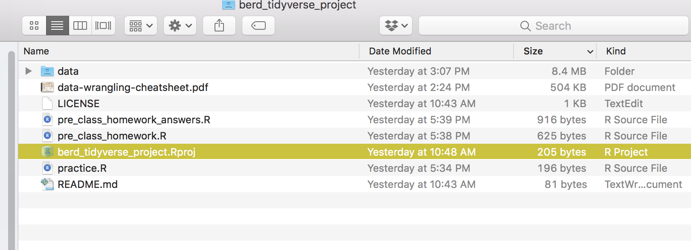
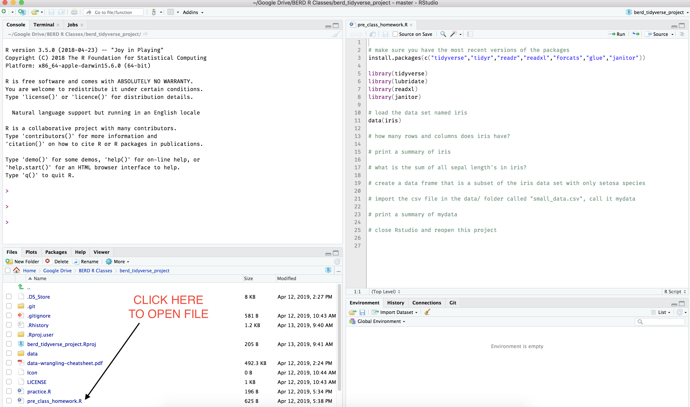

```{r setup, include=FALSE}
knitr::opts_chunk$set(echo = TRUE)
```

# If new to R

- Look over previous workshop [slides](http://bit.ly/berd_r_intro) and [video](https://echo360.org/section/aefe4e1c-c635-4a3b-bf99-ce6439184f5f/public) (Februrary 26 "Getting Started with R and Rstudio"). Finish up any practice problems you did not complete during the previous workshop. The last page of the slides has a link to the practice problems answers.
- Read [this chapter in Modern Dive](https://moderndive.com/2-getting-started.html#package-installation) to learn how to install packages and load packages.

# Everyone

## 1. Download and open an Rstudio project

## 2. Go to [https://github.com/jminnier/berd_tidyverse_project](https://github.com/jminnier/berd_tidyverse_project)

## 3. Click "Clone or Download" (upper right), then "Download as zip"


## 4. Unzip folder

## 5. Inside folder, double click on (to open) `berd_tidyverse_project.Rproj`



## 6. Rstudio should then open this whole folder as a "project".

## 7. Open `pre_class_homework.R`



## 8. Complete the instructions in `pre_class_homework.R`

## 9. Check your answers with the file `pre_class_homework_answers.R`


