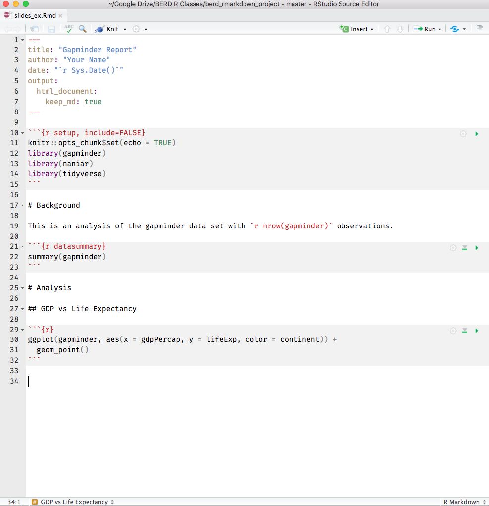
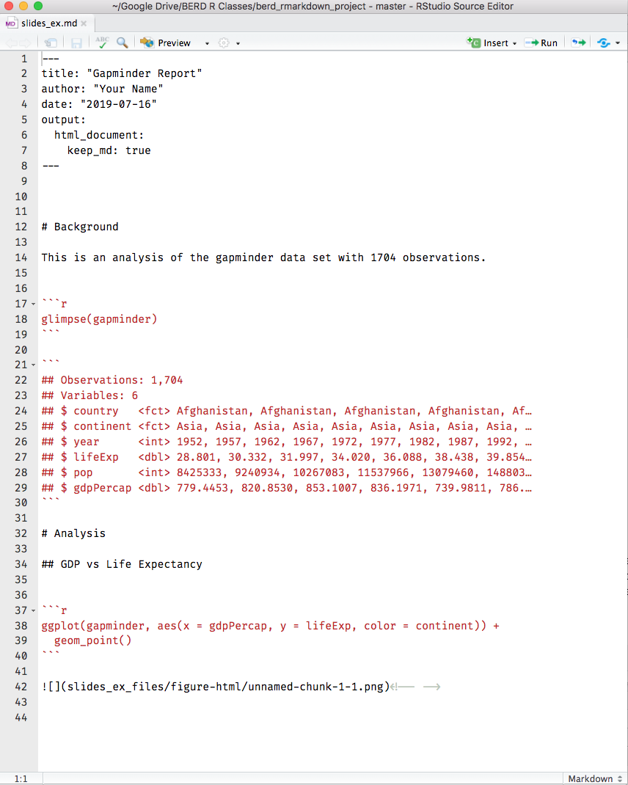
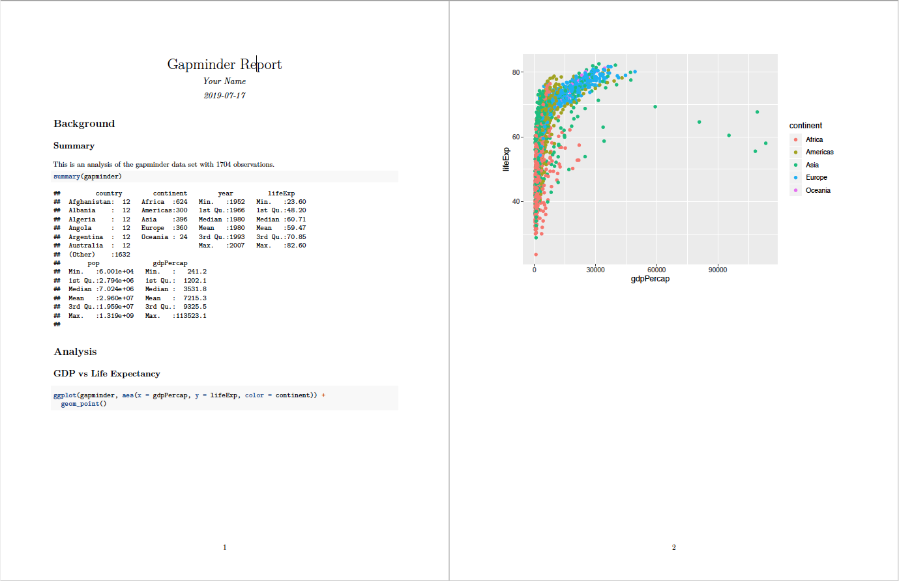
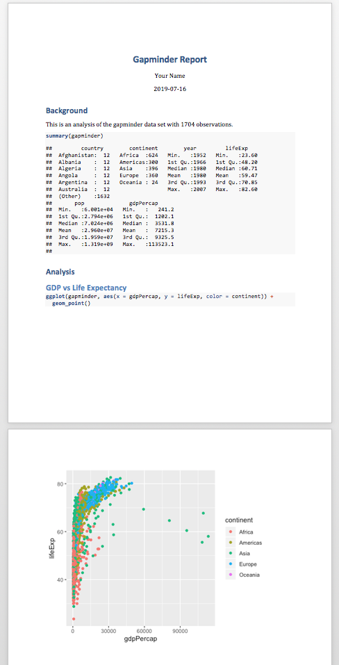
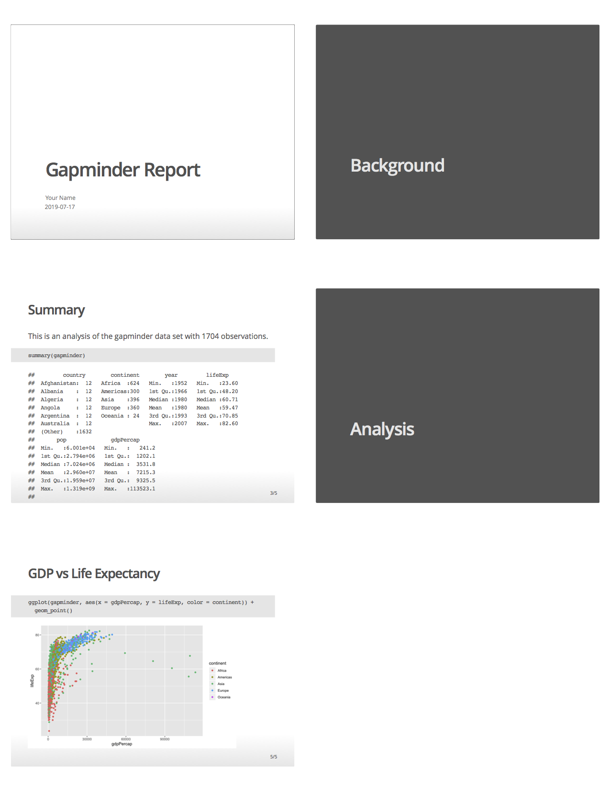
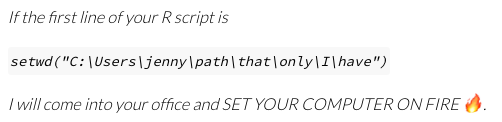

layout: true
  
<!-- <div class="my-footer"><span>bit.ly/berd_tidy</span></div>  -->

---

```{r setup, include=FALSE}
options(htmltools.dir.version = FALSE)

library(tidyverse)
library(lubridate)
library(janitor)
library(emo)
library(here)

knitr::opts_chunk$set(
  warning=FALSE, 
  message=FALSE, 
  #fig.width=10.5, 
  #fig.height=4,
  fig.align = "center",
  rows.print=7,
  echo=TRUE,
  highlight = TRUE,
  prompt = FALSE, # IF TRUE adds a > before each code input
  comment = NA # PRINTS IN FRONT OF OUTPUT, default is '##' which comments out output
  #comment=NA
  )

# set ggplot theme
theme_set(theme_bw(base_size = 24))
```


```{r xaringan-themer, include = FALSE}
# creates xaringan theme
# devtools::install_github("gadenbuie/xaringanthemer")
library(xaringanthemer)
mono_light(
  base_color =  "#3A6185", ## OHSU Marquam
  code_highlight_color = "#cbdded",
  link_color = "#38BDDE",
  header_font_google = google_font("Josefin Sans"),
  text_font_google   = google_font("Montserrat", "300", "300i","400i","700"),
  code_font_google   = NULL,
  text_font_size = "24px",
  code_font_size = "20px",
  header_h1_font_size = "45px",
  header_h2_font_size = "40px",
  header_h3_font_size = "35px",
  padding = "0em 2em 1em 2em",
  outfile = "css/xaringan-themer.css"
)
```


# Load files for today's workshop

.pull-left[
- 
]

.pull-right[
`# install.packages("knitr")`  
`library(knitr)`
]

<center></center>[Allison Horst](https://github.com/allisonhorst/stats-illustrations)

---

# Learning objectives

<!-- TO-DO: update after finishing rest of slides -->

---

class: middle, inverse

# Why Reproducibility?


- Evidence your results are correct.
- Allow others to use our methods and results.

"An article about computational results is advertising, not scholarship. The actual scholarship is the full software environment, code and data, that produced the result."

[(Claerbout and Karrenbach 1992)](http://sepwww.stanford.edu/doku.php?id=sep:research:reproducible:seg92)

---

# Types of Reproducibility

- **Computational reproducibility:** detailed information is provided about *code, software, hardware and implementation details*.
- **Empirical reproducibility:** detailed information is provided about non-computational empirical *scientific experiments and observations [data]*. 
- **Statistical reproducibility:** detailed information is provided about the choice of *statistical tests, model parameters, threshold values, etc*.

[R Opensci Reproducibility Guide](https://ropensci.github.io/reproducibility-guide/sections/introduction/)

---

# Software tool for reproducibility: *Literate Programming*

>These tools enable writing and publishing **self-contained documents that include narrative and code used to generate both text and graphical results**.

>In the R ecosystem, knitr [R markdown] and its ancestor Sweave used with RStudio are the main tools for literate computing. Markdown or LaTeX are used for writing the narrative, with chunks of R code sprinkled throughout the narrative. IPython is a popular related system for the Python language, providing an interactive notebook for browser-based literate computing."

[R Opensci Reproducibility Guide](https://ropensci.github.io/reproducibility-guide/sections/introduction/)

---

# R Markdown = `.Rmd` file

Code + text (in markdown syntax)

`knitr` is a package that converts `.Rmd` files containing code + markdown syntax to a plain text `.md` markdown file, and then to other formats (html, pdf, Word, etc)


 $\Rightarrow$


---

# knitr converts `.Rmd` -> `.md`

.pull-left[

]

.pull-right[

]

---

# knitr converts `.Rmd` -> `.md` -> `.html`

.pull-left[

]

.pull-right[

]

---

# knitr converts `.Rmd` -> `.md` -> `.pdf`

.pull-left-40[

]

.pull-right-60[

]

---

# knitr converts `.Rmd` -> `.md` -> `.doc`

.pull-left[

]

.pull-right[

]

---

# knitr converts `.Rmd` -> `.md` -> slides

.pull-left[

]

.pull-right[

]


---

# R Markdown vs. `knitr::knit()`


<center></center>[Michael Sachs](https://sachsmc.github.io/knit-git-markr-guide/knitr/knit.html)


---

# Good practices in RStudio

__Use projects__ ([read this](https://r4ds.had.co.nz/workflow-projects.html))
- Create an RStudio project for each data analysis project
- Sets *working directory*
- A project is associated with a directory folder
    + Keep data files there
    + Keep scripts there; edit them, run them in bits or as a whole
    + Save your outputs (plots and cleaned data) there
- Only use relative paths, never absolute paths
    + relative (good): `read_csv("data/mydata.csv")`
    + absolute (bad): `read_csv("/home/yourname/Documents/stuff/mydata.csv")`
    
__Advantages of using projects__
- standardize file paths
- keep everything together
- a whole folder can be shared and run on another computer

---

# INSERT MEIKE'S SLIDES HERE

---


class: center, middle, inverse

# Reproducible Workflow

---

# Be Organized

Your files must make sense to yourself 6 months from now, and/or other collaborators.
<center></center>[Jenny Bryan's "What They Forgot to Teach you About R" Rstudio::conf2018 training](https://github.com/jennybc/what-they-forgot)

---

# No! Absolute! File! Paths! (don't `setwd()`)

Absolute paths $\neq$ reproducible

Relative paths $=$ reproducible (if done correctly)

<center></center>

[Jenny Bryan](https://jennybryan.org/about/)'s oft quoted opinion, See post on [Project-oriented
workflow](https://www.tidyverse.org/articles/2017/12/workflow-vs-script/)

---

# Project directory structure

- .Rproj sets your working directory (**USE [PROJECTS](https://www.tidyverse.org/articles/2017/12/workflow-vs-script/)**)

```{r, eval=FALSE}
# Use a relative path, "relative to" the project folder
read_csv("mydata.csv") # looks in .Rproj folder
```


- .Rmd files when knit look for sourced files *in the folder they live in*

````
```{r data, eval=TRUE}`r ''`
read_csv("mydata.csv") # looks in .Rmd folder
```
````

- It's good practice to organize all your code/data/output into separate folders

These three facts together can cause a headache. Enter `here::here()`!

---

# Everything in one folder


After knitting, this gives you (file `r emo::ji("salad")`)


---

# Slightly more organized


After knitting, this gives you:


---

# A tip about "moving up" a directory/folder

- In unix, to point to the folder one level up (it contains the folder you're in), use `../`
- As in `cd ..` moves up one directory, or `cp ../myfile.txt newfile.txt` this copies a file one level up into the current folder (working directory)
- When you want to source the data, you could use `../` to move up a folder into the main directory, and then back down into the `data/` folder:

```{r, eval=FALSE}
# From the .Rmd folder, move up one folder then down to the data folder
mydata <- read_csv("../data/report3_nhanes_data.csv")
```


---

# That was confusing, right? Use `here::here()`!


<center><a href="https://github.com/allisonhorst/stats-illustrations"><br>Allison Horst</a></center>


---

- The `here` package and the `here()` function solves this issue of inconsistent working directories.
- The point of projects is to always have the same "home" working directory = where the `.Rproj` file is.
- `here::here()`

---

# Exercises:

- Open `report2.Rmd`
- Open `report3/report3.Rmd`
- Open `report3-here/report3_here.Rmd`

---

class: center, middle, inverse

# Extensions

---

---

# Possible Future Workshop Topics?

- tables
- ggplot2 visualization
- advanced tidyverse: functions, purrr (apply/map)
- statistical modeling in R

---

## Contact info:

Jessica Minnier: _minnier@ohsu.edu_

Meike Niederhausen: _niederha@ohsu.edu_


## This workshop info:

<!-- TO-DO: Update??? Create file with jsut the R code-->

- Code for these slides on github: [jminnier/berd_r_courses](https://github.com/jminnier/berd_r_courses)
- all the [R code in an R script](https://jminnier-berd-r-courses.netlify.com/03-rmarkdown/03_rmarkdown.R)
- answers to practice problems can be found here: [html](https://jminnier-berd-r-courses.netlify.com/03-rmarkdown/03_rmarkdown.html)


<!-- TO DO: move all images to project folder so print pdf below works? -->
```{r, eval=FALSE, echo=FALSE}
# RUN THESE AFTER KNITTING
knitr::purl(here::here("03-rmarkdown/03_rmarkdown_slides.Rmd"), out = here::here("03-rmarkdown/03_rmarkdown.R"))
# remotes::install_github('rstudio/pagedown')
pagedown::chrome_print(here::here("03-rmarkdown/03_rmarkdown_slides.html"))
```
