class: middle, inverse, center

# Basic R Markdown example

<center></center>

[https://www.rstudio.com/products/rpackages/](https://www.rstudio.com/products/rpackages/)


---

#  Create an R Markdown file (`.Rmd`) 

Two options:
1. click on File $\rightarrow$ New File $\rightarrow$ R Markdown... , or
1. in upper left corner of R Studio click on   $\rightarrow$ 

You should see the following text in your editor window:

<center>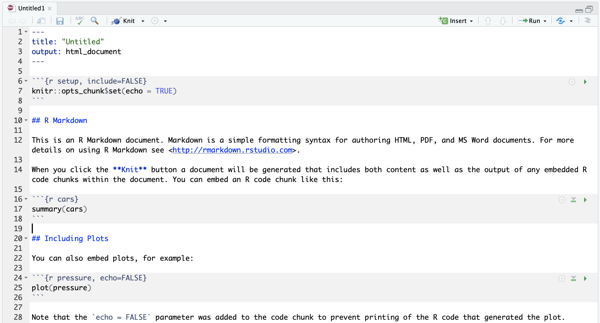</center>


---

# Knit the .Rmd file 

*Before knitting the .Rmd file, you must first **save it**. *

To **knit** the .Rmd file, either
1. click on the knit icon  at the top of the editor window 
1. or use keyboard shortcuts
    * Mac: *Command+Shift+K* 
    * PC:  *Ctrl+Shift+K*
1. or use the `render()` command in Console - *See Extensions section for details*

A new window will open with the html output.

Remark:
* The template .Rmd file that R Studio creates will knit to an html file by default
* Later we will go over knitting to other file types


---

# Compare the .Rmd file with its html output 


.pull-left[
.Rmd file

]

.pull-right[
html output  

]

---

# Compare the .Rmd file with its html output 

<center></center>


<!-- --- -->

<!-- # Show Output to html, word, pdf, other formats -->

<!-- * j already has slides on this -->
<!-- * will cover in YAML section -->

---

class: middle, inverse

# 3 types of R Markdown content

1. <span style="color:darkorange"> *Text*</span>
2. Code chunks
3. YAML metadata


---

# Formatting text

* Markdown is a markup language similar to html or LaTeX 
* All text formatting is specified via code

.pull-left[
Text in editor:

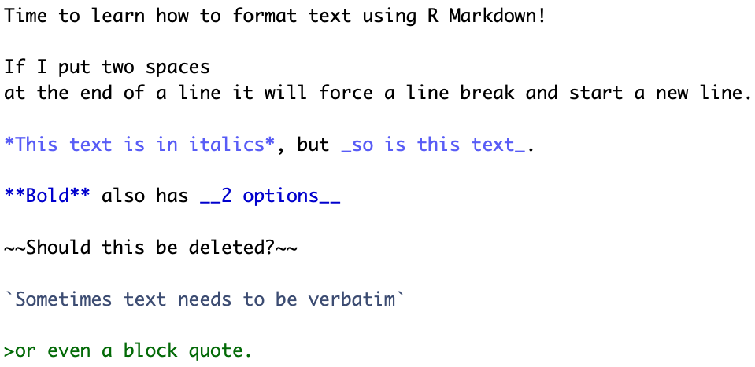
]

.pull-right[

Time to learn how to format text using R Markdown! 
 
If I put two spaces  
at the end of a line it will force a line break and start a new line.

*This text is in italics*, but _so is this text_.

**Bold** also has __2 options__

~~Should this be deleted?~~

`Sometimes text needs to be verbatim`

>or even a block quote.


]


---

# Headers

* Organize your documents using headers to create sections and subsections
* Later in the workshop we will cover
  + automatically numbering headers in output file for easy reference
  + easily creating a TOC based on the header names


.pull-left[
Text in editor:


]

.pull-right[

# Header 1

## Header 2

### Header 3

#### Header 4

##### Header 5

###### Header 6

]

---

# RStudio tip


You can easily navigating through your .Rmd file if you use headers to outline your text

<center></center>


---

# Unnumbered lists


.pull-left[
Text in editor:


]

.pull-right[

* This is an **unnumbered list**
  + with *sub-items*
      - and *sub-sub-items*,
          - or even deeper.
* You can use characters *, +, and - to create lists.
  * The order of the 
      * characters is not important
          + and characters can be repeated.

What *is* important is the *spacing*!
+ indent each 
  * sub-level with a tab and make sure  
  * there is a space between the character starting the list and the first bit of text,
  *otherwise the text won't be a new bullet in the list

]


---

# Numbered lists


.pull-left[
Text in editor:

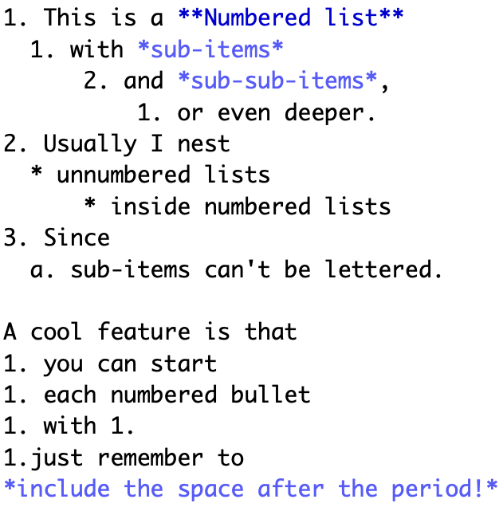
]

.pull-right[

1. This is a **Numbered list**
  1. with *sub-items*
      2. and *sub-sub-items*,
          1. or even deeper.
2. Usually I nest 
  * unnumbered lists 
      * inside numbered lists
3. Since 
  a. sub-items can't be lettered.

A cool feature is that
1. you can start  
1. each numbered bullet 
1. with 1.
1.just remember to 
*include the space after the period!*  

]


---

# Math, horizontal rule, and hyperlinks

.pull-left[
Text in editor:


]

.pull-right[


* __Mathematical formulas and sybmols__ can be included using LaTeX, both as *inline equations* or *formulas*:
  + Use single `$` for inline equations: $y=\beta_0 + \beta_1x + \varepsilon$
  + Use double `$$` for centered formulas:
  
$$\hat{y}= \frac{3}{7} +  5 \mathrm{age} + 3^2 \cdot \mathrm{height}$$ 
* __Horizontal rule__

***
* __Hyperlinks__
  + Learn more about LaTeX at this  [link](http://www.highpoint.edu/physics/files/2014/08/short-math-guide.pdf).
]

---

# Insert images

.pull-left[
Text in editor:

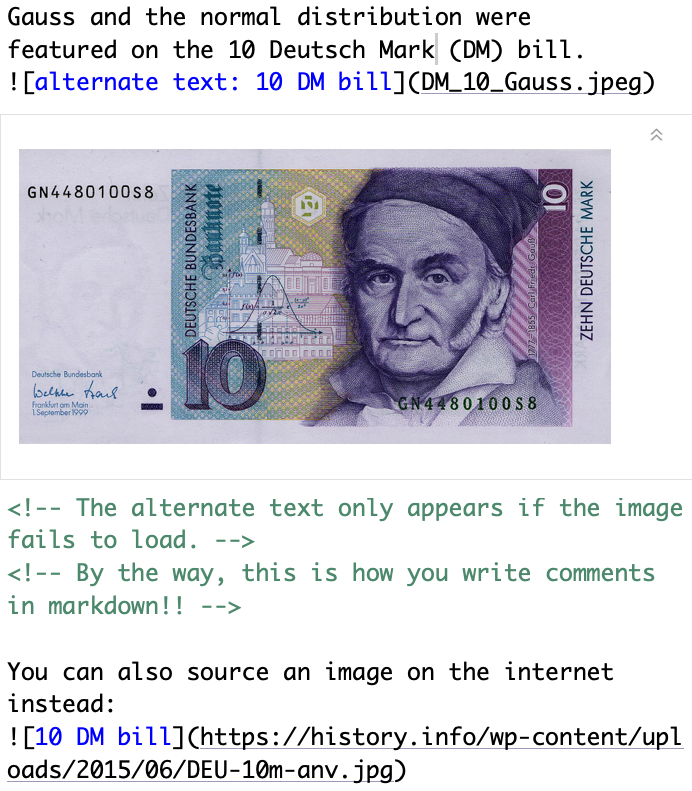
]

.pull-right[

Gauss and the normal distribution were 
featured on the 10 Deutsch Mark (DM) bill.

<!-- The alternate text only appears if the image fails to load. -->
<!-- By the way, this is how you write comments in markdown!! -->

You can also source an image on the internet instead: 


<!--   -->

]


---

# Tables created manually

Later we will use R code to create tables from data.

We can create tables using Markdown as well:


.pull-left[
Text in editor:

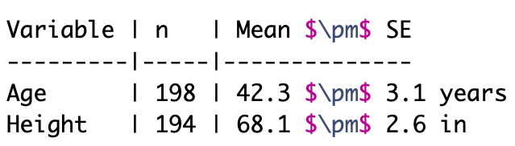
]

.pull-right[

Variable | n   | Mean $\pm$ SE
---------|-----|--------------
Age      | 198 | 42.3 $\pm$ 3.1 years
Height   | 194 | 68.1 $\pm$ 2.6 in  

]

* We **do not recommend** creating tables where the numbers are hard-coded 
  * since they are **not reproducible**!

---

# Spell check

Alas there is no autmotic sepll chekc to catch you're tipos and grammar.

* You can manually do a spell check by clicking on the  icon above the editor window. 
* There is no grammar check.

 

---

# Practice!

.pull-left[
Create an .Rmd file with file name `example1.Rmd` that creates the html output to the right. 

* Hint: The first line is not a header.
]

.pull-right[
<center>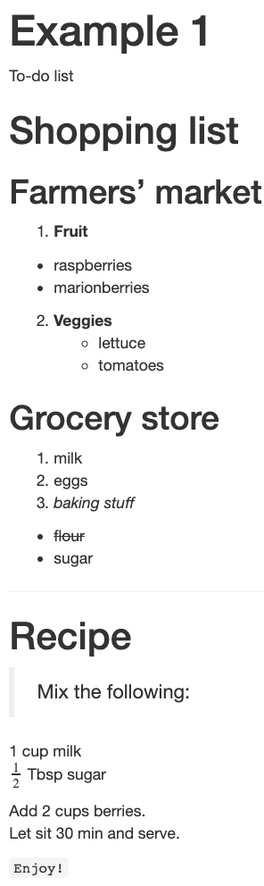</center>
]


---

class: middle, inverse

# 3 types of R Markdown content

1. Text
2. <span style="color:darkorange"> *Code chunks*</span>
3. YAML metadata


---

# Data description: Fisher's (or Anderson's) Iris data set

* n = 150 
* 3 species of Iris flowers (Setosa, Virginica, and Versicolour)
  + 50 measurements of each type of Iris
* variables:
  + sepal length, sepal width, petal length, petal width, and species

_Can the flower species be determined by these variables?_

<center>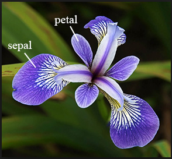</center>
[Gareth Duffy](https://github.com/Datagatherer2357/Gareth-Duffy-GMIT-Project)

---

# Code chunks

Chunks of R code start with ` ```{r} ` and end with ` ``` `.  
For example, the chunk  produces the output

```{r}
summary(iris)
```

---

# Create a code chunk

Code chunks can be created by either

1. Clicking on  $\rightarrow$  at top right of editor window, or

1. __Keyboard shortcut__
  * Mac:   _Command + Option + I_
  * PC:   _Ctrl + Alt + I_

---

# Chunk options- most common

.pull-left-40[
Text in editor:

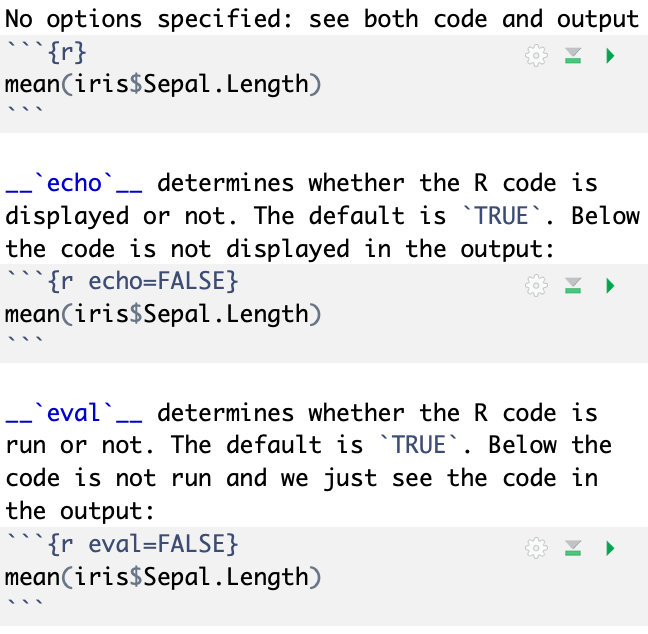
]

.pull-right-60[

No options specified: see both code and output
```{r}
mean(iris$Sepal.Length)
```

__`echo`__ determines whether the R code is displayed or not. The default is `TRUE`. Below the code is not displayed in the output:
```{r echo=FALSE}
mean(iris$Sepal.Length)
```

__`eval`__ determines whether the R code is run or not. The default is `TRUE`. Below the code is not run and we just see the code in the output:
```{r eval=FALSE}
mean(iris$Sepal.Length)
```

]

---

# More chunk options

.pull-left-40[
Text in editor:


]

.pull-right-60[

__`include`__ determines whether to include the R chunk in the output or not. The default is `TRUE`. Below the chunk is run, but we do not see the code or its output:
```{r include=FALSE}
mean(iris$Sepal.Length)
```

]

Setting `include=FALSE` is useful when you have R code that you want to run, but do not want to display either the code or its output.

See the [R Markdown cheatsheet](https://www.rstudio.com/wp-content/uploads/2016/03/rmarkdown-cheatsheet-2.0.pdf) for more chunk options.


---

# Inline code

* You can also report statistics inline with the text
  * R code is not shown in this case 

.pull-left[
Text in editor:

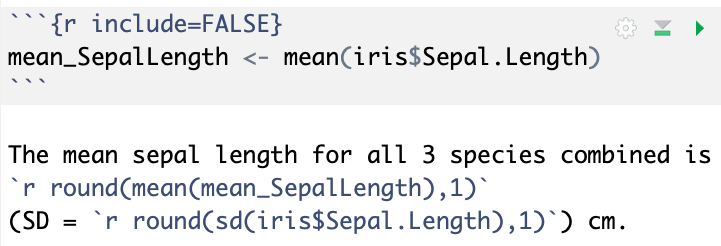
]

.pull-right[

Output: 

```{r include=FALSE}
mean_SepalLength <- mean(iris$Sepal.Length)
```

The mean sepal length for all 3 species combined is 
`r round(mean(mean_SepalLength),1)` 
(SD = `r round(sd(iris$Sepal.Length),1)`) cm.

]

* The code above is an example of where `include=FALSE` is used a chunk option to evaluate the code but not show the code or its output. It saves the mean as `mean_SepalLength`, which can then be used later on.
* For the standard deviation, the inline code did the calculation.

---

# Figures


.pull-left[
Text in editor:

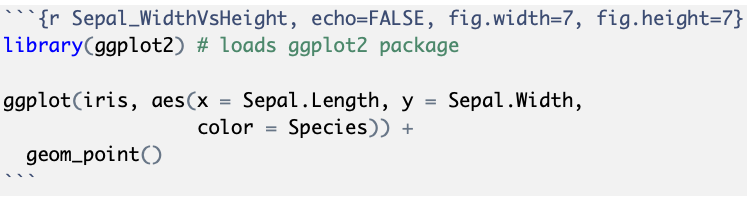

* Figure dimensions specified with `fig.width` and `fig.height`
* Figure name specified by the chunk label
  * The figure created by the chunk above is called `Sepal_WidthVsHeight-1.png`
  * _Chunk names must be unique!_
* `echo=FALSE` was used to hide the code and only display the figure

]

.pull-right[
Output: 

```{r Sepal_WidthVsHeight, echo=FALSE, fig.width=7, fig.height=7}
library(ggplot2) # loads ggplot2 package

ggplot(iris, aes(x = Sepal.Length, y = Sepal.Width, 
                 color = Species)) +
  geom_point()
```

]


---

# Tables - with no formatting

<!-- * kable, kableExtra -->

.pull-left[
 Text in editor:


]

.pull-right[
```{r}
table_sepal_length <- iris %>% 
  group_by(Species) %>% 
  summarize(mean = mean(Sepal.Length),
            SD = sd(Sepal.Length))

table_sepal_length
```


]

---

# Tables - with `kable`

.pull-left[
 Text in editor:


]

.pull-right[
```{r}
library(knitr) 
# only need to load package 
# once in a document

kable(table_sepal_length, 
      format = "markdown",
      digits = 2)
```

]


---

# Tables - use `kableExtra` for more formatting options

.pull-left-60[
 Text in editor:

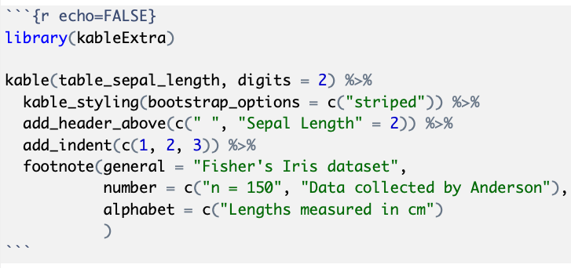
]

.pull-right-40[
Output:

```{r echo=FALSE}
library(kableExtra) 

kable(table_sepal_length, digits = 2) %>% 
  kable_styling(bootstrap_options = c("striped")) %>%
  add_header_above(c(" ", "Sepal Length" = 2)) %>% 
  add_indent(c(1, 2, 3)) %>% 
  footnote(general = "Fisher's Iris dataset",
           number = c("n = 150", "Data collected by Anderson"),
           alphabet = c("Lengths measured in cm")
           )
```

]


See [Hao Zhu's webpage](https://haozhu233.github.io/kableExtra/awesome_table_in_html.html) for many, many more `kableExtra` options.


---

# Global chunk options

* You can set global chunk options that are use for all chunks in the file
  * Include this chunk at the beginning of the .Rmd file
  * The template .Rmd file already includes a chunk labeled `global_options`
    * Add more options as desired to this chunk
* Any chunk option can be set in the `global_options` chunk

<center>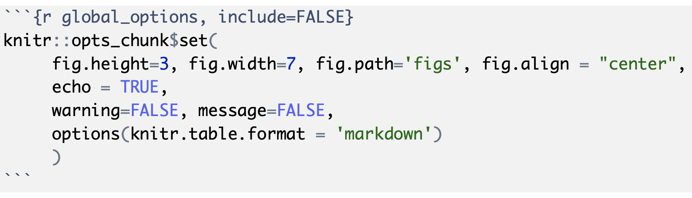</center>

* `fig.path` sets the folder name where figures generated by the .Rmd file will be saved
* See the [R Markdown cheatsheet](https://www.rstudio.com/wp-content/uploads/2016/03/rmarkdown-cheatsheet-2.0.pdf) for more chunk options.


---

# Practice! (part 1)
Create an .Rmd file with file name `example2.Rmd` that creates the html output below. 

.pull-left[

]

.pull-right[


]


---

# Practice! (part 2)

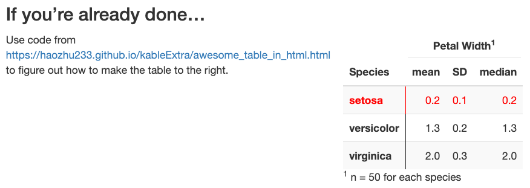


---

class: middle, inverse

# 3 types of R Markdown content

1. Text
2. Code chunks
3. <span style="color:darkorange"> *YAML metadata*</span>


---


# YAML metadata 

Many output options can be set in the YAML metadata, which is the first set of code in the file starting and ending with `---`.

* YAML is an acronym for *YAML Ain't Markup Language*
* It sets the configuration specifications for the output file
* For more details see the [YAML Wikipedia](https://en.wikipedia.org/wiki/YAML) page

__Title__, __author__, and __date__ at top of output

.pull-left[
Text in editor:

]

.pull-right[
Output:
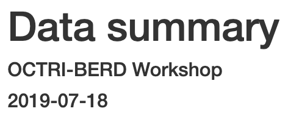
]


---

# Numbered sections & clickable table of contents


.pull-left-40[
Text in editor:

Try out `collapsed: yes` and `smooth_scroll: no`
]

.pull-right-60[
Output:
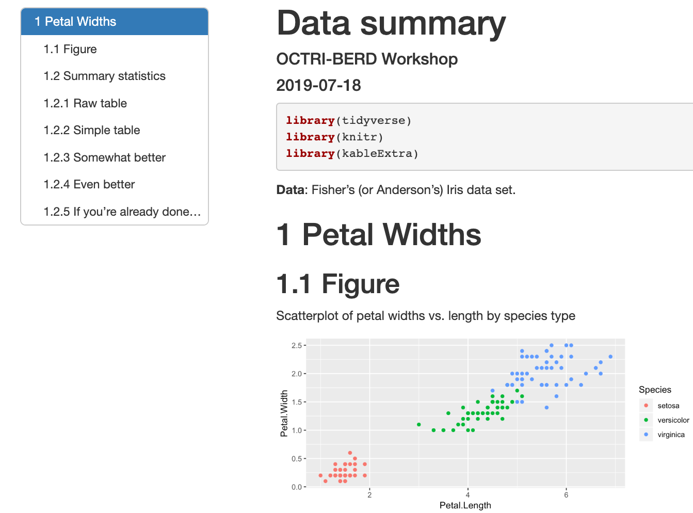
]


---

# Themes

* There are 12 themes to choose from without installing additional packages
* See http://www.datadreaming.org/post/r-markdown-theme-gallery/ for examples


.pull-left-40[
Text in editor:

]

.pull-right-60[
Output:

]


---

# Cold folding 

* Cold folding creates a button in the output html file that lets users choose whether they want to see the R code or not
  * This only applies to R code from chunks with `echo = TRUE`
* `code_folding: hide` all R code hidden by default; user must click Code button to see R
* `code_folding: show` all R code shown by default; user must click Code button to hide R
* See https://bookdown.org/yihui/rmarkdown/html-document.html#code-folding for more info

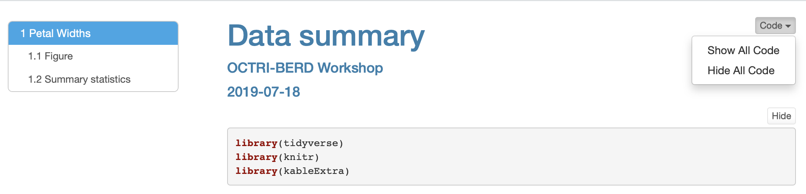

---

# Word documents

.pull-left-40[
* Not many YAML options
* Cannot include html code or html-specific commands  

Text in editor:

]

.pull-right-60[
Output: 
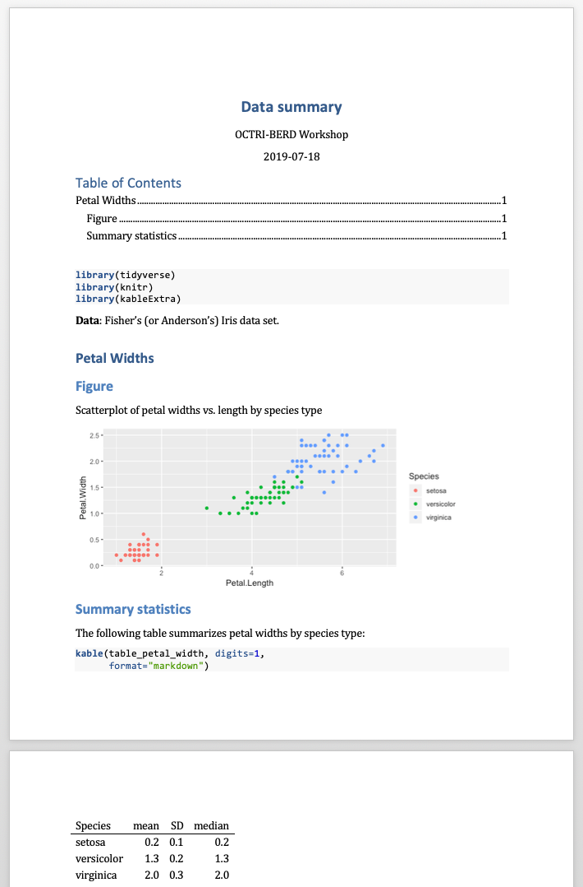
]


---

# Word documents - tables options limited

* Cannot use `kableExtra` package options
* `kable` can be used

<center></center>


---

# Word documents - using a style file


.pull-left-40[
* Create a Word doc with preferred formatting
  * font types and sizes, margins, header colors, etc.

YAML with code to include style file:

]

.pull-right-60[
Sample style file:
<center></center>
]

The Word doc created by R Studio will have the same formatting as the specified style file.

---

# Pdf documents

Producing pdf documents requires that LaTeX be installed on your computer

.pull-left-40[
* Few YAML options
* Lots of table options, including kableExtra
* Can use LaTeX code for formatting

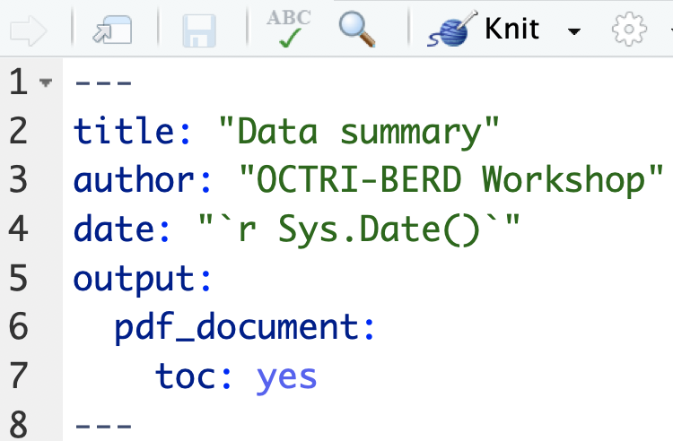
]

.pull-right-60[
<center>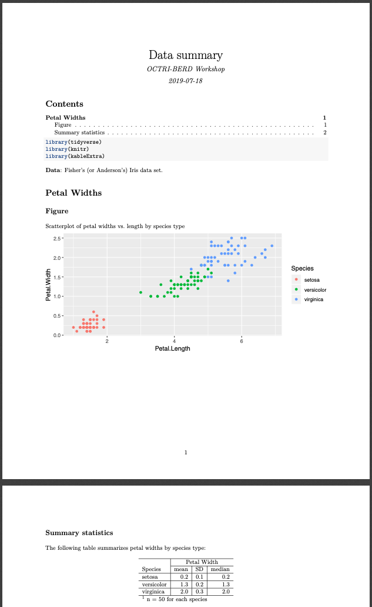</center>
]


