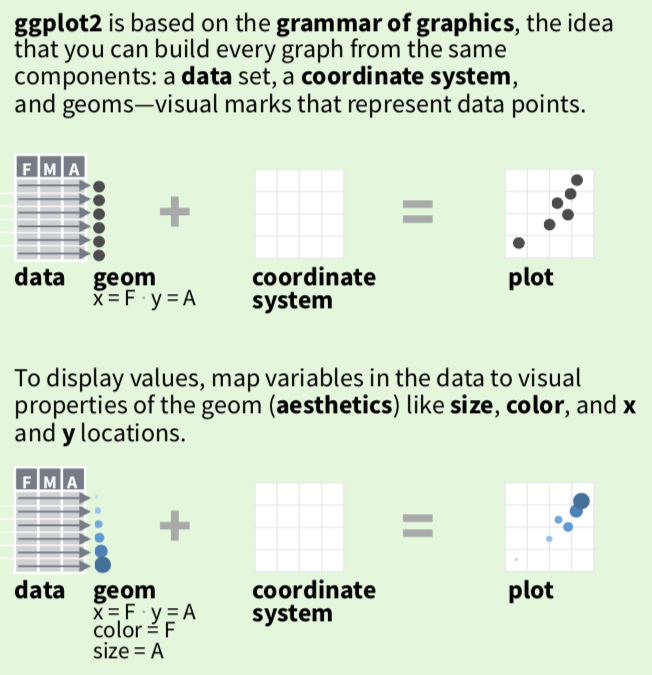
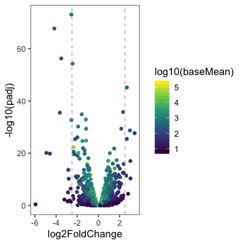
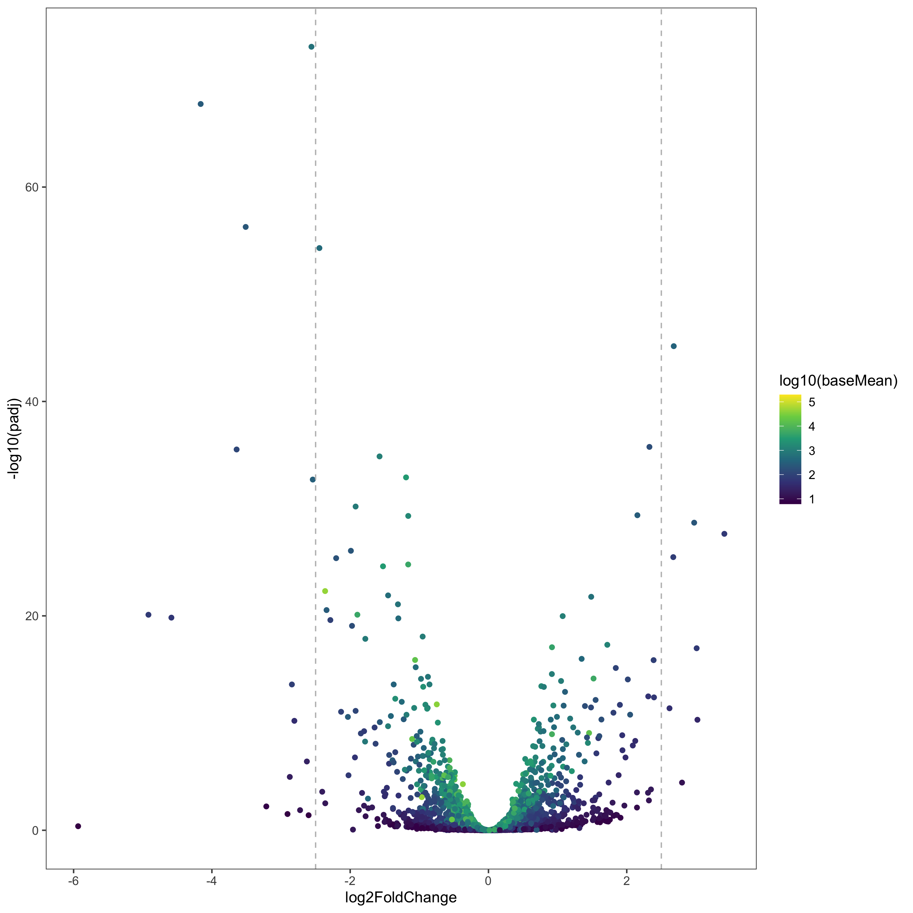
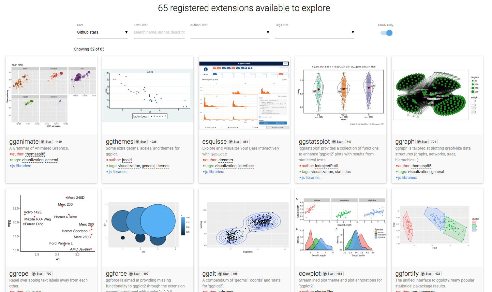
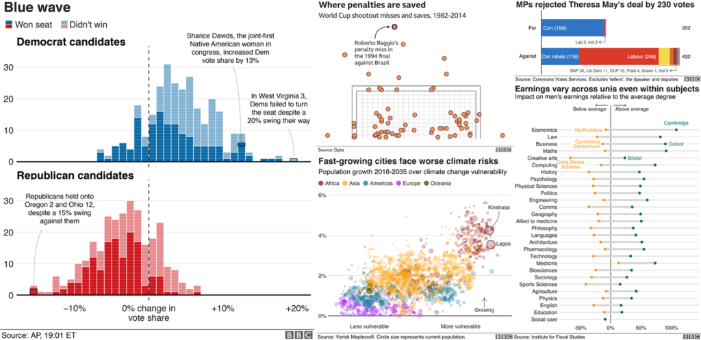
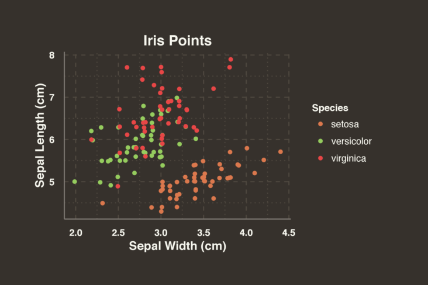
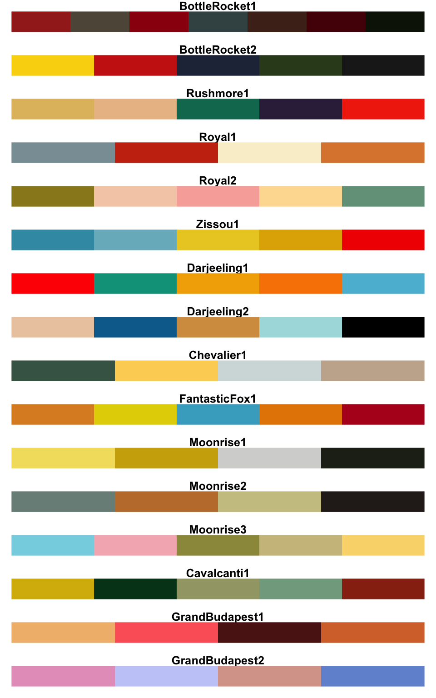

layout: true
  
<!-- <div class="my-footer"><span>bit.ly/berd_tidy</span></div>  -->
<!-- <div class="my-footer"><a href="#visualtoc"> Visual TOC</span></div> -->

---

```{r setup, include=FALSE}
options(htmltools.dir.version = FALSE)

library(tidyverse)
library(lubridate)
library(janitor)
library(emo)
library(here)
library(flipbookr) #devtools::install_github("EvaMaeRey/flipbookr")

library(ggridges)
library(gapminder)
library(GGally)
library(ggExtra)
library(ggthemes)
library(hrbrthemes)
library(ggrepel)
library(corrplot)
library(ggpubr)
library(pheatmap)
library(plotly)

filter = dplyr::filter # had to do this because flipbookr code couldn't find filter()
select = dplyr::select # pheatmap causing issues

figpath = here::here("04-ggplot","figs/")

knitr::opts_chunk$set(
  warning=FALSE, 
  message=FALSE, 
  #fig.width=6, #for flipbook
  #fig.height=4,
  #fig.path = figpath, # turn on only once to save images for visual toc, messed up flipbookr, also takes longer to run
  fig.align = "center",
  rows.print=7,
  echo=TRUE,
  highlight = TRUE,
  prompt = FALSE, # IF TRUE adds a > before each code input
  comment = "", # PRINTS IN FRONT OF OUTPUT, default is '##' which comments out output
  cache = TRUE, # MAYBE TURN ON FOR FLIPBOOK
  fig.retina = 3 # for flipbook
  #comment=NA
  )

# from https://github.com/EvaMaeRey/little_flipbooks_library/
make_html_picture_link <- function(path, link){
  cat(paste0('<a href="', link, '"></a>'))
}

# set ggplot theme
# theme_set(theme_bw(base_size = 24))
```


```{r xaringan-themer, include = FALSE}
# creates xaringan theme
# devtools::install_github("gadenbuie/xaringanthemer")
library(xaringanthemer)
mono_light(
  base_color =  "#3A6185", ## OHSU Marquam
  code_highlight_color = "#cbdded",
  link_color = "#38BDDE",
  header_font_google = google_font("Josefin Sans"),
  text_font_google   = google_font("Montserrat", "300", "300i","400i","700"),
  code_font_google   = NULL,
  text_font_size = "22px",
  code_font_size = "18px",
  header_h1_font_size = "45px",
  header_h2_font_size = "40px",
  header_h3_font_size = "35px",
  padding = "0em 2em 1em 2em",
  outfile = "css/xaringan-themer.css"
)
```

```{r data, echo=FALSE}
gapminder2011 <- read_csv(here("04-ggplot", "data", "Gapminder_vars_2011.csv"))
gapminder2011_long <- read_csv(here("04-ggplot", "data", "Gapminder_vars_2011_long.csv"))
pasilla_data <- read_csv(here("04-ggplot","data","gene_expr_pasilla_results.csv"))
```

```{r echo=FALSE, eval=FALSE}
names(gapminder2011)
```

# Load files for today's workshop

.pull-left[
1. Open slides [bit.ly/berd_ggplot](http://bit.ly/berd_ggplot)
1. Get project folder
    + Download zip folder at [bit.ly/berd_ggplot_zip](http://bit.ly/berd_ggplot_zip)
    + UNZIP completely (right click-> "extract all")
    + Open unzipped folder
    + Open (double click) `berd_ggplot_project.Rproj`
    + Inside RStudio 'Files' tab: click on file `00-install.R` and click "Run" to run all lines of code.
]
.pull-right[
<center><a href="https://github.com/allisonhorst/stats-illustrations"><br>Allison Horst</a></center>
]
---

# Learning objectives

- Understand the basic idea behind grammar of graphics
- Be able to data to visual elements
- Be able to customize plots in various ways
- Use ggplot extensions to make even more plots!

---
class: center, middle, inverse

<center><a href="https://ggplot2.tidyverse.org/index.html"></a></center>


---

# Grammar of Graphics

- The "The Grammar of Graphics," is the theoretical basis for the ggplot2 package.
    + Much like how we construct sentences in any language by using a linguistic grammar (nouns, verbs, etc.), the grammar of graphics allows us to specify the components of a statistical graphic.
    
In short, the grammar tells us that:

>A statistical graphic is a mapping of data variables to aesthetic attributes
of geometric objects.

3 **essential** components to a graphic:

- data: the data-set comprised of variables that we plot
- geom: this refers to our type of geometric objects we see in our plot (points, lines, bars, etc.)
- aes: aesthetic attributes of the geometric object that we can perceive on a graphic. For example, x/y position, color, shape, and size. Each assigned aesthetic attribute can be mapped to a variable in our data-set.

---
# ggplot basics

<center></center>


---
# Grammar of ggplot2

.pull-left[
<center><a href="https://rstudio.com/wp-content/uploads/2016/11/ggplot2-cheatsheet-2.1.pdf"><br>ggplot cheatsheet</a></center>
]
.pull-right[

<center><a href="https://www.sites.univ-rennes2.fr/mastersigat/Cours/Atelier%20Visualisation%20de%20donn%C3%A9es%20CERGY.pdf"></a></center>

]

---

# Grammar of ggplot2

<center><a href="https://github.com/rstudio-conf-2020/dataviz"><br>Kieran Healy</a></center>

---
name:visualtoc

# Visual Table of Contents


```{r, results='asis', echo=FALSE, cache=FALSE}
make_html_picture_link("figs/barplot_regions_out-1.png", "#barplot")
make_html_picture_link("figs/hist_LifeExp_out-1.png","#histogram")
make_html_picture_link("figs/density_LifeExp_out-1.png","#density")
make_html_picture_link("figs/ridges_LifeExp_out-1.png","#ridgeline")
make_html_picture_link("figs/boxplot_LifeExp_out-1.png","#boxplot")
make_html_picture_link("figs/scatter_FoodvsLifeExp_out-1.png","#scatterplot")
make_html_picture_link("figs/bubble_FemLitvsLifeExp_out-1.png","#bubbleplot")
make_html_picture_link("figs/lineplot_YearLifeExp_out-1.png","#lineplot")

make_html_picture_link("figs/margins_FoodvsLifeExp_out-1.png","#ggmarginal")
make_html_picture_link("figs/corrplotmix-1.png","#correlation")
make_html_picture_link("figs/facet_density_all_out-1.png","#facetdensity")
make_html_picture_link("figs/facet2x_density_all_out-1.png","#facethist")

make_html_picture_link("figs/volcanoplot_out-1.png","#volcano")
make_html_picture_link("figs/heatmap_out-1.png","#heatmap")
make_html_picture_link("figs/ggpubr_out-1.png","#sidebyside")
```


Inspired by [EvaMaeRey (Gina Reynolds)](https://github.com/EvaMaeRey), author of the amazing [`flipbookr`](https://github.com/EvaMaeRey/flipbookr) package.

---
name:barplot
# Barplot

.pull-left[
```{r barplot_regions_nice, eval=FALSE}
ggplot(data = gapminder2011,
       aes(x = four_regions,
           fill = eight_regions)) +
  geom_bar() +
  labs(x = "World Regions",
       y = "Number of countries",
       title = "Barplot") + 
  theme_bw() + 
  theme(
    axis.text.x =
      element_text(angle = -30, hjust = 0),
    text = element_text(family = "Palatino")) +
  scale_fill_viridis_d(name = "Subregions")
```
]

.pull-right[
```{r barplot_regions_out, ref.label="barplot_regions", echo=FALSE, fig.keep = "first"}
```
]

---

```{r barplot_regions, include=FALSE}
ggplot(data = gapminder2011) +
  aes(x = four_regions) +
  geom_bar() +
  aes(fill = eight_regions) +
  scale_fill_discrete(
    name = "Subregions"
    ) +
  labs(x = "World Regions",
       y = "Number of countries",
       title = "Barplot") + 
  theme_bw() + 
  theme(axis.text.x=element_text(
    angle = -30, hjust = 0)) +
  scale_fill_viridis_d(name = "Subregions") +
  theme(
    text = element_text(family = "Palatino"))
```

`r chunk_reveal("barplot_regions", break_type = "auto", split=40)`

---
name:histogram
# Histogram

.pull-left[
```{r hist_LifeExp_nice, eval = FALSE}
ggplot(data = gapminder2011,
       aes(x = LifeExpectancyYrs,
           fill = four_regions)
       ) + 
  geom_histogram() + 
  scale_fill_discrete(
    name = "Regions",
    labels = c("Africa", "Americas", 
               "Asia", "Europe")
    ) + 
  labs(
    x = "Life Expectancy (years)",   
    title = "Histogram"
    ) + 
  ggthemes::theme_economist() +
  theme(legend.position="bottom") 
```
]
.pull-right[
```{r hist_LifeExp_out, ref.label="hist_LifeExp_nice", echo=FALSE}
```
]

---

```{r hist_LifeExp, include = FALSE}
ggplot(data = gapminder2011) + 
  aes(x = LifeExpectancyYrs) + 
  geom_histogram() + 
  aes(fill = four_regions) +   
  scale_fill_discrete(
    name = "Regions",
    labels = c("Africa", "Americas", 
               "Asia", "Europe")
    ) + 
  labs(
    x = "Life Expectancy (years)",   
    title = "Histogram"
    ) + 
  ggthemes::theme_economist() +
  theme(legend.position="bottom") 
```

`r chunk_reveal("hist_LifeExp", break_type = "auto", split=40)`

---

# Legend position

* "Generic" positions
      * `legend.position = "left"`
      * Other options: "top", "right", "bottom", "none"
      
* Specificied by location
    * `legend.position = c(x,y)`
    * Specify x and y coordinates of position
        * Values should be between 0 and 1
        * __c(0,0)__ corresponds to the __bottom left__
        * __c(1,1)__ corresponds to the __top right__

---
name:density
# Density Plot

.pull-left[
```{r density_LifeExp_nice, eval = FALSE}
ggplot(data = gapminder2011,
       aes(x = LifeExpectancyYrs,
           fill = four_regions)
       ) + 
  geom_density(alpha = 0.4) +
  scale_fill_discrete(
    name = "Regions",
    labels = c("Africa", "Americas", 
               "Asia", "Europe")
    ) +
  labs(
    x = "Life Expectancy (years)",   
    title = "Density Plot"
    ) +
  hrbrthemes::theme_ipsum() +
  theme(legend.position=c(.2,.8))
```
]
.pull-right[
```{r density_LifeExp_out, ref.label="density_LifeExp_nice", echo=FALSE}
```
]

---

```{r density_LifeExp, include = FALSE}
ggplot(data = gapminder2011) + 
  aes(x = LifeExpectancyYrs) + 
  geom_density() +
  aes(fill = four_regions) +
  aes(alpha=.4) +   
  scale_fill_discrete(
    name = "Regions",
    labels = c("Africa", "Americas", 
               "Asia", "Europe")
    ) +
  scale_alpha(guide = "none") +
  hrbrthemes::theme_ipsum() +
  theme(legend.position=c(.2,.8)) + 
  labs(
    x = "Life Expectancy (years)",   
    title = "Density Plot"
    )
```

`r chunk_reveal("density_LifeExp", break_type = "auto", split=40)`


---
name:ridgeline

# Ridgeline Plot

.pull-left[
```{r ridges_LifeExp_nice, eval = FALSE}
library(ggridges)

ggplot(data = gapminder2011,
       aes(x = LifeExpectancyYrs,
           y = four_regions,
           fill = four_regions)
       ) + 
  geom_density_ridges(alpha = 0.4) +
  ggthemes::theme_clean() + 
  theme(legend.position="none") + 
  labs(
    x = "Life Expectancy (years)",   
    y = "Regions",
    title = "Ridgeline Density Plot"
    )
```
]
.pull-right[
```{r ridges_LifeExp_out, ref.label="ridges_LifeExp_nice", echo=FALSE}
```
]

---

```{r ridges_LifeExp, include = FALSE}
library(ggridges)

ggplot(data = gapminder2011) + 
  aes(x = LifeExpectancyYrs) + 
  aes(y = four_regions) + 
  geom_density_ridges() +
  aes(fill = four_regions) +
  aes(alpha = 0.4) +  
  ggthemes::theme_clean() + 
  theme(legend.position = "none") + 
  labs(
    x = "Life Expectancy (years)",   
    y = "Regions",
    title = "Ridgeline Density Plot"
    )
```

`r chunk_reveal("ridges_LifeExp", break_type = "auto", split=40)`


---
name:boxplot

# Boxplot

.pull-left[
```{r boxplot_LifeExp_nice, eval = FALSE}
ggplot(data = gapminder2011,
       aes(y = LifeExpectancyYrs,
           x = four_regions,
           fill = four_regions)
       ) + 
  geom_boxplot(alpha = 0.3) + 
  coord_flip() +   
  theme_fivethirtyeight() +
  theme(axis.title = element_text()) + 
  scale_fill_fivethirtyeight() + 
  theme(legend.position = "none") + 
  geom_jitter(width = .1, alpha = 0.3) +
  geom_violin(colour = "grey", alpha = .2) + 
  labs(
    x = "World Region",    
    y = "Life Expectancy (years)",   
    title = "Boxplot"
    )
```
]
.pull-right[
```{r boxplot_LifeExp_out, ref.label="boxplot_LifeExp_nice", echo=FALSE}
```
]

---

```{r boxplot_LifeExp, include = FALSE}
ggplot(data = gapminder2011) + 
  aes(y = LifeExpectancyYrs) + 
  geom_boxplot() + 
  aes(x = four_regions) +   
  aes(fill = four_regions) +
  aes(alpha=.3) +   
  coord_flip() +   
  theme_fivethirtyeight() +
  scale_fill_fivethirtyeight() + 
  theme(axis.title = element_text()) + 
  theme(legend.position = "none") + 
  geom_jitter(
    width = .1, 
    alpha = 0.3  
    ) +
  geom_violin(
    colour = "grey",
    alpha = .2
  ) + 
  labs(
    x = "World Region",    
    y = "Life Expectancy (years)",   
    title = "Boxplot"
    )
```

`r chunk_reveal("boxplot_LifeExp", break_type = "auto", split=40)`

---

# Exercise

Complete the first section of the `practice_ggplot.Rmd` file: "Bar plot".

---
name:scatterplot

# Scatterplot

.pull-left[
```{r scatter_FoodvsLifeExp_nice, eval = FALSE}
ggplot(data = gapminder2011,
       aes(x = FoodSupplykcPPD,
           y = LifeExpectancyYrs,
           color = four_regions)
       ) + 
  geom_point(alpha = 0.4) +
  geom_smooth(se = FALSE)+
  geom_smooth(method = lm) +
  theme_minimal() +
  scale_color_colorblind(
    name = "Regions",
    labels = c("Africa", "Americas", 
               "Asia", "Europe")
    ) +
  labs(
    x = "Daily Food Supply Per Person (kc)",   
    y = "Life Expectancy (years)",   
    title = "Scatterplot"
    )
```
]
.pull-right[
```{r scatter_FoodvsLifeExp_out, ref.label="scatter_FoodvsLifeExp_nice", echo=FALSE}
```
]


---


```{r scatter_FoodvsLifeExp, include = FALSE}
ggplot(data = gapminder2011) + 
  aes(x = FoodSupplykcPPD) + 
  aes(y = LifeExpectancyYrs) + 
  geom_point() +
  aes(color = four_regions) +
  aes(alpha=.4) +   
  scale_color_colorblind(
    name = "Regions",
    labels = c("Africa", "Americas", 
               "Asia", "Europe")
    ) +
  scale_alpha(guide = "none") +
  geom_smooth(se = FALSE) +
  geom_smooth(method = lm) +
  theme_minimal() +
  labs(
    x = "Daily Food Supply Per Person (kc)",   
    y = "Life Expectancy (years)",   
    title = "Scatterplot"
    )
```

`r chunk_reveal("scatter_FoodvsLifeExp", break_type = "auto", split=40)`


---
name:bubbleplot

# Bubbleplot

.pull-left[
```{r bubble_FemLitvsLifeExp_nice, eval = FALSE}
ggplot(data = gapminder2011,
       aes(x = FoodSupplykcPPD,
           y = LifeExpectancyYrs,
           color = four_regions,
           size = population)
       ) + 
  geom_point(alpha = 0.4) +
  scale_color_colorblind(
    name = "Regions",
    labels = c("Africa", "Americas", 
               "Asia", "Europe")
  ) +
  scale_size(
    name = "Population Size (millions)",
    breaks = c(1e08,5e08,1e09),
    labels = c(100,500,1000)
  ) +
  hrbrthemes::theme_ipsum() +
  labs(
    x = "Daily Food Supply PP (kc)",  
    y = "Life Expectancy (years)",   
    title = "Bubbleplot"
    )
```

]
.pull-right[
```{r bubble_FemLitvsLifeExp_out, ref.label="bubble_FemLitvsLifeExp_nice", echo=FALSE}
```
]

---

```{r bubble_FemLitvsLifeExp, include = FALSE}
ggplot(data = gapminder2011) + 
  aes(x = FoodSupplykcPPD) + 
  aes(y = LifeExpectancyYrs) + 
  geom_point() +
  aes(color = four_regions) +
  aes(alpha=.4) +   
  aes(size = population) +
  scale_color_colorblind(
    name = "Regions",
    labels = c("Africa", "Americas", 
               "Asia", "Europe")
  ) +
  scale_size(
    name = "Population Size (millions)",
    breaks = c(1e08,5e08,1e09),
    labels = c(100,500,1000)
  ) +
  scale_alpha(guide = "none") +
  hrbrthemes::theme_ipsum() +
  labs(
    x = "Daily Food Supply PP (kc)",  
    y = "Life Expectancy (years)",   
    title = "Bubbleplot"
    )
```

`r chunk_reveal("bubble_FemLitvsLifeExp", break_type = "auto", split=40)`

---

# Exercise

Complete the second section of the `practice_ggplot.Rmd` file: "Histogram."


---
name:lineplot

# Lineplot

.pull-left[
```{r lineplot_YearLifeExp_nice, eval = FALSE}
ggplot(data = gapminder,
       aes(x = year,
           y = lifeExp,
           color = continent,
           group = country)
       ) + 
  geom_point(alpha = 0.4) +
  geom_line(alpha = 0.7) +
  scale_color_colorblind(name = "Continents") +
  ggthemes::theme_clean() + 
  labs(
    x = "Year",   
    y = "Life Expectancy (years)",   
    title = "Lineplot",
    subtitle = "Time series",
    caption = "Source: gapminder package"
    )
```
]
.pull-right[
```{r lineplot_YearLifeExp_out, ref.label="lineplot_YearLifeExp_nice", echo=FALSE}
```
]

---

```{r lineplot_YearLifeExp, include = FALSE}
ggplot(data = gapminder) + 
  aes(x = year) + 
  aes(y = lifeExp) + 
  geom_point() +
  aes(color = continent) +
  aes(alpha=.4) +
  geom_line(alpha = .7) +
  aes(group = country) +
  scale_color_colorblind(
    name = "Continents"
    ) +
  scale_alpha(guide = "none") +
  ggthemes::theme_clean() + 
  labs(
    x = "Year",   
    y = "Life Expectancy (years)",   
    title = "Lineplot",
    subtitle = "Time series",
    caption = "Source: gapminder package"
    )
```

`r chunk_reveal("lineplot_YearLifeExp", break_type = "auto", split=40)`


---
name::ggmarginal
# `ggmarginal`

https://cran.r-project.org/web/packages/ggExtra/vignettes/ggExtra.html


.pull-left-40[
```{r margins_FoodvsLifeExp, fig.width=10, fig.height=5}
# library(ggExtra)

p <- ggplot(data = gapminder2011,
        aes(x = FoodSupplykcPPD, 
            y = LifeExpectancyYrs,
            color = four_regions,
            alpha=.4)
        ) +
  geom_point() +
  scale_color_discrete(
    name = "Regions",
    labels = c("Africa", "Americas", 
               "Asia", "Europe")
    ) +
  scale_alpha(guide = "none") +
  theme(legend.position="bottom") +
  labs(
    x = "Daily Food Supply PP (kc)",   
    y = "Life Expectancy (years)",   
    title = "Scatterplot"
    )
```
]

.pull-right-60[
```{r margins_FoodvsLifeExp_out, fig.width=10, fig.height=5}
ggMarginal(p,
  type = "density",
  margins = "both",
  groupColour = TRUE,
  groupFill = TRUE
)
```
]

---
class: inverse, middle, center

# Corrolelograms

---
name:correlation

## Correlation matrix

```{r}
M <- cor(gapminder2011 %>% 
           select(FoodSupplykcPPD:WaterSourcePrct),
         use = "complete.obs" # specified since there are missing values
         )
M
```

---

## `corrplot::corrplot()`

https://cran.r-project.org/web/packages/corrplot/vignettes/corrplot-intro.html

.pull-left[
```{r fig.height=4}
library(corrplot)
corrplot(M, method = "number")
```
]

.pull-right[
```{r fig.width=10, fig.height=3}
corrplot(M, method = "ellipse")
```

```{r, fig.height=2}
corrplot.mixed(M)
```

```{r corrplotmix, include=FALSE, fig.width=8, fig.height=8}
corrplot.mixed(M)
```

]

---
name:ggcorr

## `GGally::ggcorr()`
https://ggobi.github.io/ggally/index.html

```{r fig.width=10, fig.height=5}
# library(GGally)
gapminder2011 %>% 
  select(FoodSupplykcPPD:WaterSourcePrct) %>% # specifying which columns to use
  ggcorr()
```

---
name:ggpairs

## `GGally::ggpairs()`
https://ggobi.github.io/ggally/index.html

```{r fig.width=10, fig.height=5}
# library(GGally)
gapminder2011 %>% 
  select(FoodSupplykcPPD:WaterSourcePrct) %>% # specifying which columns to use
  ggpairs()
```


---
class: inverse, middle, center

# Faceting


---
name:facetdensity
# Faceted Density Plot

.pull-left[
```{r facet_density_all_nice, eval = FALSE}
ggplot(data = gapminder2011_long,
       aes(x = Values,
           color = four_regions)
       ) + 
  facet_wrap(~ Measures, 
             scales = "free",
             ncol = 2
             ) + 
  geom_density() +
  ggthemes::theme_few() + 
  theme(legend.position="top")  +
  labs(
    x = "",   
    title = "Faceted Density Plots",
    # Add a figure number!
    tag = "Fig 1",
    # note that color is being 
    # specified inside labs!
    color = "Regions"  
    )
```
]
.pull-right[
```{r facet_density_all_out, ref.label="facet_density_all_nice", echo=FALSE}
```
]

---

```{r facet_density_all, include = FALSE}
ggplot(data = gapminder2011_long) + 
  aes(x = Values) + 
  geom_density() + 
  facet_wrap(~ Measures, 
             scales = "free", 
             ncol = 2
             ) + 
  aes(color = four_regions) + 
  ggthemes::theme_few() + 
  theme( legend.position="top")  + 
  labs(
    x = "",   
    title = "Faceted Density Plots",
    tag = "Fig 1",
    color = "Regions"  
    )
```

`r chunk_reveal("facet_density_all", break_type = "auto", split=40)`


---
name:facethist

# Faceted 2x Histogram

.pull-left[
```{r facet2x_density_all_nice, eval = FALSE, fig.width=10, fig.height=5}
ggplot(data = gapminder2011_long) + 
  geom_histogram(aes(x = Values),
                 fill = "darkorange") +
  facet_grid(
    four_regions ~ Measures, 
    scales = "free_x"
    ) + 
  ggthemes::theme_igray() + 
  theme(
    strip.text.y = element_text(size=10, 
                                angle=45, 
                                face = "bold"),
    strip.text.x = element_text(size=6),
    axis.text.x = element_text(angle=45, 
                               hjust=1)
    ) +
  labs(
    x = "",   
    title = "Faceted Density Plots"
    )
```
]
.pull-right[
```{r facet2x_density_all_out, ref.label="facet2x_density_all_nice", echo=FALSE}
```
]

---

```{r facet2x_density_all, include = FALSE, fig.width=10, fig.height=5}
ggplot(data = gapminder2011_long) + 
  aes(x = Values) +
  facet_grid(
    four_regions ~ Measures, 
    scales = "free_x"
    ) + 
  geom_histogram(fill = "darkorange") +
  ggthemes::theme_igray() + 
  theme(
    strip.text.y = 
      element_text(size=10, 
                   angle=45, 
                   face = "bold"),
    strip.text.x = element_text(size=6),
    axis.text.x = element_text(angle=45, 
                               hjust=1)
    ) + 
  labs(
    x = "",   
    title = "Faceted Density Plots"
    )
```

`r chunk_reveal("facet2x_density_all", break_type = "auto", split=40)`

---
class:inverse, center, middle

# Gene Expression

---

# Pasilla Data

```{r}
glimpse(pasilla_data)
```

---
name:volcano

# Volcano Plot

.pull-left[
```{r volcanoplot_nice, include = TRUE}
# Create subset for labeling
pasilla_data_top = pasilla_data %>%
  filter(-log10(padj) > 10, 
         abs(log2FoldChange) > 2.5)

ggplot(data = pasilla_data,
       aes(x = log2FoldChange,
           y = log10(padj))) +
  geom_point() + 
  scale_y_reverse() +
  aes(color = padj < 0.05) +
  ggrepel::geom_text_repel(
    data = pasilla_data_top, 
    aes(label = gene), color = "black",
    box.padding = 0.5, min.segment.length = 0) +
  xlim(c(-7,7)) + 
  geom_vline(xintercept = c(-2.5, 2.5), 
             lty = "dashed", color="grey") + 
  ggthemes::theme_clean() + 
  labs(
    x = bquote(~Log[2]~ "fold change"),
    y = bquote(~Log[10]~adjusted~italic(P)),
    title = "Volcano Plot",
    subtitle = "Gene Expression of Pasilla Data"
  )
```
]
.pull-right[
```{r volcanoplot_out, ref.label="volcanoplot", echo=FALSE}
```
]

---

```{r volcanoplot, include=FALSE}
ggplot(data = pasilla_data,
       aes(x = log2FoldChange,
           y = log10(padj))) +
  geom_point() + 
  scale_y_reverse() +
  aes(color = padj < 0.05) +
  ggrepel::geom_text_repel(
    data = pasilla_data_top, 
    aes(label = gene), color = "black",
    box.padding = 0.5,
    min.segment.length = 0) +
  xlim(c(-7,7)) + 
  geom_vline(xintercept = c(-2.5, 2.5), 
             lty = "dashed", color="grey") + 
  ggthemes::theme_clean() + 
  labs(
    x = bquote(~Log[2]~ "fold change"),
    y = bquote(~Log[10]~adjusted~italic(P)),
    title = "Volcano Plot",
  subtitle="Gene Expression of Pasilla Data"
  )
```

`r chunk_reveal("volcanoplot", break_type = "auto", split=40)`

---
name:heatmap

# Heatmap with `pheatmap::pheatmap()`

It's possible to make heatmaps in ggplot2 with `geom_tile()`, but there are many other better functions using base R that cluster and annotate the data. This is using `pheatmap` package.

.pull-left-60[
We need to create the data:

```{r pasilla_heat, cache=FALSE}
# select expression data
pasilla_heat <- pasilla_data %>%
  select(treated1:untreated4)
# subtract off gene-specific means
pasilla_heat <- pasilla_heat - rowMeans(pasilla_heat)
# calculate standard deviation of each centered gened
sd_gene <- apply(pasilla_heat,1,sd)
# select top 500 most variable
pasilla_heat <- 
  pasilla_heat[order(sd_gene, decreasing = TRUE)[1:500],]

# create annotation data
pasilla_col <- data.frame(
  trt = factor(c(rep("trt",3), rep("untrt",4))),
  id = 1:7,
  row.names=colnames(pasilla_heat))
```
]
.pull-right-40[
```{r}
head(pasilla_heat, n = 3)

pasilla_col
```

]

---
# Heatmap with `pheatmap::pheatmap()`

.pull-left[
```{r heatmap, eval=FALSE}
pheatmap::pheatmap(
  mat = pasilla_heat,
  show_rownames = FALSE,
  annotation_col = pasilla_col
)
```
]
.pull-right[
```{r heatmap_out, ref.label="heatmap", echo=FALSE}
```
]

---
name:sidebyside
# Side by side plot with [`ggpubr`](https://rpkgs.datanovia.com/ggpubr/)
.pull-left[
```{r ggpubr}
p1 <- ggplot(data = pasilla_data,
       aes(x = log2FoldChange,
           y = -log10(padj),
           color = log10(baseMean))) +
  geom_point() + 
  geom_vline(xintercept = c(-2.5, 2.5), 
             lty = 2, color="grey") + 
  theme_few() + scale_color_viridis_c() + 
  labs(x = bquote(~Log[2]~ "fold change"),
       y = bquote(~Log[10]~adjusted~italic(P)),
       title = "Volcano Plot")
p2 <- ggplot(data = pasilla_data,
       aes(x = baseMean,
           y = log2FoldChange,
           color = log10(baseMean))) +
  geom_point() + 
  scale_x_log10() + 
  geom_hline(yintercept = 0, color = "red") + 
  theme_few() + scale_color_viridis_c() + 
  labs(y = bquote(~Log[2]~ "fold change"),
       x = bquote(~Log[10]~ "mean expression"),
       title = "MA Plot")
```
]
.pull-right[
```{r ggpubr_out,out.height="80%", out.width="80%", fig.width=6, fig.height=6}
ggpubr::ggarrange(p1, p2, labels = "AUTO",
  common.legend = TRUE, legend = "bottom")
```

Other options: [cowplot](https://wilkelab.org/cowplot/articles/index.html) and [patchwork](https://github.com/thomasp85/patchwork).
]

---
name:ggplotly
# Interactive `plotly` graphs with `ggplotly()`

.pull-left-40[
```{r ggplotly}
# Save ggplot
p1 <- ggplot(
  data = pasilla_data,
  aes(x = log2FoldChange,
      y = -log10(padj),
      color = log10(baseMean),
      key = gene) #<<
) +
  geom_point() +
  geom_vline(
    xintercept = c(-2.5, 2.5), 
    lty = 2, color="grey") + 
  theme_few() + 
  scale_color_viridis_c()
```

```{r, eval = FALSE}
plotly::ggplotly(p1) #<<
```

]
.pull-right-60[

```{r ggplotly_interactive, echo = FALSE}
plotly::ggplotly(p1)
```
]

---
name:ggsave
# Saving plots

.pull-left[
```{r}
ggsave(plot = p1,
       filename = "figs/volcanoplot_small.png", 
       height = 4, 
       width = 4, 
       units = "in",
       dpi = 100)
```
<center></center>

]
.pull-right[

```{r}
ggsave(plot = p1,
       filename = "figs/volcanoplot_large.png", 
       height = 10, 
       width = 10, 
       units = "in",
       dpi = 300)
```
<center></center>
]

---

# Exercise

Complete the third section of the `practice_ggplot.Rmd` file: "Bubble plot".

---
class:center, middle, inverse

# References and Links

---

<!--  -->

<center><a href="https://www.data-to-viz.com/poster.html"><br>https://www.data-to-viz.com/poster.html</a></center>

---

# Many, many ggplot extensions!

Some examples at the [ggplot2 extensions gallery](https://www.ggplot2-exts.org/gallery/)

<center><a href="https://www.ggplot2-exts.org/gallery/"><br>Allison Horst</a></center>

---

# Many, many themes and palettes/scales!

We used themes from [`ggthemes`](https://yutannihilation.github.io/allYourFigureAreBelongToUs/ggthemes/) and [`hrbrthemes`](https://github.com/hrbrmstr/hrbrthemes) as well as built in themes, but there are many more:

.pull-left[<center><a href="https://ryo-n7.github.io/2019-05-16-introducing-tvthemes-package/"><br>TV Themes</a></center>
<center><a href="https://www.garrickadenbuie.com/project/ggpomological/"><br>ggpomological</a></center>]
.pull-right[
<center><a href="https://github.com/bbc/bbplot/"><br>bbplot for BBC themes</a></center>
<center><a href="https://www.shanelynn.ie/themes-and-colours-for-r-ggplots-with-ggthemr/"><br>ggthemr</a></center>
]

from ["Themes to improve your ggplot figures" by David Keyes](https://rfortherestofus.com/2019/08/themes-to-improve-your-ggplot-figures/)

---

# R colors and palettes

.pull-left[
<center><a href="http://sape.inf.usi.ch/quick-reference/ggplot2/colour"><br>Built in R Colors</a></center>
]
.pull-right[
<center><a href="https://www.datanovia.com/en/blog/ggplot-colors-best-tricks-you-will-love/"><br>wesanderson package</a></center>
]

---

# References
<!-- to-do: check this slide -->

- [ggplot cheatsheet](https://github.com/rstudio/cheatsheets/raw/master/data-visualization-2.1.pdf)
- [ggplot2 package reference](https://ggplot2.tidyverse.org/reference/)
- [ggplot2: Elegant Graphics for Data Analysis](https://ggplot2-book.org/) by Hadley Wickham
- [*Data Visualizaton* online textbook by Kieran Healy](https://socviz.co/makeplot.html)
- [R Graphics Cookbook](http://www.cookbook-r.com/Graphs/) by Winston Chang
- [*R for Data Science* online textbook by Hadley Wickham](https://r4ds.had.co.nz/data-visualisation.html)
- [*Introduction to Data Science* online textbook by Rafael A. Irizarry](https://rafalab.github.io/dsbook/ggplot2.html)

Example plots and extensions:

- [R Graph Gallery](https://www.r-graph-gallery.com/)
- [ggplot2 extension gallery](https://www.ggplot2-exts.org/gallery/)
- [All Your Figure Are Belong To Us](https://yutannihilation.github.io/allYourFigureAreBelongToUs/)
- [from Data to Viz](https://www.data-to-viz.com/) - beautiful flowcharts to help you decide on a plot based on the variable type(s); check out their [poster](https://www.data-to-viz.com/poster.html)
- [Top 50 ggplot2 Visualizations - The Master List (With Full R Code)](http://r-statistics.co/Top50-Ggplot2-Visualizations-MasterList-R-Code.html)

OHSU class: 

- [CS 631 Data Visualization](https://www.ohsu.edu/school-of-medicine/csee/data-science)

---

# Inspiration for this talk

- [github/flipbookr](https://github.com/EvaMaeRey/flipbookr)
- [Kieran Healy's rstudio::conf2020 data viz materials](https://github.com/rstudio-conf-2020/dataviz)


---
class: left

# Thank you!

## Contact info:

- Jessica Minnier: _minnier@ohsu.edu_
- Meike Niederhausen: _niederha@ohsu.edu_

## This workshop info:

- Code for these slides are on github, with links to other course materials: [jminnier/berd_r_courses](https://github.com/jminnier/berd_r_courses)
- The `.Rmd` file that generated the slides is on [github](https://github.com/jminnier/berd_r_courses/blob/master/04-ggplot/04_ggplot_slides.Rmd) and can be downloaded [here](https://jminnier-berd-r-courses.netlify.com/04-ggplot/04_ggplot_slides.Rmd), though you need to download the whole [R project](https://github.com/jminnier/berd_r_courses/archive/master.zip) to knit the file.
- The project folder of examples can be downloaded at [github.com/jminnier/berd_ggplot_project](https://github.com/jminnier/berd_ggplot_project) & the solutions are in the `solns/` folder.


```{r, eval=FALSE, echo=FALSE}
# RUN THESE AFTER KNITTING
knitr::purl(here::here("04-ggplot","04_ggplot_slides.Rmd"), 
            out = here::here("04-ggplot","04_ggplot.R"))
# remotes::install_github('rstudio/pagedown')
pagedown::chrome_print(here::here("04-ggplot/04_ggplot_slides.html"),
                       timeout = 90)
```
